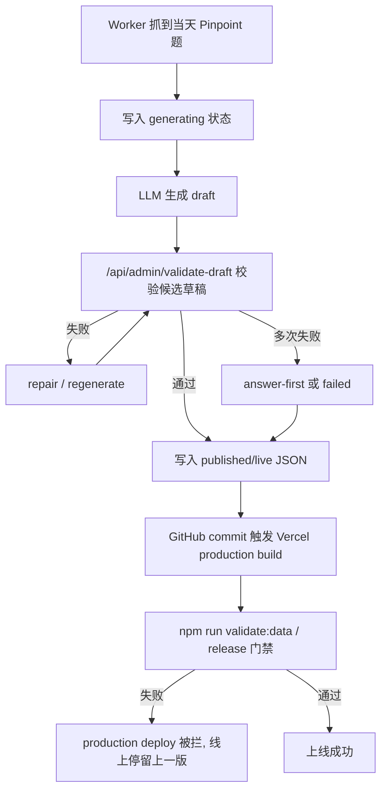
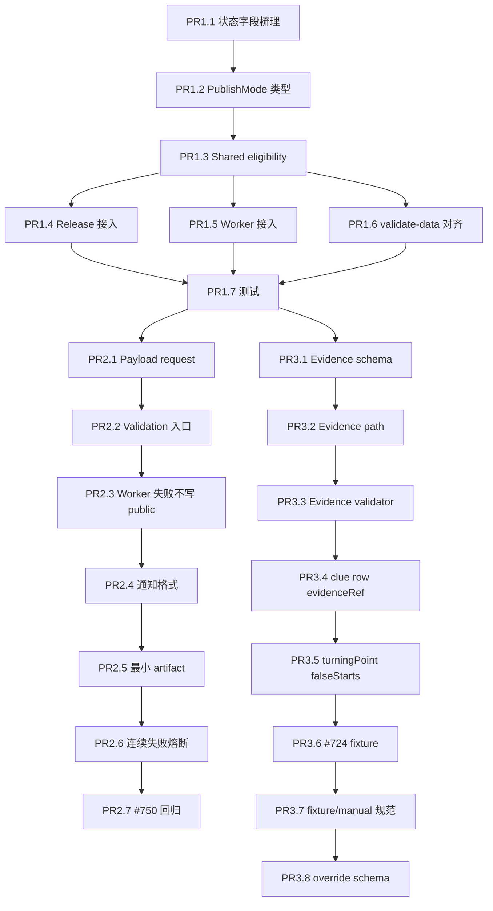

# Pinpoint 内容质量与上线门禁修复方案 - 2026-05-20

更新状态：2026-05-21 根据本地竞争站静态产物复盘修订。

本版文档不再只把目标定义为“避免 Vercel build 被坏 JSON 拦住”，而是把目标升级为：

1. 稳定生产当天可索引内容。
2. 防止坏内容进入 production commit。
3. 让最终渲染页面达到对手站同等级的正式内容形态。
4. 给 answer-first、full-analysis、failed 三种发布模式定义清晰边界。

## 执行边界与审批状态

审批状态：待审批。

建议审批结论：条件批准 PR1；PR2/PR3 需完成本节列出的边界修正后再执行。

本文档分两层使用：

1. 长期治理蓝图：Phase 0 到 Phase 9 描述最终应达到的内容生产系统。
2. 第一阶段执行规格：只做发布止血闭环，避免 PR 失控。

第一阶段批准做：

- 三种发布模式：`answer-first`、`full-analysis`、`failed`。
- release 与 Worker 共用同一套 `publish-eligibility`。
- Worker 写入 `published/live` 前必须做 production 同级 eligibility。
- 最小 evidence artifact，只支持 `deterministic`、`manual`、`weak`。
- #750 short published 和 #724 clue mapping 回归样本。
- 文件化 override 格式，但不允许自动 override 或全局 warn-only。
- 连续失败/连续降级的产品熔断规则。
- `logicalGameDate` 的官方时区基准和可审计来源。

第一阶段不批准做：

- 一次性实现 Phase 0 到 Phase 9。
- 默认公开启用 `answer-first`。
- 自动 SLA 升级、KV 丢失重建、candidate branch promote、deployment queue 同步。
- rendered HTML / link graph / schema freshness 作为 blocking CI gate。
- Playwright/Puppeteer 可见性检查作为第一阶段阻断。
- 生产模型路由升级作为第一优先级。
- 自动 override 或全局 `warn-only`。
- 默认给 `answer-first` 加 `noindex`。
- 生产使用 mock evidence 顶过门禁。

第一阶段一句话完成标准：

> Worker 不再把不符合 publish mode contract 的内容写入 `published/live`；release 和 Worker 使用同一套 eligibility 规则；失败能输出 slug、字段、issue code、source confidence。

Rendered HTML、link graph、schema freshness、Playwright 可见性、SLA 自动升级、candidate branch 和模型路由升级均为后续 PR，不阻塞第一阶段合并。

Phase 标签说明：

- `[PHASE1 MUST]`：PR1-PR3 必须覆盖。
- `[PHASE1 MUST: V1 ONLY]`：第一阶段只实现最小版本。
- `[PHASE1 DESIGN ONLY]`：第一阶段只保留设计和边界，不实现 production 行为。
- `[PHASE2]`：第二阶段再实现，不阻塞第一阶段。
- `[FUTURE]`：长期候选，不进入 PR1-PR3。
- `[NEEDS EXPLICIT APPROVAL]`：必须单独审批后才能启用。

## 审查结论

本次排查结论不是“模型不好导致内容不行”这么单一。

更准确的根因是：

1. 生成链路只拿到 `rawWords`、`mainAnswer`、`puzzleNumber` 等很薄的输入，却要求模型产出完整的 solve story、evidence、FAQ、wrong guesses、lesson、article blocks。
2. 生成不过线后，Worker 会进入 repair、fallback、short/light-explainer 等降级路径。
3. 降级产物可能被写成 `published/live` 数据。
4. 生产发布或 Vercel build 后面再执行更严格的门禁，于是上线被拦。
5. 当前修复思路过度聚焦 JSON/release gate，不足以保证每天产出稳定、可索引、可互链的正式内容页。

所以故障点分两层：

1. 工程止血层：生成结果进入发布数据之前缺少 production 同级最终门禁。
2. 内容生产层：系统还没有把“正式答案页应该长什么样、需要哪些证据、什么时候可临时上线、何时补全”为合同化流程。

模型选择会影响成功率，但不是唯一根因。只换模型，不能保证解决 `short` 页面进入 production、fallback 模板重复、repo-level content contract 迟到检查这几类问题。

## 当前直接证据

### 当前 live 数据与生产发布门禁冲突

当前 live 题 `pinpoint-answer-750` 的 detail JSON 是：

- `detailState: "published"`
- `bodyMode: "short"`
- `pageExperienceMode: "light-explainer"`

对应文件：

- `data/puzzles/pinpoint-answer-750.json`

而生产发布脚本明确拒绝 short mode：

- `scripts/release-production.mjs`
- `assertReleaseEligibleDetail()`
- 当 `bodyMode === "short"` 时抛错：`Production release only allows formal full detail pages.`

这说明当前系统存在一个策略冲突：

- 生成/Worker 链路允许短页或 light explainer 成为公开状态。
- release 链路仍要求 production 只能发布 formal full detail pages。

### 历史失败不是同一种模型错误

近期失败分布在多个内容契约字段上：

- `sections.sharedPhrasing` 增加：overview 和 solution narrative 大段复用。
- `evidence.faqItems.clueBackground.missing`：缺少 clue background FAQ evidence。
- repeated lesson title：lesson 标题模板化，和旧页面重复。
- `fullAnalysis is too thin`：fallback 正文长度不足。
- SEO description guardrail：SEO 描述和答案曝光策略不一致。

这些失败都说明：质量闸门看到的是最终 JSON 的结构或语义问题，不是模型 API 调用失败。

### 当前本地额外阻塞

当前工作区还有未提交/未跟踪文件：

- `scripts/validate-data.ts` 已修改。
- `docs/*.md` 有多个 untracked 文件。

`release-production.mjs` 会先要求 clean worktree。因此实际执行 release 时，第一道会先卡在工作区不干净。清理之后，下一道才会卡到 `bodyMode=short`。

这不是多次内容质量失败的根因，但会影响当前发布操作。

## 竞争站静态产物复盘

分析对象：

- `/Users/elng/Downloads/us.sitesucker.mac.sitesucker-pro/pinpointanswer.today`

竞品结构只作为 Content Contract 的参考 baseline，不作为 release blocking 的唯一依据。

第一阶段和后续 gate 的 blocking 判断只基于我们自己定义的 contract；竞品变化只能触发 review/warning，不能自动改变 production gate。

### 能确认的事实

下载目录是一个 Next.js App Router 静态预渲染站点。

能看到的是部署产物，不是后台仓库或生成脚本。因此不能确认：

- 使用哪个模型。
- prompt 怎么写。
- 是否有人工编辑。
- 是否有 CMS 或数据库。

但可以确认产物形态：

- 详情页 HTML 已经包含首屏、H1、meta、clues、answer reveal、正文文章、FAQ、recent answers。
- 页面底部还有 `self.__next_f.push(...)` 的 React Server Components payload，重复序列化页面树和正文。
- JS chunk 主要负责 reveal/copy/tooltip/read-more/latest modal 等交互，不包含题库数据和生成逻辑。
- 下载目录没有单独的 `*.json`、`*.md`、`*.csv`、`*.txt` 数据源。

### 对手内容形态

本地目录中有 268 个详情页，覆盖 `pinpoint-458` 到 `pinpoint-725`。

抽样和统计显示：

- 260 个页面有可解析 `<article>`。
- 有效正文中位数约 460 words，均值约 479 words。
- 255 个页面有 FAQ。
- 260 个页面有 clue table 或 `Words & How They Fit` 结构。
- 多数详情页有 recent links、latest answer CTA、archive/footer links。
- 全量没有 `application/ld+json`；详情页主要使用 `itemType="https://schema.org/NewsArticle"` 微数据。

关键样本：

- `pinpoint-704/index.html`：约 450 words，包含 false start、turning point、逐 clue 表格、3 个 FAQ。
- `pinpoint-716/index.html`：约 470 words，包含错误猜测和 cuisine rabbit-hole 叙事。
- `pinpoint-724/index.html`：约 500 words，把 `Stand/Shake/Made/Writing/Kerchief` 正确落到 `handstand/handshake/handmade/handwriting/handkerchief`。
- `pinpoint-725/index.html`：约 430 words，包含 guitar 主题、表格和 FAQ。

### 关键判断

对手不是靠特别长的文章赢，而是靠稳定的内容机器：

1. 每天有可索引的预渲染详情页。
2. 每页都有固定壳子：clues、answer reveal、full analysis、category、Words & How They Fit、FAQ、recent answers。
3. 正文不一定很深，但每个 clue 都有具体 fit。
4. 互链结构稳定，archive/recent/latest/preview 都在页面里。
5. 没有把 `short`、`fallback`、`light-explainer` 这类内部降级状态暴露成正式内容形态。

这说明我们的修复方案不能只解决“坏 JSON 不要进 production commit”。还必须定义“正式页面最低形态”和“临时 answer-first 页如何安全上线并限时补全”。

## 故障链路还原



真正需要修的是 D 到 E 之间：

在最终写入 `published/live` 前，必须用 production 同等级门禁验证最终 JSON，而不是等 commit 之后让 Vercel build 才发现问题。

## 根因拆解

### 根因 1: 生成输入过薄

当前模型通常只拿到：

- puzzle number
- 5 个 clue words
- final answer

但 prompt 要求输出：

- `questionType`
- `difficultyBand`
- `solvePath`
- `turningPoint`
- `clueRows`
- `faqItems`
- `wrongGuessCandidates`
- `setValidationSummary`
- `categoryPrecisionNote`
- `articleBlocks`
- `solutionNarrative`

这会迫使模型从很少信息里补完整推理稿。对简单题还可以，对需要背景解释或 category 判断的题，模型容易产出泛化、重复、模板化内容。

### 根因 2: repair prompt 和内容门槛不完全一致

Worker repair prompt 对部分字段的长度要求低于当前 content contract。

结果是：

- repair 可能觉得自己修好了。
- validate/build 的正式规则仍然判定太薄或语义重复。

这会制造“已经修复过但还是无法上线”的体验。

### 根因 3: fallback 和 short path 可以绕过产品预期

fallback 的初衷是保底上线，不是高质量内容。

但当前风险是：

- fallback 内容容易模板化。
- short/light-explainer 内容比 formal full detail 薄。
- 这些状态可以进入 `published/live`。
- release 脚本又不允许 short production。

因此系统内部存在两个不同的上线定义：

- Worker: 只要有可公开兜底内容，就可以继续发布。
- Release: production 只能接受 formal full detail。

### 根因 4: repo-level 校验太晚

`validate-draft` 校验的是候选草稿。

但 Vercel build 的 `validate:data` 校验的是整个仓库最终数据，包括：

- published content contract
- repeated lesson titles
- known backlog count 是否增加
- evidence contract
- public registry continuity

如果这些 repo-level 规则只在 commit 后运行，Worker 就可能已经把坏数据推到 GitHub，再由 Vercel 拦下。

### 根因 5: retry model 没有形成真正的质量升级

Worker 默认模型是 `google/gemini-2.0-flash-001`。

代码支持 `AUTO_ENRICH_RETRY_MODEL`，但如果没有配置，retry model 会等于首轮模型。

这意味着多次 retry 未必是在换更强模型，更多只是同一个模型在 repair prompt 下重写。它能降低偶发格式错误，但不能稳定解决复杂推理和原创表达问题。

### 根因 6: 缺少 source/evidence layer

当前系统把“有 5 个 clue 和最终答案”当成足够输入。

但正式内容页需要的不止这些：

- 每个 clue 如何指向答案。
- 哪个 clue 是 turning point。
- 哪些错误猜测合理但被排除。
- 最终答案是否已经确认。
- 题目来源、抓取时间、时区、原始响应或截图证据。
- 生成内容是否基于证据，而不是编造“我当时怎么猜”。

没有 source/evidence layer，模型就会用语言能力补逻辑。补得顺时像 solve story；补不顺时就是模板化、牵强解释或事实错误。

### 根因 7: 只验 JSON 字段，没有验最终渲染页面

对手站的稳定产物是页面，而不是数据文件。

当前方案主要关注：

- `data/puzzles/*.json`
- content contract
- release script
- Vercel build

但用户和搜索引擎看到的是 rendered HTML。

如果不验最终 HTML，就可能出现：

- JSON 字段勉强通过，但页面没有完整结构。
- FAQ 存在于数据里，但渲染后不可见或位置不稳定。
- clue table 缺失。
- recent links/归档链接不足。
- answer-first 或 fallback 页面被渲染得像正式页，造成质量错觉。

### 根因 8: internal links 没有被定义成流量结构

对手详情页普遍包含：

- recent answers
- latest answer CTA
- archive link
- preview link
- footer 最近 10 个答案

这些链接不只是导航，而是 daily answer 站点的索引和流量分发结构。

当前方案只提到 registry continuity，没有定义 link graph gate。这会让页面即使内容通过，也可能成为孤页，或者 archive/详情/今日页之间的权重传递不足。

### 根因 9: 发布模式过于依赖 `bodyMode`

`bodyMode: "short"` 不是唯一问题。

真正应该判断的是页面发布模式：

- `answer-first`：答案已确认，先发布轻量但完整的可索引页，不编造完整解题故事。
- `full-analysis`：答案和逐 clue 解释完整，正式内容页。
- `failed`：答案或内容证据不足，不发布当天正式页。

对手中位数正文也只有约 460 words。因此“短”本身不是问题。问题是 short/light-explainer 是否具备完整页面结构、证据、互链、schema 和补全 SLA。

### 根因 10: 审核流程缺少可追踪 artifact

当前失败更多表现为：

- build 失败。
- 质量不合格。
- 手工补 JSON。

但内容生产需要记录：

- 来源证据。
- 模型输入输出。
- 失败 issue code。
- 哪些字段被 repair。
- 是否人工 override。
- override reason。
- 发布后 HTML/GSC/sitemap 检查结果。

没有这些 artifact，下一次事故只能重新排查，无法形成稳定编辑流程。

## 修复目标

### 必须达成

1. 不允许不符合 production policy 的 detail JSON 写成 `published/live`。
2. Worker final publish 前能发现 production build 会发现的问题。
3. `answer-first`、`full-analysis`、`failed` 三种发布模式必须有统一合同。
4. fallback 内容如果进入 production，必须满足对应发布模式的 rendered page contract。
5. 质量失败时要留下可诊断原因，而不是只表现为“Vercel deploy failed”。
6. 正式详情页必须具备对手站同等级的页面结构：clues、answer、analysis、category、Words & How They Fit、FAQ、recent links。
7. 每篇内容必须能追溯 source/evidence、model trace、review status。
8. 内链、schema、sitemap、archive 不再只是 SEO 附属项，而是 release gate 的一部分。

### 不追求

1. 不追求模型一次自由发挥写出完美稿。
2. 不用“换更贵模型”替代质量门禁。
3. 不把所有 fallback 放宽到能过线为止。
4. 不在未审查前修改 SEO 或内容策略。

## 推荐修复方案

## Phase 0 - 明确产品策略 `[PHASE1 MUST]`

原文档把问题简化为：

> Production 是否允许 `bodyMode: "short"` 的页面作为正式当天页？

竞争站复盘后，这个判断过于粗糙。

真正应该拍板的是发布模式，而不是 `bodyMode` 字段。

### 新发布模式

建议用以下模式替代 `short/full` 的二元判断：

| mode | 可否公开 | 用途 | 最低要求 |
| --- | --- | --- | --- |
| `answer-first` | 可公开，但必须限时补全 | 答案已确认，先抢 daily intent 时效 | 有答案、5 clues、来源证据、answer reveal、基础 clue-to-answer map、FAQ、互链、schema、补全 SLA |
| `full-analysis` | 正式公开 | 对手站同等级正式详情页 | 完整 solve story、turning point、false starts、5 行 Words & How They Fit、FAQ、recent links、rendered HTML contract |
| `failed` | 不公开为当天正式页 | 答案或证据不足 | 保留上一版，通知并生成 review artifact |

### 推荐策略

1. 不再让 `bodyMode` 单独决定能否上线。
2. `short/light-explainer` 如果要公开，必须改名并归入 `answer-first`，并满足独立 contract。
3. `answer-first` 不能伪装成 `full-analysis`。
4. `answer-first` 必须有补全 SLA，例如 30-60 分钟内升级成 `full-analysis`，否则进入人工 review queue。
5. `full-analysis` 是正式内容目标，必须接近对手站产物：约 450+ words、逐 clue 表格、FAQ、recent links、可索引预渲染 HTML。
6. 证据不足时宁可 `failed`，不要编造完整 solve story。

### 与当前 release 策略的关系

当前 `release-production.mjs` 禁止 `bodyMode: "short"` 是合理的止血规则，但长期应该迁移为：

- 禁止未声明发布模式的页面上线。
- 禁止 `answer-first` 超过 SLA 后仍作为当天最终页。
- 禁止 `failed` 或 evidence 不足的页面触发 production detail release。
- 允许符合 contract 的 `answer-first` 先上线，但页面和 schema 必须明确是 answer-first，不冒充 full analysis。

### 决策生效规则

为避免实施者不知道“等审批还是继续做”，本文档采用以下规则：

1. 文档进入 review 后，`## 审查点` 中的决策由项目负责人拍板。
2. 项目负责人可以用评论、任务单、PR review 或对话明确回复。
3. 如果文档被标记为 approved，且没有单独反对项，`## 建议默认决策` 自动成为实施基线。
4. 如果 24 小时内没有回复，实施者可以按默认决策做 draft PR，但不得自动启用影响 production 行为的开关。
5. 以下事项必须显式确认后才能在 production 生效：
   - 公开启用 `answer-first`。
   - 启用人工 override。
   - 修改生产模型或预算上限。
   - 改变 Vercel/GitHub release 分支策略。
6. 未决事项必须写入 PR 描述的 `Open Decisions` 区块；PR 不得标记 ready。

默认策略是为了避免工程实现卡住；production 行为变更仍需要显式批准。

## Phase 0.5A - Content Contract Policy `[PHASE1 MUST: POLICY ONLY]`

### 目标

把“每天应该生产什么”写成合同，而不是只关心 JSON 能不能过 build。

### `full-analysis` 页面最低结构

正式详情页必须在最终 HTML 中具备：

1. H1：`LinkedIn Pinpoint #N Answer & Analysis` 或等价标题。
2. 日期：明确 `publishDate` 和 canonical URL。
3. Clue cards：5 个 clue 均可见，长 clue 不截断关键信息。
4. Answer reveal：答案可见或可交互揭晓，HTML 中有答案文本。
5. Analysis：至少包含 solve story、错误猜测、turning point、confirmation。
6. Category：明确最终答案类别或 phrase pattern。
7. Words & How They Fit：5 行表格，每个 clue 都有具体 phrase/example 和解释。
8. FAQ：至少 3 个问题，包含 answer question、turning clue/background question、strategy/failure-mode question。
9. Recent links：详情页内有 recent answers、archive、latest/current CTA。
10. Structured data：保留当前项目的 `Article + Game + ItemList + BreadcrumbList` 策略，不重新引入 unsupported `FAQPage/HowTo`。

### `answer-first` 页面最低结构

`answer-first` 不是低质 short 页，而是有边界的临时页。

最低要求：

1. 答案已确认。
2. 5 个 clues 可见。
3. 每个 clue 至少有一句基于证据的 fit explanation。
4. 不写虚构的“我猜错了”长故事。
5. 有 FAQ，但 FAQ 只能回答已确认事实。
6. 有 latest/archive/recent links。
7. 有明确补全状态和内部 SLA 字段，但不要把内部状态裸露给用户。
8. 长期必须在规定时间内升级为 `full-analysis`，否则进入 review queue；第一阶段只记录字段和阻断规则，不实现自动升级。

### `answer-first` SEO 策略

`answer-first` 是否公开是产品/SEO 决策，不是单纯技术开关。

第一阶段默认策略：

- `answer-first` 不默认公开启用，必须通过显式环境开关或 release decision 开启。
- 如果 `publishMode = "answer-first"` 但 `ANSWER_FIRST_PUBLIC_ENABLED !== true` 且没有明确 release decision，eligibility 必须返回 blocking issue：`publishMode.answerFirstDisabled`。
- 如果公开启用，canonical 使用最终详情页自身 URL，不另建临时 URL。
- 页面必须有用户可见状态提示，例如 `Analysis coming soon` 或等价文案，不能冒充完整解析。
- `answer-first` 可渲染基础 answer 和 clues，但 schema 不得标记为完整 analysis。
- `answer-first` 是否进入 sitemap 必须显式拍板；未拍板前默认不进入 sitemap。
- 如果 60 分钟后未补全，页面可继续在线作为临时答案页，但不得被 release gate 视为当天最终 `full-analysis`。
- 若后续升级为 `full-analysis`，必须更新 sitemap `<lastmod>` 和 schema `dateModified`。
- 默认不对正常 `answer-first` 加 `noindex`，因为这会直接放弃 daily search intent。
- `noindex` 只作为超时、失败、证据弱或人工判定低质时的降级手段，不能作为常规 `answer-first` 策略。

待拍板 SEO 选项：

| 决策 | 默认值 | 风险 |
| --- | --- | --- |
| 是否允许 `answer-first` 公开 | 否 | 公开后可能被搜索引擎抓到薄内容 |
| 是否加入 sitemap | 否 | 加入可加速发现，也可能暴露低质量初版 |
| canonical 是否与最终页相同 | 是 | 避免临时 URL 造成重复页 |
| 是否显示用户可见待补全提示 | 是 | 牺牲完整感，换取透明度 |
| 超时后是否从 sitemap 移除 | 待定 | 需要和 SEO 策略一起评估 |
| 超时/失败时是否加 `noindex` | 待定 | 可降低薄内容风险，但会损失搜索曝光 |

### 验收标准

- 对手样本 `pinpoint-704/716/724/725` 的页面结构应能映射到我们的 `full-analysis` contract。
- 我们的 `pinpoint-answer-750` 当前 short/light-explainer 不应满足 `full-analysis` contract。
- 第一阶段即使 payload 满足 answer-first contract，只要 `ANSWER_FIRST_PUBLIC_ENABLED !== true` 且无明确 release decision，也不得写入 `published/live`。
- 第二阶段如果允许 `answer-first` 上线，它必须通过 answer-first rendered HTML contract，而不是只通过 JSON 字段。

## Phase 0.5B - Answer-first SLA Runtime `[PHASE2 / NEEDS EXPLICIT APPROVAL]`

以下内容只描述长期 runtime 设计，不进入 PR1-PR3。

### `answer-first` SLA 执行闭环

`answer-first` 的 60 分钟 SLA 必须由系统执行，不是文档承诺。

### 触发者

1. Worker 在发布 `answer-first` 后写入 `answerFirstDeadlineAt = answerFirstPublishedAt + 60 minutes`。
2. Worker scheduled cron 每 10 分钟扫描未完成的 `answer-first` 记录。
3. 人工可以通过 admin action 手动触发 enrichment，但人工触发不是 SLA 的唯一来源。

### 倒计时存储

倒计时存两份：

- Runtime 状态：Cloudflare KV 或现有 Worker 状态存储，用于 cron 快速扫描。
- 审计状态：post-publish audit 或专门的 SLA state artifact 中记录 `answerFirstPublishedAt`、`answerFirstDeadlineAt`、`slaClockSource`。

如果 KV 丢失，以 post-publish audit 或 SLA state artifact 为准重建。

重建方式必须受控：

- Edge Worker 不得在请求或 scheduled cron 中自动全量扫描 GitHub repo、commit history 或 `data/puzzles` 目录来重建 SLA 队列。
- KV 丢失后的重建只能由 admin/local one-shot 脚本触发，例如 `scripts/rebuild-answer-first-sla-state.ts`。
- 重建脚本读取 post-publish audit / SLA state artifact 后，批量写回 KV，并输出 dry-run diff、写入数量、跳过原因和失败列表。
- Worker 在发现 KV 缺失但 artifact 存在时，只允许记录 `slaStateMissing` 并通知人工，不允许自行做全量 IO 重建。
- 重建完成前，相关 `answer-first` 页面保持原 publish mode，但不得被视为已完成 SLA。

### SLA 何时开始

优先使用 production URL 首次返回 `200` 且页面为 `answer-first` 的时间。

如果 post-publish audit 暂时不可用，则使用 final publish commit timestamp 作为 fallback，并记录：

```ts
slaClockSource: "production_200" | "commit_timestamp"
```

如果 production build 失败，页面没有公开成功，不启动 `answer-first` SLA，直接进入 failed/review。

### Worker 宕机或生成失败

Worker 宕机不重置 SLA。

恢复后 cron 根据持久化 deadline 继续处理。生成失败时：

1. 记录失败轮次和 issue codes。
2. 如果仍在 deadline 内，允许下一轮 cron 重试。
3. 如果超过 deadline，进入 review queue。

### SLA 过期处理

超过 deadline 后：

1. 通知现有 `notifyCron` 目标或配置的 release notification channel。
2. 自动生成 review artifact。
3. 如果有可修复草稿，创建 draft PR。
4. 页面保持 `answer-first`，但标记为 SLA expired，后续 release gate 不允许它被视为当天最终 full-analysis。

### 升级 commit 与 Vercel build 排队控制

`answer-first` 到 `full-analysis` 的自动升级不能无限制地产生 production commits。

后续启用 `answer-first` 自动升级时，必须采用 build 去重/节流策略：

1. 同一 slug 在已有 production deployment queued/building 时，不再立即推送第二个 public commit。
2. full-analysis 草稿先写入 candidate branch 或 draft PR；只有确认当前 production deployment 完成，且 final payload 仍是最新答案时，才允许 promote。
3. 如果 `answer-first` 发布后 30 分钟内生成 full-analysis，优先合并为一次 candidate promote，而不是连续触发两次 production build。
4. 如果 production 队列已有更新中的同 slug build，后续 enrichment 只更新 candidate branch，不追加 production commit。
5. 超过 SLA 后仍未 promote 的 full-analysis 草稿进入 review queue，由人工决定是否立即发布、延后到下一次 release batch，或保留 answer-first。

验收标准：

- 同一 puzzle 在 60 分钟 SLA 窗口内最多触发一次 production promote，除非人工 override 明确允许第二次 promote。
- release notification 必须显示当前 slug 的 deployment 状态：`none`、`queued`、`building`、`ready`、`failed`。
- draft PR 描述必须列出是否会触发新的 Vercel production build。

## Phase 1 - 前移 production eligibility gate `[PHASE1 MUST]`

### 改动目标

在 Worker 写入最终 `published/live` 前，执行和生产发布一致的 eligibility 检查。

### 建议新增共享模块

新增或抽出：

- `lib/puzzles/publish-eligibility.ts`

职责：

- 检查 `detailState` 是否允许公开。
- 检查 `publishMode` 是否符合 production policy。
- 检查 `bodyMode`、`pageExperienceMode` 是否与 `publishMode` 一致。
- 检查 required fields 是否满足对应模式的 detail contract。
- 对外返回结构化 issues，而不是只 throw string。

示例返回结构：

```ts
type PublishEligibilityIssue = {
  code: string;
  level: "error" | "warning";
  message: string;
  field?: string;
};
```

### 需要接入的位置

- `scripts/release-production.mjs`
- `scripts/validate-data.ts`
- `app/api/admin/validate-draft/route.ts`
- `app/api/admin/generate-draft/route.ts`
- `worker/src/index.ts`

核心要求：

- release script 和 Worker 使用同一套 eligibility 判断。
- 不再出现 Worker 认为可发布、release 认为不可发布的分裂。
- 不再用 `bodyMode` 单字段粗暴决定上线资格。

### 验收标准

- 未声明 `publishMode` 的 `published/live` 页面必须失败。
- `answer-first` 缺少补全 SLA 必须失败。
- 第一阶段 `full-analysis` 缺少逐 clue mapping 必须失败。
- 第一阶段不检查真实 rendered HTML，不因 rendered HTML 结构失败而阻断 Worker 写入前校验。
- 第一阶段只要求输出 `expectedRenderedRoute` / `ciRenderedCheckTarget` metadata，供第二阶段 CI rendered gate 使用。
- `bodyMode: "short"` + `detailState: "published"` 如果没有被明确归入合规 `answer-first`，必须失败。
- 失败必须发生在写 GitHub final publish commit 之前。
- 错误信息必须包含 slug、字段、失败 code。

## Phase 2 - final JSON 校验改为生产同级 `[PHASE1 MUST]`

### 当前问题

`/api/admin/validate-draft` 验证的是候选草稿，不等同于最终 detail JSON。

最终 detail JSON 可能经过：

- normalization
- composer
- fallback
- status wrapping
- registry update

这些步骤之后才是 Vercel build 看到的真实对象。

### 修复建议

新增一个最终发布校验端点：

- `POST /api/admin/validate-publish-payload`

输入：

- target slug
- candidate detail JSON
- candidate registry entry
- intended status
- intended detailState
- intended publishMode
- evidence artifact path/hash
- expected rendered route metadata

输出：

- `valid: boolean`
- `issues: PublishEligibilityIssue[]`
- `blockingSummary`
- `requiredNextAction`
- `ciRenderedCheckTarget`

这个端点不负责生成内容，只负责判断“这份最终 payload 如果写入 repo，会不会过 production quality gate”。

它不要求 Worker 在写 candidate commit 前拿到 rendered HTML；`ciRenderedCheckTarget` 交给 candidate branch CI 在 build 后检查。

### Worker 接入方式

在 `publishToNewSiteGitHub()` 写 final publish commit 前调用。

如果失败：

1. 不写 `published/live`。
2. 写非 public 的 failure artifact/status，或保留上一版。
3. 通知里输出 blocking codes。
4. 可选择创建 draft artifact 供人工修。

### `failed` 状态路径边界

第一阶段必须明确：

- `failed` 状态不得写入会触发 production build 的 public data path。
- `failed` 只能写入安全的审计/通知/本地 artifact 路径，或保留在 KV/runtime status 层。
- `generating`、`validated`、`failed` 都不得伪装成 `published/live`。
- 若当前实现无法隔离状态路径，则必须通过 Vercel ignore 或 commit path 隔离保证不会触发 production build。

### 验收标准

- 缺少 `faqItems.clueBackground` 时，Worker 不得写 public final payload。
- repeated lesson title 时，Worker 不得写 public final payload。
- shared phrasing 增加时，Worker 不得写 public final payload。
- short production 被禁用时，Worker 不得写 public final payload。
- evidence artifact 缺失时，Worker 不得写 `full-analysis` commit。
- rendered contract 失败时，candidate branch CI 不得 merge/promote 到 production main。

## Phase 2.5 - 新增 Source/Evidence Contract `[PHASE1 MUST: V1 ONLY]`

### 目标

解决“输入过薄导致模型编故事”的问题。

LLM 只能基于证据写作；没有证据时只能生成 `answer-first`，不能生成完整 solve story。

### Evidence 从哪里来

Evidence 不能只靠模型生成，否则会变成循环论证。

采用分层来源：

| 层级 | 来源 | 可用于 full-analysis | 说明 |
| --- | --- | --- | --- |
| L1 authoritative | LinkedIn/游戏接口原始响应、确认答案、抓取时间、截图或 hash | 是 | 证明题目和答案真实存在 |
| L2 verified support | 规则代码、词典、phrase/prefix/suffix matcher、已知题型分类器、search grounding、多模型一致性、可引用外部知识 | 是 | 证明 clue-to-answer mapping 有可复核依据 |
| L3 model-proposed | 单模型提出的 mapping、turning point、false starts | 不能单独使用 | 只能作为候选，必须经过 L2 校验、多源确认或人工确认 |
| L4 manual | 人工录入或人工确认 | 是 | 必须记录 reviewer 和 reason |
| L5 external web/social | 搜索结果、讨论帖、公开页面 | 可选 | 只有实现来源 URL、时间、摘录后才可使用；不是第一阶段依赖 |

长期体系要求 L1 + L2/L4，但 L2 不能只理解为硬编码规则：

1. L1 提供真实 clues 和 confirmed answer。
2. L2 尝试生成或验证 clue-to-answer mapping。
3. L2 可以来自 deterministic 规则，也可以来自可记录来源的 search grounding、外部知识库、两种以上模型独立一致结论，或人工确认。
4. L2 失败时进入 `answer-first` 或 review queue。
5. L3 单模型输出不能单独把页面升级为 `full-analysis`。

第一阶段实现必须进一步收窄：

```ts
type EvidenceSupportLevelV1 = "deterministic" | "manual" | "weak";
```

第一阶段只实现：

- `deterministic`：本地规则、已知题型分类器、明确词典或 phrase mapping 可验证。
- `manual`：人工确认，必须记录 reviewer、timestamp、reason。
- `weak`：证据不足，只能支持 `answer-first`、`failed` 或 review queue。

第一阶段不得把 `grounded` 或 `multi_model_consensus` 当作可上线依据；这两类只保留在接口设计中，作为第二阶段扩展。

为了避免 L2 校验器过硬导致 `full-analysis` 上线率暴跌，第一版 L2 必须返回置信度和证据类型，而不是简单 boolean：

```ts
type EvidenceSupportLevel = "deterministic" | "grounded" | "multi_model_consensus" | "manual" | "weak";
```

第一阶段 V1 升级规则：

- `deterministic` 和 `manual` 可支持 `full-analysis`。
- `weak` 只能支持 `answer-first`、`failed` 或 review queue。
- `grounded`、`multi_model_consensus` 第一阶段视为 unsupported，不得支持 `full-analysis`。
- 同一 clue 的 fit 如果只有单模型解释，必须标记为 `model_proposed` 或 `weak`，不能冒充 verified evidence。

长期升级规则：

- 第二阶段后，`grounded` 可在保存 URL、抓取时间、摘录或 normalized fact 后支持 `full-analysis`。
- 第二阶段后，`multi_model_consensus` 可在保存至少两个模型独立输出、相同点、冲突点和最终选择理由后支持 `full-analysis`。

第二阶段才允许启用：

- `grounded`
- `multi_model_consensus`
- L5 external web/social

falseStarts 的规则：

- 如果没有真实 solve trace，不得写成“我实际猜了什么”。
- 可以写成“a tempting wrong direction was...”，并在 artifact 标记为 `plausible_hypothetical`。
- full-analysis 中的 turning point 必须绑定具体 clue 和 mapping 证据。

### 建议新增数据结构

每题生成前保存一个 evidence artifact：

下面是长期目标结构；第一阶段只实现其中的 `deterministic`、`manual`、`weak` 子集。

```ts
type PinpointEvidence = {
  puzzleNumber: number;
  puzzleDate: string;
  logicalGameDate: string;
  source: {
    provider: "graphql" | "manual" | "cached" | "unknown";
    fetchedAt: string;
    timezone: string;
    timezoneSource: "assumption" | "verified" | "manual";
    rawResponseHash?: string;
    screenshotPath?: string;
  };
  answer: {
    value: string;
    confidence: "confirmed" | "inferred" | "manual";
    confirmedAt?: string;
  };
  clues: Array<{
    index: number;
    text: string;
    fit: string;
    fitSource: "deterministic" | "grounded" | "multi_model_consensus" | "manual" | "model_proposed" | "external";
    supportLevel: "deterministic" | "grounded" | "multi_model_consensus" | "manual" | "weak";
    fitConfidence: "confirmed" | "inferred" | "weak";
    phraseExample?: string;
    notes?: string;
  }>;
  falseStarts?: Array<{
    guess: string;
    rejectedBecause: string;
    basedOnClues: string[];
    source: "manual" | "model_proposed" | "plausible_hypothetical";
  }>;
  turningPoint?: {
    clue: string;
    reason: string;
  };
};
```

`logicalGameDate` 是 Daily Intent 的唯一日期锚点：

- 取值格式为 `YYYY-MM-DD`。
- 官方时区基准必须显式配置为 `PINPOINT_GAME_TIMEZONE`，第一阶段建议默认使用 `America/New_York`，除非抓取证据证明 LinkedIn Pinpoint 的实际刷新时区不同。
- `source.timezone` 必须记录本次计算使用的时区，不能留空或隐式使用服务器本地时区。
- `source.timezoneSource` 必须记录时区来源：`assumption`、`verified` 或 `manual`。
- 第一阶段如果使用 `America/New_York` 作为临时默认值，必须写入 `timezoneSource: "assumption"`。
- 如果后续抓取证据证明官方刷新时区，应改为 `timezoneSource: "verified"` 并记录证据来源。
- 人工修正日期时必须写入 `timezoneSource: "manual"` 并记录 reason。
- `source.fetchedAt` 必须是 ISO UTC 时间；`logicalGameDate` 必须由 `source.fetchedAt + PINPOINT_GAME_TIMEZONE` 计算得出，或由人工确认并记录 reason。
- registry date、detail route、archive 排序、sitemap `<lastmod>`、schema `datePublished/dateModified`、SLA 归属日都必须对齐 `logicalGameDate`。
- Worker 生成 payload 时必须同时记录 `source.fetchedAt`、`source.timezone` 和 `logicalGameDate`，用于排查跨时区边界。
- 如果抓取发生在刷新边界前后且无法确认当天题号，不得自动发布 `full-analysis`；只能进入 `answer-first` 或 review queue。
- release gate 必须检查 `puzzleNumber`、`puzzleDate`、`logicalGameDate` 的连续性，防止昨天题被当成今天题或提前泄漏明天题。

### 生成规则

1. `full-analysis` 必须有 5 个 `clues[].fit`。
2. `full-analysis` 中每个 `clues[].fit` 必须来自 `deterministic`、`grounded`、`multi_model_consensus` 或 `manual`，或来自 `model_proposed` 后经过 L2/L4 确认。
3. `falseStarts` 只能来自 evidence 或明确标记为 plausible hypothetical，不得伪装成真实操作记录。
4. `turningPoint` 必须绑定具体 clue。
5. `phraseExample` 对 phrase/prefix/suffix 题是必填。
6. `fitConfidence: "weak"` 的 clue 不能进入 `full-analysis`，只能进入 `answer-first` 或 review。

### 验收标准

- #724 这类 phrase 题必须能输出 `handstand/handshake/handmade/handwriting/handkerchief` 级别的 clue mapping。
- 如果 mapping 缺失或明显错误，final gate 必须阻止 `full-analysis`。
- 生成文本中的每个事实性解释都能追溯到 evidence artifact。

## Phase 2.6 - 新增 Rendered HTML Contract `[PHASE2]`

### 目标

把最终页面形态纳入 release gate，避免 JSON 通过但页面质量不达标。

### 建议新增脚本

- `scripts/check-pinpoint-rendered-content.ts`

输入：

- 本地 build 后的 route HTML，或 production URL。
- target slug。
- expected publish mode。

### 选定时序方案

Rendered HTML check 不能作为 Worker 写 commit 前的硬依赖，因为渲染需要 build，而 build 需要 commit。

本文档选定方案：

1. Worker pre-publish gate 只做 JSON/evidence/publish-mode 校验。
2. Worker 不直接把 full-analysis final commit 推到 production main；目标方案是推到 candidate branch 或 draft PR。
3. CI 在 candidate branch 上执行 build，并运行 rendered HTML/link/schema checks。
4. checks 通过后才 auto-merge 或人工 merge 到 production main。
5. checks 失败时，不 merge，不触发 production release；review artifact 记录失败。

短期过渡方案：

- 如果 candidate branch 流程尚未实现，rendered HTML check 可先作为 CI post-build check。
- 该阶段允许 CI 阻断 deploy 并通知，但不能宣称已经解决“坏内容进 main”的问题。
- 过渡期最长 7 天或 5 次成功发布，以先到者为准。

因此，`validate-publish-payload` 不要求 Worker 提供已渲染 HTML；它只输出 `expectedRenderedRoute` 和 `expectedPublishMode`，供 CI rendered check 使用。

Rendered check 分两层：

1. 静态 HTML/DOM contract：用 build artifact、HTML parser 或 jsdom 检查结构、metadata、schema。
2. 视觉可见性 smoke test：用 Playwright/Puppeteer 打开本地 preview 或 deployment URL，确认关键模块真的可见、可交互、未被 CSS/JS 死锁隐藏。

静态检查项：

- H1 包含题号和 answer/analysis 语义。
- 5 个 clue card 全部可见。
- answer 文本存在于 HTML 或可由 reveal 组件访问。
- `full-analysis` 页面有 analysis、category、Words & How They Fit、FAQ。
- Words & How They Fit 至少 5 行，每行有 clue、phrase/example、meaning。
- FAQ 至少 3 个问题。
- recent answers、archive、latest/current CTA 存在。
- canonical、robots、OG/Twitter meta 正常。
- JSON-LD 策略符合当前项目约束。

视觉可见性检查项：

- H1、5 个 clue card、answer reveal 控件、analysis section、Words & How They Fit、FAQ 至少一个问题、recent/archive links 都有非零 bounding box。
- 关键模块不得匹配 `display: none`、`visibility: hidden`、`opacity: 0`、`aria-hidden="true"` 或被首屏 overlay 永久遮挡。
- answer reveal 控件必须能通过 click 或 keyboard action 展示答案，且展示后答案文本可见。
- 页面加载后不能有阻断关键内容渲染的 console error。
- viewport 至少覆盖 mobile 和 desktop 两档；第一版可以只抽查当日 slug 和最近一个 archived slug。

### 验收标准

- 对手 `pinpoint-704` 的结构应作为 rendered contract 的参考样本。
- 我们的 `pinpoint-answer-750` 当前 short 页面不得通过 `full-analysis` rendered contract。
- `answer-first` 可以通过更低一档 contract，但必须有补全 SLA 和 no-hallucination 约束。
- DOM 节点存在但视觉不可见时，rendered gate 必须失败或输出 blocking issue。

### 竞争站形态异动监控

竞争站静态产物是 baseline，不应假设其形态永久不变。

第二阶段可增加非阻断监控：

- 定期抽样竞争站详情页，记录 article、FAQ、Words & How They Fit、recent/archive links、schema/metadata。
- 与当前 baseline 样本比较结构偏离度。
- 偏离度超过 30% 时输出 `competitor.contractDrift` warning。
- 该 warning 只进入产品/SEO review，不阻断我们自己的 release。
- 第一阶段不实现该监控，也不把竞争站变化作为 blocking gate。

## Phase 2.7 - 新增 Internal Link Graph Gate `[PHASE2]`

### 目标

把 archive/recent/latest/preview 链接视为内容生产的一部分，而不是页面装饰。

### 检查项

每个公开 detail 页至少应有：

- archive link。
- latest/current answer CTA。
- recent answers 列表。
- footer 最近答案链接。
- prev/next 或同类近邻链接，若当前设计支持。
- anchor text 包含 `Pinpoint #`、题号或 clue 摘要。

Archive 应检查：

- 可见条目数与 registry public count 一致。
- `ItemList.numberOfItems` 与实际可见条目一致。
- 无 orphan detail。
- newest answer 可从首页、archive、today route、sitemap 互相到达。

Sitemap 和 schema freshness 检查：

- 新增公开页面时，sitemap 必须包含该 route。
- `answer-first` 升级为 `full-analysis` 时，sitemap `<lastmod>` 必须更新到升级 commit/deploy 时间。
- 页面结构化数据中的 `dateModified` 必须同步更新，不能仍停留在 answer-first 首次发布时间。
- `datePublished` 应绑定 `logicalGameDate` 或首次正式公开时间；`dateModified` 绑定最后一次内容质量升级时间。
- 如果 sitemap `<lastmod>`、schema `dateModified` 和 post-publish audit 的 deployedAt 不一致，link/schema gate 必须输出 warning 或 blocking issue。

### 验收标准

- 新增页面不能成为孤页。
- `answer-first` 到 `full-analysis` 的升级必须能让搜索引擎看到明确 freshness signal。
- 发布一个新题后，homepage、archive、detail recent links、sitemap、structured data 数量同步。

## Phase 3 - 禁止 generating/validated 状态触发 production build 失败 `[PHASE1 DESIGN ONLY / PHASE2 IMPLEMENTATION]`

### 当前风险

历史失败里有 `generating` 状态提交触发 production build，然后被 `validate:data` 拦住。

这说明状态更新 commit 本身会进入 Vercel production build 链路。

### 修复方向

有两个可选方案。

### 方案 3A: 状态 commit 不写入生产数据文件

Worker 不再把 `generating`、`validated` 状态写入会触发 production build 的 `data/puzzles/*.json` 或 `registry.json`。

状态只写到：

- KV
- external status endpoint
- GitHub issue/comment
- notification channel

优点：

- 最干净。
- production repo 只保存可构建的公开数据。

缺点：

- 需要改状态展示链路。

### 方案 3B: Vercel ignore status-only commit

增强 Vercel ignore build 逻辑：

- 如果 commit 只改变 detail state 为 `generating` 或 `validated`，不触发 production build。
- 只有 final public publish mode commit 才触发 build。

优点：

- 改动较小。

缺点：

- 仍然会把非最终状态写入 repo。
- ignore 判断写错会继续误触发。

### 推荐

短期用 3B 止血，长期迁移到 3A。

### 迁移触发条件和负责人

负责人：release automation implementer。

3B 只是过渡方案，不允许无限期保留。

迁移到 3A 的触发条件：

1. 3B 上线后 7 天到期。
2. 或完成 5 次成功 daily release。
3. 或任意一次 status-only commit 仍触发 production build failure。

满足任一条件后，必须创建 3A 迁移 PR，把 `generating/validated` 状态从 production repo 数据文件迁出。

## Phase 4 - 对 fallback_full 和 answer-first 提升硬标准 `[PHASE2]`

### 当前问题

fallback 的使命是保底，但现在 production 又要求质量。

如果 fallback_full 可以成为正式页，它必须满足对应发布模式的最低标准：

- overview 足够具体。
- solutionEmergence 不复用 overview。
- FAQ 包含 clue background。
- lesson title 页面唯一。
- articleBlocks 不模板化重复。
- fullAnalysis 不低于当前字数线。
- Words & How They Fit 对 5 个 clue 都有具体 mapping。
- `answer-first` 不编造完整 solve story，只呈现已确认信息。

### 新体系中的 fallback 语义

旧的 `fallback_full` 语义应逐步废弃。

原因：

- 如果 fallback 能满足 `full-analysis` contract，它就不是兜底稿，而是正常的 deterministic composer 输出。
- 如果 fallback 不能满足 `full-analysis` contract，却仍公开为正式页，就会继续制造质量风险。

新体系中 fallback 只保留两个用途：

1. `answer-first-template`：答案已确认但 full-analysis 不足时，生成临时公开页。
2. `full-analysis-composer`：evidence 完整但模型 prose 失败时，用确定性 composer 拼成正式页。

未来不要再新增 `fallback_full` 作为 public state。

迁移规则：

- 旧数据中的 `fallback_full` 如果通过 full-analysis contract，可映射为 `publishMode: "full-analysis"`。
- 旧数据中的 `fallback_full` 如果只满足 answer-first contract，应映射为 `publishMode: "answer-first"` 并进入补全 SLA。
- 两者都不满足时，应进入 `failed` 或人工 review。

### 具体改动范围

- `lib/puzzles/fallback-copy.ts`
- `lib/puzzle-generation/content-composer.ts`
- `worker/src/index.ts` 的 `buildTemplateFallbackPayload()`
- `lib/puzzles/semantic-lint.ts`
- `lib/puzzles/content-contract.ts`

### 修复重点

1. `solutionNarrative` 不得从 `articleBlocks` 直接复制。
2. fallback lesson title 必须使用 answer/clue 派生的页面唯一标题。
3. FAQ 至少包含一个 clue background item。
4. category 题和 phrase 题使用不同 fallback 骨架。
5. fallback articleBlocks 要包含真实 clue-to-answer 关系，不只是替换变量。
6. answer-first 必须有独立模板，禁止出现 `compact explainer`、`formal long-form unavailable` 这类内部降级文案。
7. fallback_full 如果无法生成逐 clue mapping，不得冒充 full-analysis。

### 验收标准

- 复现 #747/#750 的 shared phrasing fixture 应失败。
- 修复后的 fallback fixture 应通过。
- #749 repeated lesson title fixture 应失败。
- 修复后的 lesson title 应与近 30 个页面不重复。
- #724 phrase mapping 错误 fixture 应失败。
- `answer-first` fixture 应能公开但不能通过 `full-analysis` contract。

## Phase 5 - 对 prompt 和 repair prompt 对齐正式门槛 `[FUTURE]`

### 当前问题

prompt 要求很多结构字段，但 repair prompt 对某些字段要求低于正式 contract。

### 修复建议

1. 把正式 content contract 阈值注入 prompt builder。
2. repair prompt 不再用硬编码低阈值。
3. repair prompt 必须带上机器失败 code，而不是只给自然语言摘要。
4. 模型输出只填槽位，composer 负责长文，但 composer 的结果也必须过 final gate。

### 需要检查的文件

- `lib/puzzle-generation/prompt-builder.ts`
- `worker/src/enrich-llm.ts`
- `app/api/admin/generate-draft/route.ts`
- `lib/puzzle-generation/content-composer.ts`

### 验收标准

- `overview`、`solutionEmergence`、`articleBlocks` 的 prompt 要求和 `content-contract.ts` 一致。
- repair prompt 能看到 `sections.sharedPhrasing`、`evidence.faqItems.clueBackground.missing`、`repeatedLessonTitle` 等 code。
- repair 后仍失败时，不写 final publish。

## Phase 6 - 设置真正的模型路由和 stronger retry model `[FUTURE / NEEDS EXPLICIT APPROVAL]`

### 当前问题

如果没有配置 `AUTO_ENRICH_RETRY_MODEL`，retry model 等于首轮模型。

这会造成“retry 了但质量没有明显改善”。

另一个问题是：当前策略把“换强模型”当成一个整体动作，而不是按任务拆分。

### 修复建议

保留首轮快模型，但把任务分层：

| 任务 | 推荐模型策略 |
| --- | --- |
| extraction/normalization | 便宜快模型或规则代码 |
| clue-to-answer mapping | 中等模型，失败时进 review |
| solve story/full-analysis | 强模型 |
| targeted repair | 只重写失败槽位，不整篇重写 |
| lint/contract | 本地规则，不用模型 |

首轮可以继续使用 `google/gemini-2.0-flash-001`，但 retry 应切到 Claude Sonnet 级别模型或其他更强长文推理模型。

具体模型名需要按当前 OpenRouter/Vercel 可用模型确认。

### 注意

这不是主修复，只是降低失败率。

必须先完成 final publish gate，否则更强模型仍然可能把不合格内容写进 repo。

同时必须设置预算和 SLA：

- 每题最大模型成本。
- 每题最大生成时长。
- 最大 retry 次数。
- answer-first 到 full-analysis 的补全 deadline。
- 失败后是否自动生成 review artifact 或 draft PR。

### 验收标准

- production env 明确设置 `AUTO_ENRICH_RETRY_MODEL`。
- Worker 日志输出首轮模型和 retry 模型。
- 质量失败通知中包含每轮模型名。
- 每次 repair 记录重写了哪个槽位、为什么重写、重写前后的 issue code。
- 超过成本或 SLA 后进入 review queue，不继续盲目重试。

## Phase 7 - 增加回归测试和故障样本 `[PHASE1 MUST: #750/#724 ONLY]`

### 必须固化的样本

建议把以下历史事故做成 fixture：

- #701: `fullAnalysis is too thin`
- #747: shared phrasing
- #748: missing clue background FAQ
- #749: repeated lesson title
- #750: short published page and shared phrasing

### 测试覆盖

新增或扩展：

- content contract fixture tests
- publish eligibility tests
- source/evidence contract tests
- rendered HTML contract tests
- internal link graph tests
- schema production HTML tests
- fallback generation tests
- Worker final payload dry-run tests
- release script eligibility tests

### 本地验证命令

每次改动后至少跑：

```bash
npm run validate:data
npm run test:pinpoint-guardrails
npm run typecheck
```

如果改动影响 build 或 release：

```bash
npm run build
npm run release:production -- --dry-run
```

如果当前没有 dry-run 参数，应先为 release script 增加 dry-run，而不是直接跑真实 release。

## Phase 8 - 建立 Review Artifact 和人工复核队列 `[PHASE1 DESIGN ONLY / PHASE2 IMPLEMENTATION]`

### 目标

把“质量不合格”从一次性错误变成可审查、可修复、可复盘的工单。

Artifact 必须拆成 pre-publish 和 post-publish 两类，避免把上线前不存在的数据写进同一个 type。

### Pre-publish artifact

生成于写 candidate branch 或 final payload 前。

只记录上线前已经可知的信息：

```ts
type PinpointPrePublishArtifact = {
  puzzleNumber: number;
  slug: string;
  publishMode: "answer-first" | "full-analysis" | "failed";
  evidencePath: string;
  modelRuns: Array<{
    model: string;
    purpose: string;
    startedAt: string;
    finishedAt: string;
    costEstimate: number;
    issueCodesBefore?: string[];
    issueCodesAfter?: string[];
  }>;
  validation: {
    dataIssues: string[];
    evidenceIssues: string[];
    publishEligibilityIssues: string[];
  };
  editorialWarnings: Array<{
    code: string;
    message: string;
    requiresHuman: boolean;
  }>;
  humanOverride?: {
    reviewer: string;
    reason: string;
    timestamp: string;
  };
};
```

### Post-publish audit

生成于 production URL 可访问后。

只记录上线后才能确认的信息：

```ts
type PinpointPostPublishAudit = {
  puzzleNumber: number;
  slug: string;
  productionUrl: string;
  deployedAt: string;
  commitSha: string;
  answerFirstSla?: {
    answerFirstPublishedAt: string;
    answerFirstDeadlineAt: string;
    slaClockSource: "production_200" | "commit_timestamp";
    status: "pending" | "completed" | "expired";
  };
  validation: {
    renderedIssues: string[];
    linkIssues: string[];
    schemaIssues: string[];
    sitemapIssues: string[];
  };
  gsc?: {
    inspectedAt: string;
    indexStatus?: string;
    canonical?: string;
    notes?: string;
  };
};
```

GSC 数据通常不是发布后立即稳定可用。因此 `gsc` 是异步补充字段，不阻塞当天 release。

### 队列规则

- blocking issue：不写 public final payload，不 merge/promote candidate branch。
- editorial warning：可进入人工复核，不自动冒充 full-analysis。
- evidence weak：只能 answer-first 或 failed。
- SLA 过期：自动提醒，并生成修复草稿或 draft PR。
- 人工 override：必须写 reason，后续进入回归样本。

### 验收标准

- 每次生成失败都有 artifact。
- 每次人工修稿都能追溯修了哪个 issue code。
- 每次发布前能看到 pre-publish artifact。
- 每次发布后能关联 post-publish audit，包括 production URL、sitemap 状态、HTML spot check 结果。

## Phase 9 - Override 和 Rollback 路径 `[PHASE1 MUST: SCHEMA ONLY]`

### 目标

新 gate 可能有误判。必须提供受控绕过机制，避免 gate bug 导致连续多天无法发布。

### Override 权限

允许 override 的角色：

- 项目负责人。
- 被项目负责人明确授权的 release maintainer。

普通自动化任务不能自己 override 自己。

### Override 入口

第一阶段使用文件化 override，方便审查：

- `data/puzzles/release-overrides/<slug>.json`

示例：

```json
{
  "slug": "pinpoint-answer-750",
  "issueCodes": ["rendered.linkGraph.warning"],
  "reviewer": "project-owner",
  "reason": "Gate false positive; page has required archive links in footer.",
  "expiresAt": "2026-05-22T00:00:00Z"
}
```

后续可以加 admin UI，但第一阶段不要求。

### KV override 后续方案边界

文件化 override 有审计优势，但 emergency unlock 通过 commit 写 override 可能再次触发 CI/Vercel build。

因此后续可以评估 KV/runtime override，但第一阶段不实现：

- KV override 只允许用于 emergency unlock，必须有 24 小时绝对过期时间。
- KV override 不能作为审计事实源；最终必须回写 incident doc 或文件化记录。
- CI/release gate 如读取远程 override，必须输出 override source、expiresAt、reviewer 和 incident URL。
- KV override 不得绕过核心阻断项：缺 answer、缺 5 clues、answer 未确认、evidence artifact 缺失、build/runtime fatal error。
- 默认仍禁止自动 override 和全局 `warn-only`。

文件格式必须支持审计和防滥用：

```ts
type ReleaseOverride = {
  slug: string;
  issueCodes: string[];
  reviewer: string;
  reason: string;
  createdAt: string;
  expiresAt: string;
  incidentUrl?: string;
};
```

### Override 限制

可 override：

- 明确误判的 rendered/link/schema warning。
- 非核心 SEO metadata warning。
- 已有人工证据支持的 editorial warning。

不可 override：

- 缺少 answer。
- 缺少 5 个 clues。
- answer 来源未确认。
- evidence artifact 缺失。
- build/typecheck/runtime fatal error。
- 结构化数据 JSON 语法错误。

防呆和熔断规则：

- 普通 override 的 `expiresAt - createdAt` 最长 48 小时。
- emergency rollback override 最长 24 小时。
- override 必须绑定具体 slug 和 issue code，不允许使用 `*`、prefix wildcard 或全局跳过。
- 同一 issue code 连续 3 个 logicalGameDate 被 override 时，CI 必须熔断并失败，直到 gate bug 被修复或 Content Contract 被正式修改。
- 同一 slug 的同一 issue code 不能连续续期超过 2 次。
- override 文件缺少 `reason`、`reviewer`、`createdAt`、`expiresAt`、`issueCodes` 任一字段时，CI 必须失败。
- override 不得降低 `publishMode` contract；例如不能把 `answer-first` 伪装成 `full-analysis`。

### CI 行为

`validate:data` 和 release gate 必须读取 override 文件。

第一阶段边界：

- PR3 只实现 override schema 校验、dry-run 解析和测试。
- PR3 不默认让 override 影响 production release。
- production 生效必须有显式审批，并且不得通过自动任务自行开启。
- override 影响 production 前，PR 描述必须列出允许 override 的 issue code 范围和不可 override 项。

如果 issue code 被 override 且未过期：

- CI 可以通过。
- 输出 warning。
- post-publish audit 必须记录 override。

如果 override 过期或 issue code 不匹配：

- CI 继续失败。

### 紧急 rollback

如果新 gate 导致全站发布阻断：

1. 创建 emergency PR，设置单次 release override。
2. override 必须带 issue 链接和 `expiresAt`，最长 24 小时。
3. release 后立即创建修复 gate 的 follow-up PR。
4. 禁止长期设置全局 `warn-only`。

全局 kill switch 只允许作为最后手段：

- 环境变量：`PINPOINT_RELEASE_GATE_MODE=warn`
- 最长有效期：24 小时
- 必须记录在 incident doc
- 到期后自动恢复 `strict`

## Phase 与 Step 对应表

| 实施步骤 | 覆盖 Phase | 主要目标 | 是否建议放入第一版 PR |
| --- | --- | --- | --- |
| Step 1 | Phase 0, Phase 1, Phase 9 最小 override 文件结构 | 发布模式、eligibility、受控绕过 | 是 |
| Step 2 | Phase 2.5 | source/evidence contract | 是 |
| Step 3 | Phase 2 | final payload validation | 是 |
| Step 4 | Phase 2.6, Phase 2.7 | rendered HTML、link graph、schema gate | 否，第二版 PR |
| Step 5 | Phase 0.5, Phase 3 | build 排队控制、状态 commit 迁移或 Vercel ignore | 否，独立 PR |
| Step 6 | Phase 4, Phase 5 | fallback/answer-first/prompt 修复 | 否，独立 PR |
| Step 7 | Phase 6, Phase 8 | 模型路由、SLA、review artifacts | 否，独立 PR |

Phase 0.5 是所有步骤的合同基础，不一定单独成 PR；它应体现在 Step 1 的 policy 和 Step 4 的 rendered checks 中。

## 现有代码映射表

| 文件 | 当前职责 | 当前问题 | 第一阶段修改点 | 是否第一阶段 |
| --- | --- | --- | --- | --- |
| `scripts/release-production.mjs` | 生产发布前的 release gate | 门禁偏后置，和 Worker publish 判断不共享 | 接入 shared `publish-eligibility`，输出统一 issue code | 是 |
| `worker/src/index.ts` | 自动生成、修复、fallback、写 GitHub payload | 可能在 publish 前写入 short/fallback/light-explainer | final publish 前调用 shared eligibility，失败只通知/产出 artifact，不写 `published/live` | 是 |
| `scripts/validate-data.ts` | repo-level 数据和内容校验 | 能拦坏数据，但通常发生在 commit/build 后 | 复用 eligibility issue code；保持作为 repo-level 防线 | 是 |
| `lib/puzzles/content-contract.ts` | 内容结构和语义规则 | 和 Worker repair/publish eligibility 没完全共用 | 暂不大改 prompt，只暴露/复用 blocking issue code | 部分 |
| `lib/puzzles/evidence-contract.shared.mjs` | evidence 规则校验 | 还不是第一阶段发布模式的唯一依据 | 加最小 evidence artifact 校验，限制 `deterministic/manual/weak` | 是 |
| `lib/puzzles/schema.ts` / `schema.shared.mjs` | Zod schema 和 TS 类型 | 缺少正式 `publishMode` / evidence reference 字段 | 增加最小字段，不做大规模 schema 迁移 | 是 |
| `lib/puzzle-generation/prompt-builder.ts` | 生成 prompt 组织 | prompt 可能要求超出 evidence 的 solve story | 第一阶段不重写；只确保失败 issue code 能反馈给后续 repair | 否 |
| `app/api/admin/validate-publish-payload/route.ts` | 计划中的 final payload 校验入口 | 当前不存在或未统一接入 | PR2 新增，用 shared eligibility 验最终 payload | 是，PR2 |
| `scripts/check-pinpoint-rendered-content.ts` | 计划中的 rendered HTML gate | 当前不是第一阶段止血必需 | 第二阶段新增，不阻塞第一阶段 | 否 |

调用关系目标：

```text
Worker final payload
  -> validate-publish-payload 或 shared publish-eligibility
  -> evidence contract
  -> content contract issue codes
  -> pass: write candidate/final payload
  -> fail: notify + artifact, do not write published/live

release-production
  -> shared publish-eligibility
  -> validate:data / repo-level checks
  -> pass: release
  -> fail: same issue code shape as Worker
```

## 第一阶段可自动化验收规则

第一阶段不使用抽象表述“每个事实都可追溯”，改为字段级规则：

- `publishMode` 必须是 `answer-first`、`full-analysis` 或 `failed`。
- `publishMode = "full-analysis"` 时，5 个 clue row 必须都有 `evidenceRef`。
- `evidenceRef` 必须指向同一 puzzle 的 evidence artifact 中存在的 clue index 或 manual note。
- `turningPoint` 如存在，必须引用某一个 `clues[index]`，不能只写自由文本。
- `phraseExample` 如存在，必须来自 evidence artifact 或标记为 manual。
- `falseStarts[].source` 必须是 `manual`、`model_proposed` 或 `plausible_hypothetical`，不能默认为真实经历。
- `fitConfidence = "weak"` 时禁止 `publishMode = "full-analysis"`。
- `supportLevel = "weak"` 时禁止写入 `published/live` 的 full-analysis payload。
- 缺 answer、缺 5 clues、缺 evidence artifact、缺 required clue fit 时必须 blocking。
- release 和 Worker 对同一 payload 必须返回相同 issue code。

### 旧数据兼容与迁移规则

第一阶段不得因为历史旧题缺少新字段导致全量 build 失败。

| 数据类型 | 第一阶段规则 |
| --- | --- |
| 新生成当天题 | 必须有 explicit `publishMode`。 |
| 当前正在发布的目标 slug | 必须通过新的 shared eligibility。 |
| 历史已发布旧题 | 第一阶段不因缺 `publishMode` 全量失败；可以用 legacy inference 输出 warning。 |
| 被修改的历史题 | 修改后必须补 `publishMode` 或通过明确 legacy mapping。 |
| `fallback_full` 旧题 | 只做兼容推断；不得作为新 public state 继续写入。 |
| 未来迁移 PR | 才批量补旧题字段和 evidence artifact。 |

`validate-data.ts` 接入 shared eligibility 时必须遵守：

- 只对当前目标 slug、新生成 slug、被修改 slug 或 public release path 使用 blocking 规则。
- 对未修改的 archived legacy 数据，缺 explicit `publishMode` 只能 warning，不能第一阶段全量失败。
- 如果 legacy 数据本身已有严重结构错误，例如缺 answer 或 clues count 不对，保留现有 repo-level 校验行为。

### Evidence fixture 规范

第一阶段可以使用 fixture，但必须限定为测试或人工证据，不得作为生产假证据。

- 测试 fixture 文件命名必须包含 `fixture`，例如 `pinpoint-answer-724.evidence.fixture.json`。
- fixture 只能用于 unit/integration tests、dry-run 或本地回归，不得被 production Worker 读取。
- 人工证据必须标记 `supportLevel: "manual"`，并记录 reviewer、timestamp、reason。
- 禁止使用 `mock` evidence 让 production eligibility 通过。
- CI 必须能区分 fixture evidence 和 production evidence。

### 连续失败 / 连续降级熔断

严格门禁可能把工程问题从“上线失败”转成“内容流贫血”。因此必须监控连续失败和连续降级：

- 连续 3 个 `logicalGameDate` 未产出 `full-analysis`，触发 P0/P1 高优先级告警。
- 连续 3 个 `logicalGameDate` 只产出 `answer-first` 或 `failed`，必须生成聚合 review artifact。
- 聚合 artifact 必须统计 issue code 分布、缺失字段、source confidence、模型轮次和人工处理状态。
- 该熔断不得自动放宽门禁，不得切到全局 `warn-only`。
- 熔断后的处理目标是补厚输入、修 evidence、修 prompt 或人工修稿，而不是允许弱 `full-analysis` 上线。

## 建议实施顺序

### Step 1 - 策略统一和发布模式

目标：

- 明确 `answer-first`、`full-analysis`、`failed` 三种发布模式。
- 抽出 publish eligibility。
- release 和 Worker 共用同一判断。

产出：

- `lib/puzzles/publish-eligibility.ts`
- publish mode policy。
- release override 文件格式和过期规则。
- release script 接入。
- Worker final publish 前接入。
- 对 #750 short published 增加测试。

### Step 2 - Source/Evidence Contract

目标：

- 每题生成前必须保存 evidence artifact。
- full-analysis 必须有逐 clue fit mapping。
- 证据不足时禁止编造 solve story。

产出：

- `PinpointEvidence` 数据结构。
- evidence validation。
- #724 phrase mapping fixture。
- weak evidence 只能进入 answer-first/failed 的测试。

### Step 3 - 防止坏数据进入 public final payload

目标：

- 新增 final publish payload validation。
- Worker 写 candidate/final payload 前调用。
- 失败时只通知，不写坏的 published/live。

产出：

- `app/api/admin/validate-publish-payload/route.ts`
- Worker 接入。
- 失败通知包含 issue codes。

### Step 4 - Rendered HTML / Link Graph / Schema gate

目标：

- 不只验 JSON，还验最终页面。
- 确认页面结构达到对手站同等级最低形态。
- 确认 archive/recent/latest/sitemap/schema 同步。
- 确认 DOM 存在且视觉可见、reveal 可交互。

产出：

- `scripts/check-pinpoint-rendered-content.ts`
- link graph gate。
- production HTML spot check。
- Playwright/Puppeteer 可见性 smoke test。
- archive visible count 与 structured data 一致性检查。
- sitemap `<lastmod>` 和 schema `dateModified` freshness 检查。

### Step 5 - 处理 build 排队和 status commit

目标：

- `generating/validated` 不再触发 production deploy 失败。
- `answer-first` 到 `full-analysis` 不造成短时间双 production build 或 Vercel 队列堆积。

产出：

- 短期增强 Vercel ignore。
- 长期迁移状态存储。
- candidate branch / draft PR promote 节流。
- deployment queue 状态检查和同 slug 去重。

### Step 6 - 修 fallback、answer-first 和 prompt

目标：

- fallback_full 达到对应发布模式最低线。
- answer-first 不冒充 full-analysis。
- repair prompt 与 content contract 对齐。

产出：

- fallback copy 去模板化。
- composer 减少 shared phrasing。
- repair prompt 带 blocking code。
- answer-first 模板。

### Step 7 - 模型路由和 review queue

目标：

- 用更强模型提高关键槽位成功率。
- 失败可审查、可修稿、可追溯。

产出：

- env 配置。
- 日志和通知可观测。
- review artifact。
- SLA 和预算限制。
- Worker cron 扫描 `answer-first` deadline。

## 审查点

为避免 15 个决策同时阻塞实施，审查点分为必须显式确认和可默认执行两类。

### RACI

| 事项 | Owner | Approver | Backup | 第一阶段是否必须 | 备注 |
| --- | --- | --- | --- | --- | --- |
| `publishMode` policy | 产品负责人 | 项目负责人 | 开发负责人 | 是 | 影响 production 发布语义 |
| shared release gate | 开发负责人 | 项目负责人 | release maintainer | 是 | PR1 必须 |
| Worker final publish 接入 | 开发负责人 | 项目负责人 | release maintainer | 是 | PR1/PR2 必须 |
| manual evidence review | 内容负责人 | 项目负责人 | SEO/产品 | PR3 需要 | manual evidence 必须签名 |
| override schema | release maintainer | 项目负责人 | 开发负责人 | PR3 需要 | 只 schema/dry-run |
| override production 生效 | release maintainer | 项目负责人 | 开发负责人 | 否 | 需显式批准 |
| `answer-first` public | SEO/产品 | 项目负责人 | 内容负责人 | 否 | 必须显式批准 |
| sitemap / noindex 策略 | SEO/产品 | 项目负责人 | 内容负责人 | 否 | 必须显式批准 |
| emergency rollback | release maintainer | 项目负责人 | 开发负责人 | schema only | 24 小时内补 follow-up |
| continuous failure alert | release automation implementer | 项目负责人 | 开发负责人 | PR2 轻量版 | 3 个 `logicalGameDate` 触发 |

### 必须显式确认

1. 是否允许 `answer-first` 公开。
2. `answer-first` 是否进入 sitemap。
3. 是否允许人工 override 影响 production。
4. 是否改变 production 分支、candidate branch 或 Vercel promote 流程。
5. retry model 的成本上限和启用时机。
6. `PINPOINT_GAME_TIMEZONE` 的官方基准是否使用 `America/New_York`，或是否有更可靠来源。
7. `answer-first` 超时/失败时是否加 `noindex`。

### 可默认执行

1. 增加 `publishMode` 字段和类型。
2. release 与 Worker 共用 shared `publish-eligibility`。
3. Worker final publish 前执行 eligibility。
4. 缺 answer、缺 5 clues、缺 evidence artifact、weak evidence 时阻断 full-analysis。
5. 增加 #750/#724 fixture 测试。
6. 失败通知输出 slug、field、issue code、source confidence。
7. 连续失败/连续降级触发告警和聚合 artifact。
8. production 禁止读取 fixture/mock evidence。

### 后续阶段再确认

1. `answer-first` SLA 自动升级策略。
2. candidate branch / promote 节流。
3. KV 丢失重建脚本。
4. search grounding / multi-model consensus 是否纳入 L2。
5. rendered/link/schema gate 是否成为 blocking CI。
6. Playwright/Puppeteer 可见性检查范围。
7. KV/runtime override 是否作为 emergency unlock。
8. 竞争站形态异动监控频率和阈值。

## 建议默认决策

我的建议如下：

1. 第一阶段不默认公开 `answer-first`；只完成设计和字段，公开必须显式批准。
2. `answer-first` 到 `full-analysis` 的补全 SLA 长期先定为 60 分钟，但第一阶段只实现字段和阻断，不实现自动升级。
3. 第一阶段不实现 Worker cron 自动 SLA；只记录 `answerFirstPublishedAt`、`answerFirstDeadlineAt`、`answerFirstStatus`。
4. `full-analysis` 以对手站最低形态为基线：约 450+ words、逐 clue 表格、FAQ、recent/latest/archive links。
5. 证据不足时只允许 answer-first 或 failed，不允许编造完整解题故事。
6. 废弃 `fallback_full` 作为新 public state；旧数据按 contract 迁移。
7. `generating/validated` 不应触发 production build。
8. 第一阶段不升级生产模型路由。
9. final gate 失败后先通知并生成 artifact；自动 draft PR 放后续阶段。
10. override 允许设计文件格式，但 production 生效必须显式批准。
11. `answer-first` 升级长期默认走 candidate branch / draft PR；第一阶段不实现 promote 节流。
12. 第一阶段 L2 evidence 只接受 deterministic、manual、weak；grounded 和多模型一致性放第二阶段。
13. rendered gate 默认第二阶段实现；第一阶段不作为 blocking CI。
14. KV 丢失后的 SLA 状态重建默认只由 admin/local one-shot 脚本执行，但第一阶段不实现该脚本。
15. 所有 daily intent、archive、sitemap、schema 日期默认以 `logicalGameDate` 对齐。
16. 第一阶段默认 `PINPOINT_GAME_TIMEZONE=America/New_York`，除非抓取证据证明应调整。
17. 正常 `answer-first` 默认不加 `noindex`；超时/失败/证据弱时再作为待拍板降级选项。
18. 连续 3 个 `logicalGameDate` 未产出 `full-analysis` 必须高优先级告警并聚合失败特征。
19. fixture 只用于测试和本地回归，production eligibility 不得使用 mock evidence。

## 风险评估

### 如果只换模型

失败频率可能下降，但以下问题仍会发生：

- short page 进入 production policy 冲突。
- fallback 文案模板化。
- repo-level checks 在 commit 后才失败。
- generating 状态误触发 production build。
- 缺少 source/evidence 时，强模型仍会编顺滑但不可靠的 solve story。

结论：不推荐作为唯一修复。

### 如果只放宽校验

上线成功率会上升，但内容质量和 SEO 风险会转移到线上。

结论：不推荐。

### 如果前移 final gate

自动发布可能更保守，但坏数据不会进入 production commit。

结论：推荐，但只是止血，不足以追平对手的内容生产稳定性。

### 如果只做内容模板

页面看起来会更完整，但仍可能把错误解释、弱证据、错误 mapping 发布出去。

结论：不推荐单独做，必须配合 source/evidence contract 和 final gate。

### 如果建立内容生产合同

可以同时解决上线失败、内容薄、互链弱、生成不可追溯的问题。

结论：推荐作为主线。

## 第一阶段完成定义

PR1-PR3 完成必须同时满足：

1. Worker 不会把不符合 publish mode contract 的页面写成 production `published/live`。
2. final payload 在写 GitHub 前能跑 production 同级门禁。
3. release、Worker、validate-data 使用一致的 shared eligibility issue code。
4. `answer-first` 在未开启 `ANSWER_FIRST_PUBLIC_ENABLED` 或明确 release decision 时被 `publishMode.answerFirstDisabled` 阻断。
5. PR2 在 PR3 前允许 `sourceConfidence: "unknown"`，PR3 后接入真实 evidence confidence。
6. 新生成当天题必须有 explicit `publishMode`。
7. 历史未修改旧题不会因为缺 `publishMode` 在第一阶段全量失败。
8. 最近事故样本 #750 和 #724 有回归测试。
9. 连续失败/连续降级不会静默发生，必须有告警和聚合 artifact。
10. production 不能使用 fixture/mock evidence 通过门禁。
11. PR3 只定义 override schema 和 dry-run 校验，不默认影响 production release。
12. `logicalGameDate` 贯穿第一阶段 evidence / validation，且记录 `timezoneSource`。
13. `npm run validate:data` 通过。
14. `npm run test:pinpoint-guardrails` 或等价 guardrail 测试通过。
15. `npm run typecheck` 通过。

## 长期完成定义

完整治理方案完成必须同时满足：

1. 每题有 source/evidence artifact。
2. `full-analysis` 页面通过 rendered HTML contract。
3. `answer-first` 页面通过独立 contract，并有补全 SLA。
4. link graph、archive、sitemap、schema 数量一致。
5. pre-publish artifact 和 post-publish audit 分开保存。
6. override/rollback 路径可用，且不可绕过核心数据缺失。
7. Vercel production build 不再因为已知内容契约问题失败。
8. 失败通知能说明 issue code、source confidence、publish mode、下一步处理状态。
9. `answer-first` 到 `full-analysis` 升级不会在 SLA 窗口内重复触发 production build。
10. sitemap `<lastmod>` 和 schema `dateModified` 能在 full-analysis 升级时同步更新。
11. `logicalGameDate` 贯穿 evidence、registry、archive、sitemap 和 schema。

## 第一阶段 PR 拆分

第一阶段不做一个大 PR，拆成 3 个可审查 PR。

| PR | 内容 | 目标 | 不包含 |
| --- | --- | --- | --- |
| PR1 | `publishMode` 类型、shared `publish-eligibility`、release/Worker 接入 | Worker 和 release 使用同一套发布资格判断 | evidence artifact、override、rendered gate |
| PR2 | final publish payload validation、issue code notification、#750 回归、连续失败熔断 | 坏 payload 在写 `published/live` 前失败，并给出可诊断错误；PR3 前 `sourceConfidence` 可为 `unknown` | 自动 draft PR、candidate branch、SLA cron |
| PR3 | 最小 evidence artifact、#724 回归、fixture 规范、override 文件格式 | full-analysis 具备最小证据引用，override 有可审查格式但不默认 production 生效 | grounded、多模型一致性、production 自动 override、生产 mock evidence |

### PR1 - Publish Mode 与 Shared Eligibility

范围：

1. 新增 `publishMode: "answer-first" | "full-analysis" | "failed"`。
2. 新增 `lib/puzzles/publish-eligibility.ts`。
3. `scripts/release-production.mjs` 接入 shared eligibility。
4. Worker final publish 前调用 shared eligibility。
5. `scripts/validate-data.ts` 复用或对齐同一 issue code。

验收：

- #750 当前 short/light-explainer 不能作为 `full-analysis` 通过。
- release 和 Worker 对同一 payload 返回一致 issue code。
- 缺 answer、缺 5 clues、未声明 publishMode 均 blocking。

### PR2 - Final Payload Validation 与通知

范围：

1. 新增或接入 final publish payload validation。
2. Worker 在写 `published/live` 前调用。
3. 失败时不写 public final payload。
4. 通知输出 slug、field、issue code、publishMode、source confidence。
5. 增加 #750 回归测试。
6. 连续失败/连续降级熔断：连续 3 个 `logicalGameDate` 未产出 `full-analysis` 时告警并生成聚合 artifact。

验收：

- bad payload 只生成失败通知或 artifact，不进入 `published/live`。
- Vercel build 不再是第一处发现该类坏 payload 的地方。
- 错误信息能定位到字段和 issue code。
- 连续失败不会被视为“系统健康”；必须进入高优先级产品/工程 review。

### PR3 - 最小 Evidence 与 Override 文件格式

范围：

1. 新增最小 evidence artifact。
2. 第一阶段 support level 只支持 `deterministic`、`manual`、`weak`。
3. `full-analysis` clue row 必须有 `evidenceRef`。
4. 增加 #724 clue mapping fixture。
5. 增加 fixture/manual evidence 规范，禁止 production mock evidence。
6. 增加 override 文件 schema、过期规则和不可 override 项。

验收：

- `fitConfidence = "weak"` 时禁止 `publishMode = "full-analysis"`。
- `turningPoint` 必须引用 clue index。
- `falseStarts[].source` 不得默认为真实经历。
- fixture evidence 只能在测试、dry-run 或本地回归中使用。
- override 文件缺 `reviewer/reason/createdAt/expiresAt/issueCodes` 时失败。

第一阶段不建议同时做：

- 大规模 prompt 重写。
- SEO 策略改变。
- rendered HTML/link graph/schema CI gate。
- 全量 fallback 改写。
- 生产模型大迁移。
- `answer-first` 自动 SLA。
- candidate branch / deployment queue promote。
- KV 丢失重建脚本。
- Playwright/Puppeteer 可见性检查。
- grounded / multi-model consensus evidence 升级。
- KV/runtime override emergency unlock。
- 竞争站形态异动监控。

第二版 PR 再加入 rendered HTML contract、link graph gate 和 schema production HTML checks。

这样第一阶段可以保持可审查，同时先解决发布模式、前置门禁、最小证据和可诊断失败这几个止血问题。

## 第一阶段超细任务拆解

本节把 PR1、PR2、PR3 拆到可开 issue / 可分配 / 可验收的粒度。每个任务都应保持小 PR、小 diff、可独立 review。

### 拆解原则

1. 每个任务只改变一个明确边界：类型、规则、接入点、测试、通知或文档。
2. 优先新增共享函数，再替换调用点，避免 Worker 和 release 各自复制逻辑。
3. 先做 read-only / dry-run 输出，再让它成为 blocking gate。
4. 所有 blocking issue 必须有稳定 code，不允许只返回自然语言错误。
5. 第一阶段不引入新外部服务依赖，不新增自动 release 分支流程。
6. 所有新字段必须向后兼容旧数据，旧题不能因为缺新字段导致全量 build 立刻失败，除非进入明确迁移步骤。

### Issue Code 命名约定

建议统一 issue code 形态：

```text
<domain>.<subject>.<problem>
```

示例：

- `publishMode.missing`
- `publishMode.unsupported`
- `publishMode.bodyModeMismatch`
- `publishMode.answerFirstExpired`
- `answer.missing`
- `clues.countMismatch`
- `publishMode.answerFirstDisabled`
- `evidence.missingArtifact`
- `evidence.weakFit`
- `evidence.fixtureInProduction`
- `content.shortPublishedAsFullAnalysis`
- `override.expired`
- `override.disallowedIssueCode`
- `release.worktreeDirty`
- `notification.missingIssueCode`

Issue level 建议只用三档：

```ts
type PublishIssueLevel = "blocking" | "warning" | "info";
```

第一阶段只有 `blocking` 会阻止 Worker 写 `published/live` 或 release 继续。

### Issue Code Registry

第一阶段必须维护稳定字典，测试、通知、artifact、override 都引用 code，不引用 message。

| Code | Level | Blocking | 适用模式 | 可 override | Worker 行为 | Release 行为 | Fixture |
| --- | --- | --- | --- | --- | --- | --- | --- |
| `publishMode.missing` | blocking | 是 | all | 否 | 不写 public payload | fail | missing-publish-mode |
| `publishMode.unsupported` | blocking | 是 | all | 否 | 不写 public payload | fail | invalid-publish-mode |
| `publishMode.answerFirstDisabled` | blocking | 是 | answer-first | 否 | 不写 `published/live`，写 artifact/notify | fail | answer-first-disabled |
| `publishMode.bodyModeMismatch` | blocking | 是 | full-analysis | 否 | 不写 public payload | fail | short-as-full |
| `publishMode.pageExperienceMismatch` | blocking | 是 | full-analysis | 否 | 不写 public payload | fail | light-explainer-as-full |
| `publishMode.failedPublicPayload` | blocking | 是 | failed | 否 | 不写 public payload | fail | failed-public |
| `answer.missing` | blocking | 是 | all | 否 | 不写 public payload | fail | missing-answer |
| `answer.unconfirmed` | blocking | 是 | full-analysis | 否 | 不写 full-analysis | fail | unconfirmed-answer |
| `clues.countMismatch` | blocking | 是 | all | 否 | 不写 public payload | fail | clue-count |
| `clues.evidenceRefMissing` | blocking | 是 | full-analysis | 否 | 不写 full-analysis | fail | missing-evidence-ref |
| `evidence.missingArtifact` | blocking | 是 | full-analysis | 否 | 不写 full-analysis | fail | missing-evidence |
| `evidence.fixtureInProduction` | blocking | 是 | all | 否 | 不写 public payload | fail | fixture-production |
| `evidence.weakFit` | blocking | 是 | full-analysis | 否 | 降级或失败，不写 full-analysis | fail | weak-fit |
| `logicalGameDate.missing` | blocking | 是 | all | 否 | 不写 public payload | fail | missing-logical-date |
| `logicalGameDate.timezoneMissing` | blocking | 是 | all | 否 | 不写 public payload | fail | missing-timezone |
| `override.expired` | blocking | 是 | all | 否 | 忽略 override | fail | expired-override |
| `override.invalidSchema` | blocking | 是 | all | 否 | 忽略 override | fail | invalid-override |
| `legacy.publishModeMissing` | warning | 否 | legacy | 不需要 | legacy inference | warn | legacy-missing-mode |

新增 issue code 必须更新本表、测试 fixture、通知文案和 override allowlist 规则。

### 共享返回结构

所有 eligibility / validation 接口应返回同一形状：

```ts
type PublishGateIssue = {
  code: string;
  level: "blocking" | "warning" | "info";
  message: string;
  slug?: string;
  puzzleNumber?: number;
  field?: string;
  sourceConfidence?: "confirmed" | "manual" | "inferred" | "weak" | "unknown";
  publishMode?: "answer-first" | "full-analysis" | "failed";
};

type PublishGateResult = {
  ok: boolean;
  slug: string;
  puzzleNumber?: number;
  publishMode?: "answer-first" | "full-analysis" | "failed";
  issues: PublishGateIssue[];
};
```

约束：

- `ok === true` 时不得包含 `level: "blocking"` 的 issue。
- `ok === false` 时至少有一个 blocking issue。
- Worker、release、validate-data 输出的 `code` 必须一致。
- 通知、artifact、测试断言都基于 `code`，不基于 message 文案。

## PR1 超细拆解 - Publish Mode 与 Shared Eligibility

### PR1 目标

让 Worker 和 release 在“什么可以公开发布”上使用同一套规则。

PR1 不做：

- evidence artifact。
- override 生效。
- rendered HTML gate。
- `answer-first` 自动公开。
- SLA cron。

### PR1.1 - 梳理现有状态字段

目标：列出现有字段和新 `publishMode` 的映射关系。

涉及文件：

- `data/puzzles/*.json`
- `data/puzzles/registry.json`
- `lib/puzzles/schema.ts`
- `lib/puzzles/schema.shared.mjs`
- `scripts/validate-data.ts`
- `scripts/release-production.mjs`
- `worker/src/index.ts`

具体动作：

1. 列出现有 detail 字段：`detailState`、`bodyMode`、`pageExperienceMode`、`status`。
2. 列出现有 registry 字段：`status`、`detailState`、`publishedAt`、`date`。
3. 定义映射草案：
   - `bodyMode: "short"` -> 不可等同 `full-analysis`。
   - `pageExperienceMode: "light-explainer"` -> 不可等同 `full-analysis`。
   - `detailState: "fallback_full"` -> 旧状态，不能作为新 public state。
   - `status: "live"` + formal fields complete -> 可候选 `full-analysis`。
4. 把映射写入文档或代码注释，不改变运行逻辑。

验收：

- 能明确回答 #750 为什么不能是 `full-analysis`。
- 能明确回答旧 `fallback_full` 如何过渡。
- 无业务代码行为变化。

### PR1.2 - 增加 `PublishMode` 类型

目标：建立统一类型，先不强制所有旧数据都填。

建议文件：

- `lib/puzzles/publish-eligibility.ts`
- 或 `lib/puzzles/publish-mode.ts`

建议类型：

```ts
export const publishModes = ["answer-first", "full-analysis", "failed"] as const;
export type PublishMode = (typeof publishModes)[number];
```

具体动作：

1. 新增 `PublishMode` 类型。
2. 新增 `isPublishMode(value)`。
3. 新增 `normalizePublishMode(detail, registryEntry)`，只做推断，不写文件。
4. 为旧数据提供兼容推断：
   - 如果明确有 `publishMode`，优先使用。
   - 如果 `bodyMode === "short"` 或 `pageExperienceMode === "light-explainer"`，推断为 `answer-first` 或 `failed`，不得推断为 `full-analysis`。
   - 如果 detail 缺核心字段，推断为 `failed`。
   - 否则可推断为 `full-analysis` 候选。

验收：

- 类型可被 Worker、release、validate-data 引用。
- 不要求立刻迁移所有 JSON。
- 推断逻辑有单元测试。

### PR1.3 - 新增 shared `publish-eligibility`

目标：把 public eligibility 抽成共享函数。

建议文件：

- `lib/puzzles/publish-eligibility.ts`

建议 API：

```ts
type PublishEligibilityInput = {
  slug: string;
  registryEntry: unknown;
  detail: unknown;
  expectedMode?: PublishMode;
  now?: string;
};

export function validatePublishEligibility(input: PublishEligibilityInput): PublishGateResult;
```

第一阶段 blocking 规则：

1. 缺 slug：`slug.missing`。
2. 缺 puzzle number：`puzzleNumber.missing`。
3. 缺 answer：`answer.missing`。
4. clues 不是 5 个：`clues.countMismatch`。
5. 缺 publish mode 且无法推断：`publishMode.missing`。
6. unsupported publish mode：`publishMode.unsupported`。
7. `bodyMode: "short"` 却期望 `full-analysis`：`publishMode.bodyModeMismatch`。
8. `pageExperienceMode: "light-explainer"` 却期望 `full-analysis`：`publishMode.pageExperienceMismatch`。
9. `publishMode: "failed"` 试图进入 public final payload：`publishMode.failedPublicPayload`。
10. `answer-first` 超时仍被当成 full-analysis：`publishMode.answerFirstExpired`。
11. `publishMode: "answer-first"` 但未启用 `ANSWER_FIRST_PUBLIC_ENABLED` 且没有明确 release decision：`publishMode.answerFirstDisabled`。

第一阶段 warning 规则：

1. 旧数据缺 explicit `publishMode`，但可兼容推断：`publishMode.inferredLegacy`。
2. 旧 `fallback_full` 被映射：`publishMode.legacyFallbackFull`。

验收：

- #750 返回 blocking issue。
- 一个健康 full-analysis fixture 返回 ok。
- 一个 answer-first fixture 返回 ok，但不能通过 expectedMode full-analysis。
- 一个 answer-first fixture 在未开启 `ANSWER_FIRST_PUBLIC_ENABLED` 时返回 `publishMode.answerFirstDisabled`。
- issue code 稳定。

### PR1.4 - 接入 `release-production.mjs`

目标：release 使用 shared eligibility，而不是只靠脚本内局部判断。

涉及文件：

- `scripts/release-production.mjs`

具体动作：

1. 在现有 `assertReleaseEligibleDetail()` 附近调用 `validatePublishEligibility()`。
2. 保留原有 release 检查，短期双保险。
3. 如果 shared eligibility 返回 blocking issue，release 输出：
   - slug
   - puzzleNumber
   - publishMode
   - issue code
   - field
   - message
4. release exit code 保持失败。
5. 不改变 clean worktree 检查。

验收：

- #750 失败原因从“short forbidden”升级为稳定 issue code。
- release 输出能直接复制进 issue / artifact。
- 原有 release guardrail 不被删除。

### PR1.5 - 接入 Worker final publish 前检查

目标：Worker 写 `published/live` 前先跑 eligibility。

涉及文件：

- `worker/src/index.ts`

具体动作：

1. 找到写 GitHub final payload 的路径。
2. 在写 commit 前组装 `PublishEligibilityInput`。
3. 调用 shared eligibility 或同源编译产物。
4. 如果 blocking：
   - 不写 `published/live`。
   - 不写会触发 production build 的坏 detail。
   - 记录 issue codes。
   - 走失败通知 / artifact 路径。
5. 如果 ok：继续原发布流程。

验收：

- Worker 对 #750 类 payload 不写 final public commit。
- Worker 和 release 返回同一 issue code。
- 不影响 preview / draft / non-public 状态写入，除非它会触发 production release。

### PR1.6 - 对齐 `validate-data.ts`

目标：repo-level 仍是最后防线，但 issue code 与 shared eligibility 对齐。

涉及文件：

- `scripts/validate-data.ts`

具体动作：

1. 对 public registry entry 调用 shared eligibility。
2. 将 blocking issue 计入 validate failure。
3. 输出 issue code 和 slug。
4. 保留现有 content contract 校验。
5. 不扩大到所有 legacy archived 数据，除非它已在 public release path。

验收：

- `npm run validate:data` 对当前健康数据通过。
- 人工构造 #750 类 fixture 时失败。
- 错误 code 与 Worker/release 一致。

### PR1.7 - PR1 测试清单

建议新增测试：

- `publish-eligibility.full-analysis.ok`
- `publish-eligibility.short-as-full.blocking`
- `publish-eligibility.light-explainer-as-full.blocking`
- `publish-eligibility.failed-public.blocking`
- `publish-eligibility.missing-answer.blocking`
- `publish-eligibility.clue-count.blocking`
- `publish-eligibility.legacy-inferred.warning`

PR1 完成标准：

- Worker、release、validate-data 可共用同一 eligibility 规则。
- #750 类问题在写 public payload 前失败。
- 没有新增自动公开 `answer-first`。
- 没有新增模型调用。
- 没有引入 rendered/link/schema gate。

## PR2 超细拆解 - Final Payload Validation、通知与连续失败熔断

### PR2 目标

把“坏 payload 不写入 public final data”做成明确流程，并让失败可诊断、可统计、可告警。

PR2 不做：

- 自动 draft PR。
- candidate branch promote。
- Worker cron 自动 SLA。
- KV 重建。
- Playwright。

### PR2.1 - 定义 final payload validation 输入

目标：明确 Worker 在写 final payload 前要验证什么。

建议结构：

```ts
type ValidatePublishPayloadRequest = {
  slug: string;
  registryEntry: unknown;
  detail: unknown;
  expectedPublishMode?: PublishMode;
  sourceConfidence?: "confirmed" | "manual" | "inferred" | "weak" | "unknown";
  dryRun?: boolean;
};
```

具体动作：

1. 明确请求字段。
2. 明确哪些字段由 Worker 提供，哪些字段由 repo 读取。
3. 明确 `dryRun` 不写文件。
4. 明确返回 `PublishGateResult`。
5. PR2 在 PR3 前没有真实 evidence 时，`sourceConfidence` 必须允许为 `unknown`。
6. PR3 接入最小 evidence 后，再把 `unknown` 替换为 `confirmed`、`manual`、`inferred` 或 `weak`。

验收：

- 可以用本地 fixture 调用。
- 可以在 Worker 写 commit 前调用。
- 失败不会改变 repo。
- PR2 不因缺 PR3 evidence 而阻塞通知格式落地。

### PR2.2 - 新增 validation 入口

可选实现路径：

1. 共享函数直接在 Worker 内调用。
2. 新增 admin API：`app/api/admin/validate-publish-payload/route.ts`。
3. 两者都做，但第一阶段优先共享函数，避免网络依赖。

建议第一阶段选择：共享函数优先，API 可作为后续或 dry-run 工具。

### validate-publish-payload 接口安全边界

如果实现 `app/api/admin/validate-publish-payload/route.ts`，必须满足：

- 只允许 Worker token 或 admin token 调用。
- 不得公开匿名访问。
- 必须限制 method 为 `POST`。
- 必须记录调用日志：slug、puzzleNumber、commitSha、caller、timestamp、result、blockingCodes。
- 日志不得输出 raw evidence secret、cookies、authorization header、用户 token 或完整私密 raw response。
- 请求体大小必须有限制，防止被用作大 payload sink。
- 失败返回只包含 issue code、field、message，不返回敏感原始数据。
- 若鉴权未实现，该 route 不得进入 production deploy；第一阶段应只使用共享函数。

涉及文件：

- `lib/puzzles/publish-eligibility.ts`
- `worker/src/index.ts`
- 可选：`app/api/admin/validate-publish-payload/route.ts`

验收：

- Worker 不依赖线上 Next API 才能完成发布前校验。
- 本地脚本和测试可复用同一函数。

### PR2.3 - 失败路径不写 public final payload

目标：阻止坏 payload 进入 `published/live`。

具体动作：

1. Worker 生成 final payload。
2. 调用 validation。
3. 如果 blocking：
   - 不更新 registry 为 `live`。
   - 不写 detail 为 `published`。
   - 不写 `full-analysis` mode。
   - 不触发 production build 的 final commit。
4. 允许写非 production 状态到安全位置，前提是不触发 production build。
5. 记录失败 result。

验收：

- blocking payload 不会出现在 `data/puzzles/pinpoint-answer-*.json` 的 public final 状态。
- registry 不会显示它是当天正式 live full-analysis。
- 通知能说明它为什么没写。

### PR2.4 - 失败通知格式

目标：让“质量不合格”不是一句 build failed，而是可修复信息。

建议通知字段：

```ts
type PublishFailureNotification = {
  slug: string;
  puzzleNumber?: number;
  logicalGameDate?: string;
  publishMode?: PublishMode;
  sourceConfidence?: "confirmed" | "manual" | "inferred" | "weak" | "unknown";
  blockingCodes: string[];
  warningCodes: string[];
  fields: string[];
  nextAction: "manual-review" | "regenerate" | "fix-data" | "wait";
};
```

具体动作：

1. 当前通知渠道先复用现有 `notifyCron` 或 release notification channel。
2. 通知标题包含 slug + first blocking code。
3. 通知正文列出最多 5 个 blocking issue。
4. 超过 5 个 issue，附 summary，不刷屏。
5. 所有 issue 进入 artifact / log。

验收：

- 能从通知直接知道哪个字段坏了。
- 能从通知知道下一步是人工修、重生成还是修代码。
- 通知不泄露 API key、raw token、内部密钥。

### PR2.5 - Lightweight failure summary

第一阶段不实现完整 pre-publish artifact / post-publish audit 系统；只输出轻量失败摘要。

建议字段：

```ts
type LightweightFailureSummary = {
  slug: string;
  logicalGameDate?: string;
  publishMode?: PublishMode;
  issueCodes: string[];
  sourceConfidence?: "confirmed" | "manual" | "inferred" | "weak" | "unknown";
  retryCount?: number;
  nextAction: "manual-review" | "regenerate" | "fix-data" | "wait";
};
```

完整 artifact 放 Phase 8 / Phase2。

### PR2.5 - 最小 artifact

目标：即使不做完整 review queue，也要有失败记录。

建议路径：

- `output/publish-artifacts/<logicalGameDate>/<slug>.prepublish.json`
- 或 repo 内安全目录，需确认不会触发 public data 读取。

建议字段：

```ts
type MinimalPrePublishArtifact = {
  slug: string;
  puzzleNumber?: number;
  logicalGameDate?: string;
  createdAt: string;
  publishMode?: PublishMode;
  ok: boolean;
  issues: PublishGateIssue[];
  sourceConfidence?: "confirmed" | "manual" | "inferred" | "weak" | "unknown";
  workerRunId?: string;
};
```

约束：

- 第一阶段 artifact 可以先不 commit。
- 如果 commit，不能触发 production page rendering。
- 不包含完整 raw LLM prompt 或密钥。

验收：

- 失败可在本地或日志中复盘。
- 连续失败熔断能读取这些 artifact 或等价日志。

### PR2.6 - 连续失败 / 连续降级熔断计数

目标：避免门禁让内容生产静默贫血。

输入：

- 最近 N 个 `logicalGameDate` 的 publish result。
- 每天最终状态：`full-analysis`、`answer-first`、`failed`、`missing`。

规则：

1. 连续 3 个 `logicalGameDate` 没有 `full-analysis`：触发 high priority alert。
2. 连续 3 个 `logicalGameDate` 是 `answer-first` 或 `failed`：生成聚合 artifact。
3. 同一 blocking code 连续 3 天出现：标记为 systemic issue。
4. 熔断不自动放宽门禁。
5. 熔断不自动启用 `warn-only`。

建议聚合 artifact：

```ts
type PublishDegradationAggregate = {
  windowStart: string;
  windowEnd: string;
  logicalGameDates: string[];
  slugs: string[];
  finalStates: Record<string, "full-analysis" | "answer-first" | "failed" | "missing">;
  issueCodeCounts: Record<string, number>;
  sourceConfidenceCounts: Record<string, number>;
  recommendedAction: "fix-generation" | "fix-evidence" | "manual-review" | "fix-gate";
};
```

验收：

- 构造 3 天 failed fixture 会触发 aggregate。
- 构造 2 天 failed 不触发 high priority。
- 构造 3 天 ok 不触发。
- 熔断输出不会让 release 通过坏数据。

### PR2.7 - #750 回归测试

目标：固化 short published 事故。

测试输入应包含：

- `detailState: "published"`
- `bodyMode: "short"`
- `pageExperienceMode: "light-explainer"`
- `expectedPublishMode: "full-analysis"`

期望：

- `ok: false`
- blocking code 包含 `publishMode.bodyModeMismatch` 或等价稳定 code。
- Worker 不写 public final payload。
- release 不通过。

### PR2.8 - PR2 完成标准

PR2 完成必须满足：

- bad payload 不进入 `published/live`。
- 失败有 issue code、field、slug、source confidence。
- validation 可被 Worker 调用。
- validation 返回 `PublishGateResult`。
- PR2 允许 `sourceConfidence: "unknown"`。
- 失败通知包含 issue code。
- 连续失败/降级有熔断告警或 lightweight failure summary；完整 artifact 放 Phase2。
- 不新增自动 draft PR。
- 不新增 candidate branch promote。
- 不新增 Worker cron 自动 SLA。

PR3 后升级验收：

- evidence artifact 缺失阻断 `full-analysis`。
- weak evidence 阻断 `full-analysis`。
- #724 mapping fixture 生效。
- production fixture evidence 被阻断。

## PR3 超细拆解 - 最小 Evidence、Fixture 规范与 Override 文件格式

### PR3 目标

让 `full-analysis` 不再是“模型说得像真的”，而是至少有可追溯的 clue-level evidence。

PR3 不做：

- search grounding。
- multi-model consensus。
- production mock evidence。
- production 自动 override。
- KV/runtime override。

### PR3.1 - 定义最小 evidence schema

建议第一阶段 schema：

```ts
type EvidenceSupportLevelV1 = "deterministic" | "manual" | "weak";

type PinpointEvidenceV1 = {
  schemaVersion: 1;
  slug: string;
  puzzleNumber: number;
  logicalGameDate: string;
  source: {
    provider: "graphql" | "manual" | "cached" | "unknown";
    fetchedAt: string;
    timezone: string;
    timezoneSource: "assumption" | "verified" | "manual";
    rawResponseHash?: string;
  };
  answer: {
    value: string;
    confidence: "confirmed" | "manual" | "inferred" | "weak";
    confirmedAt?: string;
  };
  clues: Array<{
    index: number;
    text: string;
    fit?: string;
    evidenceRef: string;
    supportLevel: EvidenceSupportLevelV1;
    fitConfidence: "confirmed" | "manual" | "weak";
    phraseExample?: string;
  }>;
};
```

约束：

- `schemaVersion` 必须是 `1`。
- `logicalGameDate` 必填。
- `source.timezone` 必填。
- `source.timezoneSource` 必填；第一阶段默认 `America/New_York` 时必须写 `assumption`。
- `source.fetchedAt` 必须 ISO UTC。
- 5 个 clue 必须按 index 0-4。
- clue text 必须与 registry clues 对齐。
- raw response 不得完整保存，只允许保存 hash 或 redacted snapshot。
- 不得保存 cookies、authorization header、用户 token、session id、完整私密接口响应。

验收：

- 缺 clue evidenceRef 失败。
- 缺 schemaVersion 失败。
- 缺 logicalGameDate 失败。
- clue 顺序不一致失败。
- answer 不一致失败。

### PR3.2 - Evidence path 约定

建议路径：

- production evidence：`data/puzzles/evidence/<logicalGameDate>/<slug>.evidence.json`
- test fixture：`tests/fixtures/pinpoint/evidence/<slug>.evidence.fixture.json`

约束：

- production Worker 只能读取 production evidence path。
- test runner 可以读取 fixture path。
- production 代码不得 import、readFile 或 glob `tests/fixtures/pinpoint/evidence`。
- fixture path 不得被 production build 当成正式 evidence。
- evidence 文件不进入页面公开内容，除非页面明确引用已净化字段。
- production evidence 可以进入 repo，但不得被页面路由直接公开为用户可访问资源。
- evidence artifact 必须脱敏，只保存 hash、redacted snapshot 或人工确认字段。
- evidence 丢失时，`full-analysis` 必须 blocking；允许降级为 `answer-first`、`failed` 或 review。

验收：

- production code 中出现 `evidence-fixtures` 读取应失败或被 lint/test 拦截。
- fixture 文件名必须包含 `.fixture.`。

### PR3.3 - Evidence validator

建议文件：

- `lib/puzzles/evidence-contract.shared.mjs`
- 或新增 `lib/puzzles/evidence-contract.ts`

第一阶段 blocking 规则：

1. `evidence.missingArtifact`
2. `evidence.logicalGameDateMissing`
3. `evidence.timezoneMissing`
4. `evidence.answerMismatch`
5. `evidence.clueCountMismatch`
6. `evidence.clueTextMismatch`
7. `evidence.missingRef`
8. `evidence.weakFit`
9. `evidence.fixtureInProduction`

验收：

- #724 mapping fixture 能检测错误 mapping。
- weak support 不能进入 full-analysis。
- manual support 必须有 reviewer/reason。

### PR3.4 - Full-analysis clue row 引用 evidence

目标：页面 detail 中的解释必须能引用 evidence。

建议字段：

```ts
type ClueRow = {
  clue: string;
  phraseExample?: string;
  fit: string;
  evidenceRef: string;
};
```

规则：

- 每个 full-analysis clue row 必须有 `evidenceRef`。
- `evidenceRef` 必须存在于 evidence artifact。
- `phraseExample` 如果存在，必须来自 evidence artifact 或 manual support。
- `fitConfidence: "weak"` 禁止 full-analysis。

验收：

- 缺 `evidenceRef` 的 full-analysis 失败。
- 指向不存在 evidenceRef 失败。
- answer-first 可以缺完整 clue row，但必须不能冒充 full-analysis。

### PR3.5 - Turning point 与 false starts 规则

目标：防止模型编“解题经历”。

规则：

- `turningPoint` 必须引用 clue index 或 evidenceRef。
- `falseStarts[].source` 必须是：
  - `manual`
  - `model_proposed`
  - `plausible_hypothetical`
- `falseStarts` 不得默认表达成真实用户经历。
- `model_proposed` false start 不能单独提高 publishMode。

验收：

- `turningPoint` 只有自由文本时失败或 warning。
- `falseStarts` 缺 source 时失败。
- `source: "model_proposed"` 不算 manual evidence。

### PR3.6 - #724 回归 fixture

目标：固化 clue mapping 错误。

Fixture 应包含：

- 正确 clues。
- 正确 answer。
- 一个错误 `fit` 或错误 `phraseExample`。
- 一个 weak support clue。

期望：

- 错误 mapping 被 validator 发现。
- weak support 阻止 full-analysis。
- 修正后可通过。

### PR3.7 - Fixture / manual evidence 规范

目标：允许测试和人工修复，不允许生产假证据。

规则：

- fixture 仅用于 tests/dry-run/local regression。
- production Worker 不得读取 fixture path。
- manual evidence 必须包含：
  - reviewer
  - timestamp
  - reason
  - changedFields
- manual evidence 可以支持 full-analysis，但必须在 artifact 中记录。
- mock evidence 不能进入 production eligibility。

验收：

- production 下使用 fixture path 返回 `evidence.fixtureInProduction`。
- manual evidence 缺 reviewer 失败。
- manual evidence 缺 reason 失败。

### PR3.8 - Override 文件 schema

建议路径：

- `data/puzzles/release-overrides/<slug>.json`

Schema：

```ts
type ReleaseOverride = {
  slug: string;
  issueCodes: string[];
  reviewer: string;
  reason: string;
  createdAt: string;
  expiresAt: string;
  incidentUrl?: string;
};
```

第一阶段只做 schema、validation、dry-run 解析和测试，不默认 production 生效。

production 生效要求：

- 必须有显式审批。
- 必须列出允许 override 的 issue code 范围。
- 必须确认不可 override 项仍然 blocking。
- 必须确认不是自动任务自我 override。

Blocking 规则：

1. 缺 reviewer：`override.reviewerMissing`
2. 缺 reason：`override.reasonMissing`
3. 缺 createdAt：`override.createdAtMissing`
4. 缺 expiresAt：`override.expiresAtMissing`
5. 过期：`override.expired`
6. 超过 48 小时：`override.tooLong`
7. issue code 不匹配：`override.issueCodeMismatch`
8. 试图 override 核心阻断项：`override.disallowedIssueCode`

不可 override：

- 缺 answer。
- 缺 5 clues。
- answer 未确认。
- evidence artifact 缺失。
- fixture evidence in production。
- build/typecheck/runtime fatal。
- structured data JSON syntax error。

验收：

- override 缺字段失败。
- override 过期失败。
- override 核心阻断项失败。
- override warning 类 issue 可通过 dry-run，但 production 生效仍需显式批准。

### PR3.9 - PR3 完成标准

PR3 完成必须满足：

- full-analysis clue row 有 evidenceRef。
- weak fit 不能进入 full-analysis。
- #724 mapping 错误被 fixture 捕捉。
- fixture 不会被 production Worker 读取。
- override 有 schema、过期、不可 override 项。
- 不实现 KV/runtime override。
- 不实现 grounded / multi-model consensus。

## 第一阶段任务依赖图



## 第一阶段每日执行检查表

每个 PR 开发前：

- [ ] 确认不引入第一阶段禁止项。
- [ ] 确认变更文件列表不超过该 PR 范围。
- [ ] 确认 issue code 已命名。
- [ ] 确认是否影响 legacy archived 数据。
- [ ] 确认是否需要迁移脚本。

每个 PR 提交前：

- [ ] `npm run validate:data`
- [ ] `npm run typecheck`
- [ ] 相关单元测试或 guardrail 测试。
- [ ] 手工检查 #750 fixture。
- [ ] 手工检查 #724 fixture，如果该 PR 涉及 evidence。

每个 PR review 时：

- [ ] 是否把后续阶段内容偷渡进第一阶段。
- [ ] 是否新增自动 release / promote / override。
- [ ] 是否有稳定 issue code。
- [ ] 是否有失败路径测试。
- [ ] 是否保留旧数据兼容。
- [ ] 是否有 rollback 或禁用方式。

## 第一阶段风险与回滚

### PR1 风险

风险：shared eligibility 误判，导致 Worker 或 release 阻断正常发布。

回滚：

- 保留原 release guardrail。
- 新 eligibility 可先以 dry-run / warning 输出一轮。
- Worker 接入前先只记录 issues，不阻断一次测试运行。
- 若误判，回滚 Worker 接入点，不删除 shared 模块。

### PR2 风险

风险：Worker 失败路径不写 public payload，导致当天没有新正式页。

回滚：

- 不允许切全局 `warn-only`。
- 可手动发布人工修正后的 full-analysis。
- 可临时保留上一版 live 页面。
- 通过聚合 artifact 修生成输入，不放宽 full-analysis gate。

### PR3 风险

风险：evidence schema 太严格，导致 full-analysis 产出率下降。

回滚：

- 保持 `answer-first` / `failed` 分流。
- 对 manual evidence 提供明确补录路径。
- 不允许 production mock evidence。
- 对 validator 误判使用文件化 override，但必须限期和记录 reason。

## 第一阶段不做清单 - 防止范围膨胀

以下需求即使看起来相关，也不得进入 PR1-PR3：

1. 改写全部 prompt。
2. 更换生产模型。
3. 引入 search grounding。
4. 引入 multi-model consensus。
5. 自动 `answer-first` SLA cron。
6. KV 丢失重建脚本。
7. KV/runtime override 生效。
8. candidate branch promote。
9. Vercel deployment queue 同步。
10. Playwright 可见性阻断。
11. rendered HTML blocking gate。
12. link graph blocking gate。
13. schema freshness blocking gate。
14. 竞争站形态监控。
15. 自动 draft PR。
16. 全局 `warn-only`。
17. 生产 mock evidence。

## 第二阶段候选 Backlog

第一阶段完成后，再评估：

1. `answer-first` 是否公开启用。
2. `answer-first` 是否进入 sitemap。
3. 超时/失败时是否加 `noindex`。
4. 自动 SLA 预警：剩余 20 分钟未升级时提醒。
5. Worker cron 自动升级。
6. candidate branch / draft PR promote。
7. deployment queue 去重。
8. KV/runtime emergency override。
9. rendered HTML static gate。
10. Playwright/Puppeteer 可见性 smoke test。
11. link graph gate。
12. schema `dateModified` / sitemap `<lastmod>` freshness gate。
13. grounded evidence。
14. multi-model consensus evidence。
15. 竞争站形态异动监控。
16. 模型路由升级。
17. prompt / repair prompt 大改。
