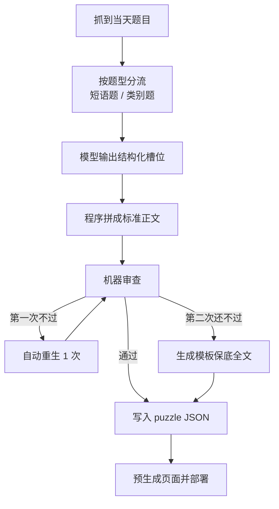

# Pinpoint 内容一次成稿最佳实践（2026-03-17）

这份文档的目标不是追求“模型一次自由发挥就写完美”，而是把
Pinpoint 内容生成做成一条稳定的生产流程：

1. 先生成可控素材
2. 再做机器审查
3. 最后只发布合格成品

---

## 一句话结论

想提高“一次性生成成功”的概率，最有效的办法不是继续堆提示词，
而是把模型的自由度收窄，把页面结构、审查和兜底都做成程序规则。

对于当前站点，推荐长期固定为：

- 单一内容源：`data/puzzles/*.json`
- 按题型分流：短语题 / 类别题
- 模型只填槽位，不直接写整篇
- 程序负责拼正文
- 机器审查不过线就自动重生
- 再不过线就发布模板保底全文
- 正式发布只吃预生成结果，不做运行时临场拼稿

---

## 从对手源码里学到什么

### 已确认的事实

这次参考的是下载下来的对手站前端产物，不是它后台仓库源码：

- `/Users/elng/Downloads/My WangWang /us.sitesucker.mac.sitesucker-pro/pinpointanswer.today/linkedin-pinpoint-answer/pinpoint-662/index.html`
- `/Users/elng/Downloads/My WangWang /us.sitesucker.mac.sitesucker-pro/pinpointanswer.today/_next/static/chunks/app/[locale]/page-11692b21d9e1f443.js`
- `/Users/elng/Downloads/My WangWang /us.sitesucker.mac.sitesucker-pro/pinpointanswer.today/_next/static/chunks/app/[locale]/linkedin-pinpoint-answer/[slug]/page-407ec62a89beeb00.js`

从这些文件能确认：

- 对手是 `Next.js` 站点
- 文章内容是预先准备好，再塞进详情页模板
- 详情页有固定壳子：clue 提示、揭晓答案、长文分析、FAQ、最近文章
- 页面内容是预渲染结果，不像打开页面后再临场找 AI 写文

### 不能过度推断的地方

因为拿到的是部署产物，不是后台仓库，所以不能证明：

- 它具体用哪个模型
- 它后台有没有数据库
- 它的 prompt 长什么样
- 它是不是完全 AI 写稿

所以真正值得学的，不是“猜它用了什么模型”，而是学它的生产方式：

- 内容先成型
- 页面后渲染
- 模板固定
- 发布稳定

---

## 推荐总流程

---

## 生产链路拆分

### 1. 输入层：先判断题型

不要一套模板吃所有题。

最少保留两条：

- 短语题
  - 例如：`Words that come before "roses"`
  - 重点是短语关系、turning point、特殊 clue 的 phrase 恢复
- 类别题
  - 例如：`Types of dolls`
  - 重点是类别归属、为什么属于同类、不要硬写成短语题

如果题型判断错了，后面整篇就容易出现机器味。

### 2. 生成层：模型只填槽位

不要让模型直接写整篇长文。

推荐只让模型交这些结构化字段：

- `hero_intro_spoiler_safe`
- `answer_label`
- `turning_point`
- `false_starts`
- `connector_summary`
- `clue_explanations`
- `difficulty_reason`
- `faq_candidates`

这样做的好处：

- 容易控制首段不剧透
- 容易限制答案重复次数
- 容易统一 FAQ 风格
- 容易做机器审查

### 3. 组装层：程序负责成稿

页面结构不要交给模型决定。

推荐长期固定：

- Hero 段：不剧透，只讲题目为什么容易误判
- Reveal 卡片：第一次明确给答案
- Overview：讲这题为什么会卡
- How I solved it：讲误判和转折，但不要和 Overview 重复
- Clue Table：逐条解释 clue 为什么成立
- Lessons：只保留可迁移的 2 到 3 点
- FAQ：只保留最有搜索意图的问题

这一步的核心目标是：

- 让页面节奏稳定
- 让不同题不会写成完全不同风格
- 让“旧模板味”从页面层被消掉

---

## 机器审查规则

### 必拦问题

以下问题建议直接判为不过线：

- 答案标签不自然
  - 例如：`Types of bicycle`
  - 例如：`Magazines (with global readership / versions)`
- `Puzzle Overview` 和 `How I solved it` 明显重复
- 假误判太假
  - 例如：`Brands of vehicle`
  - 例如：`Types of item`
- FAQ 太空太模板化
- 首段直接透答案
- 类别题写成短语题
- 短语题写成泛泛类别题

### 建议拦截信号

这些问题虽然不一定要一票否决，但建议作为高风险信号：

- Hero 太像营销文案
- turning point 不是具体 clue，而是空话
- 表格里的 example phrase 不自然
- 答案在正文里复读太多次

---

## 自动重生与兜底

### 最佳实践

不要无限重试，也不要第一次不过就直接上线烂稿。

推荐固定为：

1. 初次生成
2. 机器审查
3. 不过线就自动重生 1 次
4. 第二次还不过，就发布模板保底全文

### 为什么要模板保底全文

因为站点需要“当天一定有内容”，但也不能把明显不合格的 AI 长文直接放出去。

模板保底全文的作用是：

- 保证当天页面不是空的
- 保证有完整可读内容
- 避免把明显机器味的自由稿直接上线

这比“只保留快版内容”更适合当前站点需求。

---

## 发布口径

### 建议固定为

- 生成完成不等于可发布
- 通过机器审查才算可发布
- 页面只发布预生成结果
- 发布以 `git push -> Vercel 自动部署` 为准

### 不建议的做法

- 页面运行时临场拼全文
- 不做质量闸门就让 AI 成稿直接上线
- 一边改生成器，一边不跑回归
- 发现不合格稿还硬发全文

---

## 每日自动执行建议

如果不做人审，机器至少要做完这几步：

1. 规范答案标签
2. 判断题型
3. 生成槽位
4. 程序拼稿
5. 自动审查
6. 首次失败自动重生
7. 二次失败自动切模板保底全文
8. 发布合格 JSON
9. 走 Vercel 自动部署

---

## 发布前最低自检

即使已经无人值守，也建议保留一条固定回归命令：

- 日常改动：`npm run test:pinpoint-regression`
- 准备发主线：`npm run test:pinpoint-regression:core`
- 大改生成器：`npm run test:pinpoint-regression:all`

样本集见：

- `docs/content/pinpoint-content-regression-sample-set.md`

---

## 当前站点的推荐执行标准

对当前仓库，建议以后把下面这句话当成默认口径：

不是追求“模型一次写完美”，而是追求“坏稿绝对过不了线，过线稿永远能稳定发布”。

如果只能保留 4 条核心原则，就保留这 4 条：

1. 模型只填槽位
2. 程序负责成稿
3. 审查不过就不直接上 AI 全文
4. 第二次不过就切模板保底全文
