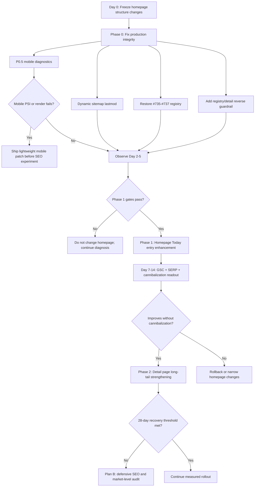

# Homepage Today Answer Strategy Review

> 文档状态：v1.0 批准版  
> 生成日期：2026-05-19  
> 批准日期：2026-05-19  
> 目标站点：`https://pinpointanswertoday.app`  
> 竞品站点：`https://pinpointanswer.today/`  
> 关联方案：`docs/gsc-ranking-recovery-plan-2026-05-19.md`  
> 审批结论：Approved with minor recommendations  
> 审查问题：竞品把首页做成今日答案页，我们为什么不能直接照抄？如果要做，应怎么做、何时做、怎么验收？

---

## Approval Record

审批状态：**Approved**

审批结论：批准按照本文档推荐的「分阶段、保守推进、先修复再实验」策略执行。

批准范围：

1. 批准《Homepage Today Answer Strategy Review》作为 Phase 0-3 的执行依据。
2. 批准“先修生产完整性，再做首页实验”的整体路线。
3. 批准 Phase 0 独立发布，不与首页 title/H1/schema/结构改版混合。
4. 批准 P0.5 移动端诊断作为 Phase 0 并行门槛。
5. 批准后续用 7 天滚动窗口、`query + page + device`、`impressions >= 20` 作为判断口径。

非批准范围：

1. 不批准当前直接复制竞品首页。
2. 不批准当前迁移 URL 结构。
3. 不批准当前新增 QAPage/FAQPage 等高风险 schema 实验。
4. 不批准当前把首页改成详情页克隆。
5. 不批准在未明确下达实现指令前启动代码变更。

执行前置条件：

1. 先启动 PR 1：P0 生产完整性修复。
2. Freeze 首页结构变更，除非 P0.5 移动轻量化补丁被指标触发。
3. 发布前补齐移动端基线：Googlebot Smartphone HTML、URL Inspection Live Test、PSI 或 Lighthouse。
4. 发布前记录 SERP 快照：US mobile/desktop，核心 today query。
5. Phase 0 完成后再按数据门槛决定是否进入 Phase 1。

---

## Executive Summary

一句话结论：**批准分阶段推进，但首要目标是修复数据一致性、移动端可见性和可观测性，不是盲目复制竞品 URL 或把首页做成详情页克隆。**

关键路径：

1. Phase 0 先修生产完整性：动态 sitemap lastmod、`#735/#736/#737` registry 恢复、registry/detail 反向一致性 guardrail、移动端 P0.5 诊断。
2. Phase 1 再做首页 today intent 增强：只有 Phase 0 数据门槛通过，才调整首页首屏、title/description、强详情页链接和工具性模块。
3. Phase 2 强化详情页长尾承接：以 clue/题号 query 增长为目标，不让首页抢走详情页的长尾空间。
4. Phase 3 才测试更激进首页/schema：必须先证明不是移动端性能、SERP feature 或全行业算法波动导致。
5. 28 天仍无恢复时进入 Plan B：内容信任、视频/讨论信号、SERP feature 适配和利基市场降权审计。

Day 0-14 任务流：



---

## 1. 审批结论

**推荐批准：采用“更强首页 Today Answer 入口 + 详情页完整承接”的混合方案。**

**不推荐批准：把首页直接改成详情页克隆，或在当前 P0 技术修复窗口内一次性复制竞品首页。**

这不是说“我们不可以做竞品那种首页”。更准确的判断是：

1. 竞品首页打法是有效方向，值得借鉴。
2. 我们当前已经有首页 today 入口、详情页、归档页和 `/pinpoint/today` 跳转入口，直接改成竞品 URL/内容结构会破坏已有 SEO 契约。
3. 当前 GSC 下滑窗口里还有明确生产缺陷：sitemap 静态页 `lastmod` 过期、`#735/#736/#737` registry 缺失。它们必须先单独修复，但不能被表述为已证实的排名恢复根因。
4. 首页可以更激进地承接 `pinpoint answer today`，但必须和详情页分工清楚：  
   - 首页 `/`：今天是什么、线索是什么、去哪里看完整答案。  
   - 详情页：完整答案、完整解释、题号长尾和 clue 长尾排名。

本方案的核心审批口径改为：

```text
Phase 0 不是“已知根因修复”，而是“生产完整性 + 可观测性修复”。
Phase 1 不是“等 5 天就上线”，而是“Phase 0 数据门槛通过后再上线”。
Phase 2/3 不是“照抄竞品”，而是“基于 SERP、GSC 和 cannibalization 结果做实验”。
```

最终建议：

```text
Day 0-1: 修 P0 生产完整性问题，并补诊断基线，不改首页信息架构。
Day 2-5: 观察抓取、404、sitemap、Googlebot Smartphone HTML、SERP 快照和 GSC 初步方向。
Day 6+: 只有通过 Phase 1 数据门槛，才独立 PR 推首页 Today Answer 增强。
Day 14+: 只有首页/详情页分工没有恶化，才考虑更激进首页主承接实验。
```

---

## 2. 输入来源与可信边界

### 2.1 已使用输入

1. GSC 导出数据：`/Users/elng/Downloads/cursor-469606-0a5db422b4a4.json`
2. 当前修复总方案：`docs/gsc-ranking-recovery-plan-2026-05-19.md`
3. 竞品首页实时抓取：`https://pinpointanswer.today/`，抓取时间 `2026-05-19`
4. 竞品 sitemap 实时抓取：`https://pinpointanswer.today/sitemap.xml`，抓取时间 `2026-05-19`
5. 既有竞品分析文档：`docs/competitor-analysis-pinpointanswer-today-2026-04-26.md`
6. 两个 agent 审查输出：
   - SEO 策略 agent：评估竞品打法、可借鉴点、风险和发布节奏。
   - 技术映射 agent：核对当前仓库 URL、canonical、sitemap、首页模块和详情页模块。

### 2.2 可信边界

- 竞品首页和 sitemap 已实时验证，能确认其当前策略。
- SERP 排名快照不是 rank-tracking，不能当作固定排名证据。
- 本文不是代码实现 PR，不改变站点行为。
- 本文给出的是审批建议和实施边界；具体代码变更应另开 PR。
- PageSpeed Insights API 在本次修订中对首页和最新详情页均 90 秒超时，因此 CWV 仍是待补外部诊断；本文只记录已完成的 Googlebot Smartphone HTML 抽查。

---

## 3. 根因假设与验证矩阵

本方案不能把 sitemap `lastmod` 和 `#735/#736/#737` registry 缺失定性为已知排名根因。它们是已确认生产缺陷，但 5 月 12 日断崖仍需要按假设验证。

### 3.1 当前最合理根因表

| 假设 | 支持证据 | 反证/缺口 | 验证方式 | 时间节点 | 决策影响 |
| --- | --- | --- | --- | --- | --- |
| H1: Google 对 `today answer` query cluster 重新排序 | 首页核心 query 从 9-10 名掉到 44-62 名；移动 impressions 几乎消失 | 缺少 5 月 11 前 SERP 对照 | 固定 US mobile/desktop SERP 快照，记录 top 10 页面类型、AI Overview、PAA、视频/论坛结果 | Day 0、Day 3、Day 7 | 若竞品/媒体/AI Overview 集体上位，Phase 1 首页增强优先级升高 |
| H2: 首页 freshness/trust 信号弱 | 首页 sitemap `lastmod` 停在 2026-04-01；竞品首页 `lastmod` 近当天 | lastmod 早就过期，不能解释 5 月 12 单点触发 | Phase 0 后检查 sitemap、URL Inspection last crawl、Google selected canonical、首页 snippet 是否更新 | Day 1-5 | 若抓取/snippet 不更新，先修 freshness，不做首页大改 |
| H3: registry 断层削弱近期连续性 | `#735/#736/#737` JSON 存在但 registry 缺失，造成 404、sitemap 漏页、归档断层 | 缺失发生在 5 月 7 日，5 月 8-9 仍有恢复迹象 | 恢复三题后检查 200、sitemap、归档、legacy alias、GSC page rows | Day 0-5 | 若 404 清零但排名不恢复，说明它不是主要触发器 |
| H4: 竞品/同类站近期上位 | 当前可见 SERP 中有多个专门站、媒体站和 Reddit 结果；`pinpointanswer.today` 可见，但本次搜索快照不能证明它稳定 top 3 | 缺少竞品历史排名曲线 | 每天保存核心 query SERP top 10，标记竞品页面类型和 title/H1/content pattern | Day 0、Day 3、Day 7、Day 14 | 若竞品结构稳定占优，Phase 1/2 加速 |
| H5: AI Overview 或 SERP feature 吃掉 impressions | puzzle answer 类 query 容易被直接答案/摘要吸收 | 本次没有完成稳定移动 SERP feature 记录 | 手动或 rank tracker 记录 AI Overview、featured snippet、PAA、视频模块 | Day 0-7 | 若 SERP feature 主导，单纯技术修复恢复有限 |
| H6: 移动端渲染/CWV 问题 | 首页移动 impressions 从 1,442 降到 16 | Googlebot Smartphone HTML 当前能看到题号、clues、详情链接；PageSpeed API 超时未完成 | URL Inspection live test、PageSpeed/CrUX、移动截图、HTML 抽查 | Day 0-3 | 若 render/CWV fail，移动修复升为 P0.5，暂停 Phase 1 |
| H7: 首页/详情页 cannibalization | 首页 before 周期已出现 `linkedin pinpoint 735 answer`、`pinpoint #735`、`pinpoint 735` 等题号 query | 样本小，且详情页仍有 clue query 展示 | GSC query+page 交叉表：today query 应归首页，题号/clue query 应归详情页 | Day 0、Day 7、Phase 1 后 Day 7 | 若 cannibalization 已存在，Phase 1 必须收窄首页内容 |
| H8: 整类 puzzle answer 站点被算法降权 | 核心 query position 大幅恶化，不只是 CTR 问题 | 需要竞品同周期数据，无法从本站 GSC 直接验证 | SERP 是否由媒体/官方/UGC 替代小站；观察其他专门站是否同步波动 | Day 0-14 | 若成立，首页小改收益有限，需要内容质量/品牌 trust 升级 |
| H9: 页面有用性不足，被识别为纯 SEO/doorway 风格页面 | 首页有 today intent，但工具性偏弱；竞品首页提供 Play on LinkedIn、reveal、recent answers 等明确任务入口 | 没有直接证据证明 Google 因有用性降权 | 对比竞品移动首屏任务完成路径；检查首页是否提供“看线索、玩游戏、看完整解释、保存/返回”的完整用户任务链 | Phase 1 设计前 | Phase 1 必须加入轻量工具性模块，而不是只堆关键词 |

### 3.2 Phase 0 的真实目标

Phase 0 的目标不是证明“修完就恢复排名”，而是：

1. 消除已确认的生产错误。
2. 恢复 sitemap、registry、归档、详情页之间的一致性。
3. 让后续首页实验具备可归因基线。
4. 如果 Phase 0 后不恢复，可以明确排除“明显生产断层”这一层干扰。

Phase 0 后如果没有恢复，不代表 Phase 0 失败；它只说明排名触发器更可能在 H1/H4/H5/H6/H8。

---

## 4. 竞品现在到底怎么做

截至 `2026-05-19` 抓取，竞品 `pinpointanswer.today` 的首页是明确的 **Today Answer 主承接页**。

### 4.1 首页 metadata

竞品首页：

```text
Title: LinkedIn Pinpoint Answer Today - Daily Answers & Solutions
Canonical: https://pinpointanswer.today/
Robots: index, follow
```

其 description 明确承诺“今日答案、每日更新、线索解释和 tips”。这说明它不是把首页当品牌页或归档页，而是直接用首页抢 `LinkedIn Pinpoint Answer Today` 和 `pinpoint answer today`。

### 4.2 首页 H1 与首屏

竞品首页 H1：

```text
Today's LinkedIn Pinpoint #748 Answer
```

首屏可见内容包括：

- 当天题号：`#748`
- 当天线索：`Butter chicken`、`Vindaloo`、`Palak paneer`、`Naan`、`Biryani`
- 今日答案 reveal 按钮
- 跳转 LinkedIn 游戏的按钮
- 一段解题摘要
- 详情页入口

这套结构的意图很明确：搜索者落到首页后，不需要再判断“这里有没有今天的答案”。首页第一屏直接回答“有，而且是今天这一题”。

### 4.3 首页结构化数据

竞品首页输出了站点级和页面级 JSON-LD：

- `Organization`
- `WebSite`
- `WebPage`
- `FAQPage`
- `ItemList`
- 首页 `WebPage.mainEntity` 绑定当天问题
- `acceptedAnswer.url` 指向当天详情页

这代表它把首页和当天题的语义关系做得很强：

```text
首页 = 今天 LinkedIn Pinpoint #748 的答案入口
详情页 = #748 的完整答案页
```

### 4.4 竞品 sitemap

竞品 sitemap 当前策略：

| URL 类型 | lastmod | changefreq | priority |
| --- | --- | --- | --- |
| `/` | `2026-05-18T07:41:13.249Z` | daily | 1 |
| `/next-pinpoint-preview/` | `2026-05-18T07:41:13.249Z` | daily | 0.8 |
| `/linkedin-pinpoint-answer/` | `2026-05-18T07:41:13.249Z` | daily | 0.8 |
| `/linkedin-pinpoint-answer/pinpoint-748/` | `2026-05-18T07:04:43.000Z` | weekly | 0.7 |
| 历史详情页 | 各自发布时间 | weekly | 0.7 |

这和我们当前最大技术缺陷形成对照：竞品首页和归档页的 `lastmod` 跟随每日更新，而我们当前 `data/static-page-metadata.json` 中首页仍是 `2026-04-01T02:12:46.000Z`，`/puzzles` 是 `2026-03-31T12:59:06.000Z`。

### 4.5 竞品详情页和归档页

竞品详情 URL 形态：

```text
/linkedin-pinpoint-answer/pinpoint-748/
```

首页 recent list 链接最近 20 个详情页，锚文本包含题号：

```text
LinkedIn Pinpoint 748 Answer & Hints
LinkedIn Pinpoint 747 Answer & Hints
...
```

归档页：

```text
/linkedin-pinpoint-answer/
```

这说明竞品不是只有首页一个页面在打关键词。它是三层结构：

```text
/                                抢 today 大词
/linkedin-pinpoint-answer/        承接归档和历史索引
/linkedin-pinpoint-answer/{id}/   承接题号、clue、answer 长尾
```

---

## 5. 竞品为什么可能有效

竞品有效的核心不是“它首页像详情页”，而是它把 `today answer` 搜索意图压得非常明确。

### 5.1 搜索意图对齐强

搜索 `pinpoint answer today` 的用户要的不是品牌介绍，也不是完整归档。他要的是：

1. 今天是哪一题？
2. 今天的 5 个 clue 是什么？
3. 答案能不能马上看到？
4. 如果我想理解答案，有没有完整解释？

竞品首页把这四个问题都放在首屏或首屏后第一模块，因此对 query intent 的匹配很直接。

### 5.2 Freshness 信号一致

竞品的 freshness 信号是多层一致的：

- title 是 today intent。
- H1 带当天题号。
- 可见正文带当天 clues。
- 页面 `dateModified` 接近当天。
- sitemap 首页 `lastmod` 接近当天。
- 首页链接当天详情页。
- ItemList 链接最近 20 个详情页。

Google 不需要猜这个首页今天有没有更新。

### 5.3 首页权重集中

首页通常是站内最强 URL。竞品直接让首页承接最大词：

```text
pinpoint answer today
linkedin pinpoint answer today
pinpoint today
```

详情页再承接：

```text
pinpoint 748 answer
linkedin pinpoint 748 answer
Butter chicken Vindaloo Palak paneer Naan Biryani
```

这套分工本身是合理的。

### 5.4 内链结构清楚

竞品首页不是孤立答案页。它把 today query 和历史详情页串起来：

- 首页首屏给当天详情页强链接。
- 首页 recent list 链最近 20 个详情页。
- sitemap 保持详情页连续。
- 归档页作为列表中心。

这有助于 Google 理解：今天页面、历史页面和归档页面属于同一个稳定集合。

---

## 6. 我们为什么不能直接照抄

答案不是“不能做”，而是“现在不能直接克隆，不能和 P0 修复同批发布，不能破坏现有 URL/canonical 契约”。

### 6.1 当前处在排名下滑窗口，不能混合变量

GSC 已确认：

| 指标 | 2026-05-05 到 2026-05-11 | 2026-05-12 到 2026-05-18 |
| --- | ---: | ---: |
| 全站 impressions | 1,978 | 268 |
| 全站 avg position | 10.94 | 28.28 |
| 首页 impressions | 1,646 | 147 |
| 首页 avg position | 11.66 | 45.02 |

核心 query：

| Query | Before impressions / pos | After impressions / pos |
| --- | --- | --- |
| `pinpoint answer today` | 1,046 / 9.51 | 15 / 48.40 |
| `linkedin pinpoint answer today` | 145 / 10.08 | 10 / 61.70 |
| `pinpoint today` | 115 / 10.44 | 11 / 44.55 |

如果现在同一批发布：

- sitemap `lastmod` 修复
- `#735/#736/#737` registry 恢复
- 首页 title/H1 调整
- 首页首屏重排
- schema 增强
- 内链重排
- 详情页内容增强

那么 7-14 天后无论恢复还是继续掉，都无法判断是哪一个变量起作用。

SEO 修复最怕“同时动太多”。当前必须先恢复可观测性。

### 6.2 当前已有明确 P0 技术缺陷，必须先单独处理

当前生产缺陷：

1. `data/static-page-metadata.json` 中首页 lastmod 停在 `2026-04-01T02:12:46.000Z`。
2. `data/static-page-metadata.json` 中 `/puzzles` lastmod 停在 `2026-03-31T12:59:06.000Z`。
3. `#735/#736/#737` JSON 文件存在，但 registry 缺失，造成生产 404、归档断层和 sitemap 漏页。

这三个问题不一定是 5 月 12 日断崖的单点触发器，但它们是明确负面信号。先修它们，是因为它们确定错误、可验证、可回归。

### 6.3 详情页排名基线不足以无条件支撑分工假设

“首页抢 today 大词、详情页抢题号和 clue 长尾”是推荐架构，不是已经完全被数据证明的事实。

最新 20 个详情页 GSC 基线：

| 周期 | Clicks | Impressions | 说明 |
| --- | ---: | ---: | --- |
| 2026-05-05 到 2026-05-11 | 1 | 266 | 主要集中在 `#741`，255 impressions / pos 6.61 |
| 2026-05-12 到 2026-05-18 | 0 | 102 | 主要来自 `#742`、`#748`、`#743` 的 clue query |

After 周期详情页样本：

| Detail URL | Impressions | Avg position | Top query pattern |
| --- | ---: | ---: | --- |
| `/linkedin-pinpoint-answers/pinpoint-answer-742/` | 49 | 7.82 | `pinpoint scale beaker`、`scale beaker pinpoint` |
| `/linkedin-pinpoint-answers/pinpoint-answer-748/` | 20 | 7.80 | `butter chicken vindaloo pinpoint`、完整 clue 组合 |
| `/linkedin-pinpoint-answers/pinpoint-answer-743/` | 17 | 5.00 | `magic flute carmen pinpoint` |

对 `#748` 的细分：

| Query | Impressions | Avg position |
| --- | ---: | ---: |
| `butter chicken vindaloo pinpoint` | 7 | 9.00 |
| `butter chicken vindaloo palak paneer naan biryani` | 6 | 7.83 |
| `vindaloo butter chicken pinpoint` | 3 | 8.00 |
| `butter chicken pinpoint` | 1 | 3.00 |

结论：

- 详情页确实能拿到 clue 组合 query 的少量展示，位置并不差。
- 但详情页 impressions 规模很小，不能假设它已经稳固承接所有题号长尾。
- Phase 1 首页增强时，必须监控是否让详情页这部分 clue query 消失。
- Phase 2 详情页增强不能只是“补模块”，还要以扩大 clue/题号 query 覆盖为目标。

### 6.4 我们的 URL 体系和竞品不同

当前仓库路由：

| 类型 | 当前 URL |
| --- | --- |
| 首页 | `/` |
| 归档 | `/puzzles` |
| 详情页 | `/linkedin-pinpoint-answers/{slug}/` |
| 当前详情示例 | `/linkedin-pinpoint-answers/pinpoint-answer-748/` |
| today 跳转入口 | `/pinpoint/today` |

竞品路由：

| 类型 | 竞品 URL |
| --- | --- |
| 首页 | `/` |
| 归档 | `/linkedin-pinpoint-answer/` |
| 详情页 | `/linkedin-pinpoint-answer/pinpoint-748/` |

不建议为模仿竞品迁移 URL。原因：

- 当前详情页已 self-canonical 到 `/linkedin-pinpoint-answers/{slug}/`。
- `/puzzles` 已是归档 canonical。
- `/pinpoint/today` 已作为动态跳转入口，正式状态下 307 到当前详情页。
- 大规模 URL 迁移会带来 redirect、canonical、sitemap、历史索引和 GSC 数据口径重置风险。

我们可以学习竞品的信息架构，不需要复制它的 URL。

### 6.5 首页和详情页直接重复会制造 cannibalization

如果首页也放完整答案分析、完整 hint ladder、完整 clue-by-clue explanation、完整 FAQ，首页和详情页会争同一组 query：

```text
linkedin pinpoint 748 answer
pinpoint 748 answer
Butter chicken Vindaloo Palak paneer Naan Biryani
```

这会导致 Google 不确定该排名的是首页还是详情页。对一个已经处于下滑窗口的站点，这会增加不稳定性。

更稳的分工是：

| Query 类型 | 推荐承接页 |
| --- | --- |
| `pinpoint answer today` | 首页 |
| `linkedin pinpoint answer today` | 首页 |
| `pinpoint today` | 首页 |
| `pinpoint 748 answer` | 详情页 |
| `linkedin pinpoint 748 answer` | 详情页 |
| clue 组合词 | 详情页 |
| `all linkedin pinpoint answers` | 归档页 |
| `next pinpoint answer` | 预告页 |

当前首页已经存在轻微 cannibalization 信号。Before 周期首页 top query 中出现：

| 首页 query | Impressions | Avg position |
| --- | ---: | ---: |
| `linkedin pinpoint 735 answer` | 1 | 12.00 |
| `pinpoint #735` | 4 | 7.25 |
| `pinpoint 735` | 4 | 8.00 |
| `crown case dial pinpoint` | 2 | 18.00 |

这些样本很小，不足以判定严重内耗，但说明首页已经会承接一部分题号/clue 查询。Phase 1 首页增强必须避免进一步扩大这种重叠。

### 6.6 竞品 schema 不能无验证照搬

竞品首页把当天问题放进 `WebPage.mainEntity`，并通过 `acceptedAnswer` 指向详情页。这对它可能有效，但对我们不能直接复制，原因是：

- 首页可见内容、隐藏内容和 structured data 必须严格一致。
- 如果 answer 在 schema 中暴露，但页面上默认 spoiler-safe 隐藏，存在一致性边界问题。
- `FAQPage` rich result 对普通站点价值有限，Google 当前对 FAQ 富结果展示非常克制。
- 大规模 schema 调整会成为另一个不可归因变量。

建议：

```text
Phase 1: 不新增 QAPage，不新增 FAQPage，不把答案塞进首页 schema。
Phase 2: 只在可见内容和 schema 一致性验证通过后，测试 WebPage.mainEntity 指向当天详情页。
```

### 6.7 竞品当前排名未被完整验证

本文已验证竞品结构，但没有竞品 GSC，因此不能验证它在 5 月 12 日前后的排名曲线。搜索快照只能说明它是当前可见强相关竞争者，不能证明“它是 5 月 12 日后才超过我们”。

本次 `2026-05-19` 搜索快照观察到的强相关结果包括：

| Query snapshot | 可见结果类型 | 备注 |
| --- | --- | --- |
| `pinpoint answer today` | `linkedin-pinpoint-answers.today`、`linkedinanswer.today`、`linkedinpinpointanswer.today`、The Word Finder、`pinpointanswertoday.online`、Try Hard Guides、Reddit | 多个专门站和媒体页都在抢 today intent |
| `linkedin pinpoint answer today` | The Word Finder、Try Hard Guides、同类专门站、Reddit | 说明竞争不只是一个站点 |
| `site:pinpointanswer.today pinpoint answer today` | `pinpointanswer.today` 首页和详情页可被检索 | 说明竞品可见，但不能据此判断排名稳定性 |

这个快照支持“SERP 竞争格局已拥挤”的判断，不足以支持“`pinpointanswer.today` 一定是当前 top 3 且已稳定压过我们”的判断。

后续必须补：

1. 固定地区和设备的 SERP top 10：
   - US mobile
   - US desktop
   - query: `pinpoint answer today`
   - query: `linkedin pinpoint answer today`
   - query: `pinpoint today answer`
2. 记录每个结果：
   - URL
   - title
   - 页面类型：首页/详情页/归档页/媒体页/UGC
   - 是否出现 AI Overview、PAA、视频、论坛模块
3. 连续观察：
   - Day 0
   - Day 3
   - Day 7
   - Day 14

如果竞品也在波动，说明当前问题更像 SERP/算法重排；如果竞品稳定 top 3，则首页 today intent 对齐更可能是差距来源。

### 6.8 竞品自身也不是完美范式

竞品首页存在一些不能直接照抄的点：

- 广告和交互模块较重，可能影响移动体验。
- 首页也有 FAQ、recent list、benefits 等大量模板内容，存在模板化风险。
- 部分内容表达偏激进，可能牺牲品牌可信度。
- 答案 reveal 默认隐藏，对“答案词是否可被 HTML/渲染内容稳定识别”仍有风险。

竞品能排名，不代表每个实现细节都该复制。

---

## 7. 我们当前其实已经做了哪些

技术 agent 对当前仓库检查后确认：我们不是完全没有 today 首页承接。

### 7.1 当前首页已具备 today 入口

当前首页模块位于：

- `app/(site)/(home)/page.tsx`
- `components/home/HomeHero.tsx`
- `components/home/HomeRevealSection.tsx`
- `components/home/HomeRecentAnswers.tsx`
- `components/home/HomeCtaFooter.tsx`

当前首页已经有：

- H1：`Today's LinkedIn Pinpoint #${puzzle.number} Answer`
- Hero CTA：链接当前详情页
- Reveal 区：显示 today clues、hints、answer reveal
- Today 卡片：链接当前详情页
- Recent answers
- Archive 入口
- Pro Tips / next puzzle 入口

所以问题不是“首页完全没打 today”。问题是：

1. 首页 metadata title 仍较通用：`LinkedIn Pinpoint Answer Today | Hints & Solution`。
2. sitemap 静态 lastmod 没跟每日 puzzle 更新。
3. 首页首屏还承载了品牌、bookmark、badge 等非 today 权重元素。
4. 可见 trust/freshness 信号不如竞品强。
5. schema 没把首页与当天 puzzle 建立足够清晰的关系。

### 7.2 当前详情页已具备完整承接框架

详情页位于：

- `app/(detail)/linkedin-pinpoint-answers/[slug]/page.tsx`
- `components/detail/PuzzleDetail.tsx`
- `components/detail/PuzzleFullAnalysis.tsx`

当前详情页已有：

- 自指 canonical
- article metadata
- H1
- 发布/更新日期
- answer reveal
- full analysis
- adjacent prev/next
- recent answer links
- latest answer CTA

因此不应把首页改成详情页克隆。更好的方向是增强详情页内容质量，同时让首页给详情页更强的内部链接和今日入口信号。

---

## 8. 推荐架构

### 8.1 首页 `/`

定位：**今日答案入口 + 站点权重 Hub**。

首页应该负责：

- 直接承接 `pinpoint answer today`
- 显示当天题号
- 显示当天日期
- 显示 5 个 clues
- 显示 spoiler-safe hint / reveal answer 卡
- 提供当前详情页强链接
- 提供最近 7-20 个答案入口
- 提供归档页入口
- 提供简短 trust / verification 说明
- 提供简短 FAQ，但避免和详情页重复

首页不应该负责：

- 完整答案长文
- 完整 clue-by-clue explanation
- 完整 hint ladder
- 与详情页完全相同的 FAQ
- 与详情页完全相同的 title/H1
- 题号长尾的主要排名

首页必须补一个“工具性”模块，避免页面只像 SEO 文案堆叠。这个模块不追求复杂，目标是让用户在首页完成真实任务。

推荐工具性模块：

| 模块 | 内容 | SEO/UX 目的 |
| --- | --- | --- |
| Today Quick Actions | `View full answer`、`Play on LinkedIn`、`Browse archive` 三个明确入口 | 让用户快速完成“查答案/去玩/看历史”任务 |
| Difficulty signal | 今日题难度、可能误导方向、推荐先看第几条 clue | 提升页面独特价值，不只是复述答案 |
| Spoiler-safe progress | `Show hint 1`、`Show stronger hint`、`Reveal answer` 渐进式层级 | 满足不想被直接剧透的用户 |
| Verification note | `Last checked`、数据来源和更正入口 | 强化可信度和 freshness |

Phase 1 的首页增强必须至少包含 `Today Quick Actions` 和 `Verification note`。如果只改 title/H1/关键词，不批准上线。

推荐 title：

```text
LinkedIn Pinpoint Answer Today - Daily Hints & Archive
```

更激进的测试 title：

```text
LinkedIn Pinpoint #748 Answer Today - Daily Hints
```

推荐 H1：

```text
Today's LinkedIn Pinpoint #748 Answer
```

推荐首屏 CTA：

```text
View Full Answer & Hints
```

推荐强链接 anchor：

```text
Today's LinkedIn Pinpoint #748 Answer and Hints
```

### 8.2 详情页 `/linkedin-pinpoint-answers/pinpoint-answer-748/`

定位：**具体题号 SEO 主战场**。

详情页必须负责：

- 题号
- 日期
- 5 个 clues
- 最终答案
- hint ladder
- clue-by-clue explanation
- 解题思路
- FAQ
- 上一题/下一题
- 返回归档页
- 返回今日答案入口

详情页内容质量标准：

| 模块 | 最低标准 |
| --- | --- |
| Overview | 80-120 words，先说明这题为什么容易误判，再给解决方向 |
| Clue-by-clue explanation | 5 条 clue 全覆盖，每条解释必须说明“为什么它指向答案”，不能只复述 clue |
| Hint ladder | 至少 3 层，按 spoiler 程度递进，第一层不泄露答案 |
| Wrong paths / disambiguation | 至少 2 个可能误读方向，说明为什么排除 |
| FAQ | 2-4 条，优先围绕本题主题或用户搜索意图，不复用首页泛 FAQ |
| Internal links | previous、next、archive、today answer 四类链接齐全 |
| SEO title/description | 题号 + 主要 clues 可见，避免与首页 title 完全重合 |

推荐 title：

```text
LinkedIn Pinpoint #748 Answer Today - May 18, 2026
```

或 clue 长尾 title：

```text
LinkedIn Pinpoint 748 Answer: Butter Chicken, Vindaloo, Palak Paneer, Naan, Biryani
```

推荐 H1：

```text
LinkedIn Pinpoint #748 Answer and Hints
```

### 8.3 归档页 `/puzzles`

定位：**索引页 + 内链中心**。

归档页应该负责：

- 所有题号列表
- 按月份分组
- 最新题目置顶
- 每题显示题号、日期、clue 摘要
- 链接到详情页

推荐 title：

```text
All LinkedIn Pinpoint Answers - Daily Archive
```

注意：竞品归档是 `/linkedin-pinpoint-answer/`，我们不建议迁移。当前 `/puzzles` 继续作为 canonical。

### 8.4 预告页 `/next-pinpoint-preview`

定位：**next / tomorrow / preview 查询**。

可以继续保留：

- 下一题倒计时
- 常见解题模式
- 最近答案入口
- 订阅/提醒入口

---

## 9. 分阶段执行方案

### Phase 0：P0 生产完整性修复，单独发布

推荐：**批准，立即做。**

范围：

1. 修复首页和归档页 sitemap `lastmod`：
   - 首页 lastmod 应跟随当前 live puzzle 更新时间或每日生成时间。
   - `/puzzles` lastmod 应跟随最新 archive entry 更新时间。
   - 修复方式必须是持续机制，不接受只手动改 `data/static-page-metadata.json` 一次。
2. 恢复 `#735/#736/#737` registry entries：
   - 确保详情页 200。
   - 确保进入 sitemap。
   - 确保归档页可见。
   - 确保 date/number alias 不再 404。
3. 补 registry/detail 反向一致性 guardrail：
   - 当前 `validate:data` 只检查 registry 条目都有详情 JSON。
   - 它没有检查“所有公开 detail JSON 都必须在 registry 中存在”。
   - Phase 0 必须补这个反向检查，否则 749/750 仍可能复发。
4. 发布后用 URL Inspection 抽查：
   - `/`
   - `/puzzles`
   - `/linkedin-pinpoint-answers/pinpoint-answer-735/`
   - `/linkedin-pinpoint-answers/pinpoint-answer-736/`
   - `/linkedin-pinpoint-answers/pinpoint-answer-737/`
   - 最新详情页

#### Phase 0-A：sitemap lastmod 机制

当前 `app/sitemap.ts` 对静态入口调用 `getStaticRouteLastModified()`，而 `data/static-page-metadata.json` 只基于静态源文件 git commit 时间生成。因此首页和归档页即使每天内容变了，lastmod 也不会跟随当前 puzzle 更新。

推荐实现机制：

| URL | lastmod 来源 | 理由 |
| --- | --- | --- |
| `/` | `currentPuzzle.updatedAt`，fallback 到 `currentPuzzle.publishDate` | 首页内容每天由 live puzzle 驱动 |
| `/puzzles` | 最新 archive/live entry 的 `updatedAt`，fallback 到最新 `publishDate` | 归档页内容每天新增/变更 |
| `/next-pinpoint-preview` | preview 更新时间或当前 live puzzle 更新时间 | 倒计时/预告会随每日题变化 |
| 非动态静态页 | 继续使用 `data/static-page-metadata.json` | About/legal 不需要每日更新 |

不推荐：

```text
手动把 data/static-page-metadata.json 里的 / 和 /puzzles 改成今天。
```

原因：明天新题发布后会再次过期，P0 没有真正修复。

#### Phase 0-B：#735/#736/#737 缺失原因

已确认：

- `f5a67b8 fix: deprecate fullAnalysis field, migrate all data to articleBlocks` 修改了大量详情 JSON。
- 同一 commit 中 `data/puzzles/registry.json` 从 `#737/#736/#735/#734` 变成只剩 `#734`，该文件 diff 显示 61 行变更，删除了三条 registry entry。
- `#735/#736/#737` 的详情 JSON 仍存在，且 `detailState=published`、`bodyMode=standard`。
- 后续 `46429a0 Refresh Pinpoint content and legacy routing` 之后 registry 包含 `#742/#741/#740/#739/#738/#734`，仍缺 `#735/#736/#737`。

当前最可能原因：一次内容迁移/合并时 registry 被旧快照覆盖或手动裁剪，而不是每日发布 pipeline 对所有新题持续失效。理由是 `#738` 之后的 `#739-#748` 都能继续进入 registry。

但这仍暴露 pipeline/CI 缺口：

```text
允许 data/puzzles/pinpoint-answer-735.json 存在且公开，但 registry.json 缺条。
```

Phase 0 必须补：

1. 恢复三条 registry entry。
2. 增加反向一致性校验。
3. 校验最近 30 天 puzzle number 是否连续，除非明确有 allowlist。

不做：

- 不改首页 H1/title。
- 不改首页布局。
- 不改 schema。
- 不改详情 URL。

验收：

| 项目 | 标准 |
| --- | --- |
| sitemap 首页 lastmod | 不早于最新 live puzzle 更新时间 |
| sitemap 归档 lastmod | 不早于最新 archive 更新时间 |
| #735/#736/#737 | 详情页全部 200 |
| registry | 三题全部出现 |
| sitemap | 三题全部出现 |
| 归档页 | 三题全部可见 |
| canonical | 自指或既定 canonical 正常 |
| validate:data | 能拦截“公开 JSON 存在但 registry 缺条” |
| 最近 30 天编号 | 连续或有显式 allowlist |

Phase 0 发布后的判断：

| 观察结果 | 解释 | 下一步 |
| --- | --- | --- |
| 404/sitemap 修复，首页 query 仍不恢复 | P0 不是主要排名触发器 | 按 H1/H4/H5/H6 继续诊断，准备 Phase 1 |
| 404/sitemap 修复，首页 query 有明显恢复 | 生产完整性/freshness 是重要放大因素 | 继续观察，不急于 Phase 1 大改 |
| 404 未清零或 sitemap 仍缺页 | Phase 0 未完成 | 不进入 Phase 1 |
| Googlebot Smartphone 看不到核心内容 | 移动渲染升为 P0.5 | 暂停首页策略实验 |
| PSI mobile performance < 50 或 LCP > 2.5s | 移动性能升为 P0.5 | 先发轻量化补丁，再讨论首页 SEO 改版 |
| 竞品移动首屏明显更轻，且我们 JS/交互阻塞首屏 | 移动 UX/性能可能是放大因素 | Phase 0 加入首页首屏轻量化补丁 |

#### Phase 0-C：移动端 P0.5 硬指标与轻量化分支

移动端 impressions 从 1,442 降到 16，不能只作为“Phase 1 前检查项”。它必须成为 Phase 0 的并行诊断。

Phase 0 必须完成以下对比：

| 检查项 | 我们 | 竞品 | 判定 |
| --- | --- | --- | --- |
| Mobile HTML 首屏是否含题号/clues/详情链接 | 已完成初查：有 | 待补截图/HTML 摘要 | 若我们缺核心内容，直接 P0.5 |
| 首屏 JS 依赖 | 检查 `HomeRevealSection`、answer reveal、analytics、badge wall 是否阻塞首屏 | 抓竞品首页 HTML/JS bundle 数量和首屏 DOM | 若我们首屏依赖显著更重，先轻量化 |
| PSI mobile performance | 本次 API 90 秒超时，待补 | 待补 | < 50 触发强制轻量化 |
| LCP | 待补 PSI/CrUX | 待补 | > 2.5s 触发强制轻量化 |
| CLS | 待补 PSI/CrUX | 待补 | > 0.1 触发布局稳定性修复 |
| INP/TBT | 待补 PSI/CrUX 或 Lighthouse | 待补 | INP > 200ms 或 TBT > 300ms 触发交互瘦身 |

强制轻量化补丁范围：

1. 首页首屏只保留 SSR 可见的题号、日期、5 clues、详情页链接和 Play on LinkedIn 链接。
2. `HomeRevealSection` 的交互逻辑延后到首屏之后或保持 progressive enhancement。
3. 首屏不加载非必要的 badge wall、重型 analytics、广告、动画和非关键组件。
4. 详情页强链接必须是普通 `<a>`/`Link`，不能依赖点击 reveal 后才生成。
5. 保留现有 title/H1/schema，不把轻量化补丁和 SEO 文案改版混在一起。

轻量化验收：

| 指标 | 目标 |
| --- | --- |
| PSI mobile performance | >= 50 才允许进入 Phase 1；>= 70 为推荐进入 |
| LCP | <= 2.5s |
| CLS | <= 0.1 |
| INP 或 TBT 替代指标 | INP <= 200ms；没有 INP 时 TBT <= 300ms |
| Googlebot Smartphone HTML | 题号、日期/更新信息、5 clues、详情链接可见 |

### Phase 1：轻量首页 Today Answer 增强

推荐：**有条件批准。必须同时满足时间门槛和数据门槛，不能只等 5 天。**

Phase 1 触发条件：

| 条件 | 必须达到的标准 |
| --- | --- |
| 时间 | Phase 0 发布后至少 5 个完整自然日 |
| 生产完整性 | `#735/#736/#737` 详情页 200，sitemap/归档/legacy alias 均可见 |
| sitemap | `/` 和 `/puzzles` lastmod 不早于最新 live puzzle 更新时间 |
| Googlebot Smartphone HTML | 首页能看到题号、日期或更新信息、5 clues、详情页链接 |
| GSC 方向 | 首页核心 query 没有继续恶化超过 20 名；或 impressions 未继续下跌超过 50% |
| 详情页保护 | 最新 10 个详情页合计 impressions 未在 Phase 0 后继续下跌超过 50% |
| SERP | 已记录至少 2 次固定 query SERP 快照 |
| 移动性能 | PSI mobile >= 50 且 LCP <= 2.5s；若 PSI 继续超时，必须有 Lighthouse mobile 替代结果 |
| 统计样本 | 核心判断只使用 impressions >= 20 的 query/page 组合；低于该值只做观察 |

目标：让首页更像竞品一样明确承接 today intent，但不复制详情页完整内容。

建议变更：

1. 首页 title 从通用表达改为更明确 today 表达：

   ```text
   LinkedIn Pinpoint Answer Today - Daily Hints & Archive
   ```

2. 首页 description 保持动态题号：

   ```text
   Today's LinkedIn Pinpoint answer is Puzzle #748. View the clues, spoiler-safe hints, and full answer breakdown.
   ```

3. 首页首屏保留动态 H1：

   ```text
   Today's LinkedIn Pinpoint #748 Answer
   ```

4. 首屏直接显示：
   - 日期
   - 题号
   - 5 个 clues
   - hint/reveal card
   - full answer CTA
   - last verified / updated

5. 将非 today 目标模块下沉：
   - badge wall 下沉或移出首页
   - general benefits 下沉
   - archive/pro tips 不抢首屏

6. 首页到详情页的 anchor 改为强语义：

   ```text
   Today's LinkedIn Pinpoint #748 Answer and Hints
   ```

7. 新增轻量工具性模块：
   - `Play on LinkedIn`
   - `View full answer`
   - `Browse archive`
   - `Last checked`
   - 今日难度或 spoiler-safe hint progression

不做：

- 不迁移 URL。
- 不让首页 canonical 到详情页。
- 不让详情页 canonical 到首页。
- 不把完整分析复制到首页。
- 不新增 QAPage。
- 不新增 FAQPage，除非可见内容和 structured data 已逐项匹配。

验收：

| 项目 | 标准 |
| --- | --- |
| Mobile HTML | 题号、日期、5 clues、详情页强链接可见 |
| Googlebot Smartphone render | 核心内容可见 |
| 首页 canonical | 仍指向 `/` |
| 详情页 canonical | 仍指向自身 |
| 首页到详情页链接 | SSR 可见，不依赖点击后生成 |
| 首屏意图 | 不再被品牌/徽章/泛介绍稀释 |

### Phase 2：详情页完整承接增强

推荐：**批准，和 Phase 1 可并行设计，但分 PR 发布。**

目标：确保详情页能赢题号和 clue 长尾，而不是被首页抢掉。

建议变更：

1. 详情页 H1 保持题号聚焦：

   ```text
   LinkedIn Pinpoint #748 Answer and Hints
   ```

2. 详情页上方明确显示：
   - `Published`
   - `Updated`
   - `Verified`
   - answer reveal
   - all clues

3. 增强完整解释：
   - why each clue fits
   - wrong paths / disambiguation
   - hint ladder
   - answer category
   - previous/next

4. 详情页底部强化内链：
   - 返回 today answer
   - 返回 archive
   - previous/next
   - recent 10 answers

验收：

| Query 类型 | 目标 URL |
| --- | --- |
| `pinpoint 748 answer` | 详情页 |
| `linkedin pinpoint 748 answer` | 详情页 |
| clue 组合词 | 详情页 |
| `pinpoint answer today` | 首页 |

数据验收：

| 指标 | 目标 |
| --- | --- |
| 最新 10 个详情页 clue query impressions | Phase 2 后 14 天不低于 Phase 1 前基线 |
| 最新详情页题号/clue query avg position | 有展示 query 的平均位置维持在前 10-15，或 impressions 增长 |
| 首页承接题号 query 占比 | 不超过首页总 impressions 的 15%，否则疑似 cannibalization |

### Phase 3：首页更激进主承接实验

推荐：**暂不批准本轮执行，只批准准备实验设计。**

触发条件：

- Phase 0 后 5-7 天，抓取和 404 已恢复。
- Phase 1 后 7-14 天，首页 query 没有继续恶化。
- 移动端 GSC / URL Inspection / render 没有发现首页核心内容缺失。
- 详情页仍能拿题号长尾，不被首页明显 cannibalize。

可测试内容：

- 首页 title 动态带当天题号。
- 首页 `WebPage.mainEntity` 指向当天详情页。
- 首页添加 `ItemList` recent answers。
- 首页更强地展示 today answer module。

仍不建议：

- 首页复制完整详情页正文。
- 首页复制完整详情页 FAQ。
- URL 迁移到竞品路径。
- 大规模 schema 一次性上线。

---

## 10. Cannibalization 监控

首页增强后，必须监控首页和详情页是否互相抢 query。

### 10.1 监控维度

GSC 维度固定为：

```text
query + page + device + country + date
```

核心 URL：

- `/`
- `/puzzles`
- `/next-pinpoint-preview`
- 最新 10 个详情页
- `#735/#736/#737`

核心 query：

- `pinpoint answer today`
- `linkedin pinpoint answer today`
- `pinpoint today`
- `pinpoint today answer`
- `pinpoint 748 answer`
- `linkedin pinpoint 748 answer`
- 当天 5 个 clues 的组合词

### 10.2 正常状态

正常状态应该是：

| Query | 首页表现 | 详情页表现 | 量化标准 |
| --- | --- | --- | --- |
| `pinpoint answer today` | 主承接 | 辅助 | 首页拿到该 query impressions 的 70%+ |
| `linkedin pinpoint answer today` | 主承接 | 辅助 | 首页拿到该 query impressions 的 70%+ |
| `pinpoint 748 answer` | 辅助或无 | 主承接 | 详情页拿到该 query impressions 的 70%+ |
| clue 组合词 | 辅助或无 | 主承接 | 详情页拿到 clue query impressions 的 70%+ |

如果样本低于 20 impressions，不做强判定，只记录趋势。

### 10.3 统计口径与噪声控制

GSC 小样本噪声很大，不能把 1-10 impressions 的波动当成方向性结论。

统一统计口径：

| 规则 | 标准 |
| --- | --- |
| 观察窗口 | 发布后至少 7 个完整自然日；主要决策使用 7 天滚动窗口 |
| 周期对比 | 优先同星期结构对比，例如 Mon-Sun vs Mon-Sun，避免周末/工作日错配 |
| query/page 最小样本 | impressions >= 20 才做方向性判断；< 20 只记录，不触发回滚或加速 |
| 核心 query 汇总 | `pinpoint answer today`、`linkedin pinpoint answer today`、`pinpoint today`、`pinpoint answers today` 合并观察 |
| 设备维度 | 移动端单独看；desktop 恢复不能替代 mobile 恢复 |
| 国家维度 | US 为主；样本不足时看 US + UK + CA + AU，但需单独标注 |
| 异常日处理 | 若遇到 Google 状态事故、站点 downtime、部署失败或抓取异常，当天不作为趋势判断 |
| bot/异常流量 | GSC 本身不提供 bot 过滤；用 server log/GA4 只做辅助，不把异常访问当 SEO 恢复 |

Phase 1 后读数：

| 时间点 | 看什么 | 不看什么 |
| --- | --- | --- |
| Day 1-3 | 抓取、server log、URL Inspection、HTML、404、sitemap | 不用 GSC 判断排名成败 |
| Day 4-7 | GSC 初步方向，只看核心 query 聚合和 page/device 趋势 | 不解读单个低样本 query |
| Day 8-14 | 是否继续 Phase 2 或回滚 | 不因单日波动改策略 |

### 10.4 异常状态

需要警惕：

1. 首页和详情页同时排名同一题号 query，且位置都低。
2. 首页拿走 `pinpoint 748 answer`，但详情页 impressions 消失。
3. 详情页拿 today 大词，但首页 impressions 没恢复。
4. 首页增强后 mobile impressions 继续下降，详情页没有补偿增长。

### 10.5 回滚条件

满足任一条件，应回滚 Phase 1 首页增强或暂停 Phase 2/3：

| 条件 | 动作 |
| --- | --- |
| 首页改版后 7 天内 mobile impressions 继续下降超过 50%，详情页无对应增长 | 回滚首页首屏/metadata 改动 |
| 首页核心 query avg position 再恶化 20 名以上 | 回滚首页 title/H1/schema 变更 |
| URL Inspection 显示 Googlebot Smartphone 看不到题号、日期、clues、详情链接 | 修移动渲染，暂停 SEO 文案实验 |
| 首页和详情页同 query cannibalization 明显 | 收窄首页内容，强化详情页主承接 |
| title/H1/可见日期/schema 日期不一致 | 立即修 schema/metadata，不继续发布 |

---

## 11. 移动端专项要求

这次下滑最大缺口来自移动端。首页策略调整前，必须把移动端作为单独审批项。

已知数据：

| Device | 2026-05-05 到 2026-05-11 | 2026-05-12 到 2026-05-18 |
| --- | --- | --- |
| Mobile homepage | 1,442 impressions / pos 9.34 | 16 impressions / pos 14.31 |
| Desktop homepage | 133 impressions / pos 34.76 | 105 impressions / pos 55.49 |

解释：移动端不是简单排名小幅下降，而是首页几乎不再进入可产生 impression 的移动结果集。

### 11.1 已完成的移动端 HTML 抽查

抓取方式：Googlebot Smartphone UA 直接请求生产 URL。

| URL | 结果 |
| --- | --- |
| `/` | HTML 中能看到 `#748`、`Butter chicken`、详情页链接、H1 |
| `/linkedin-pinpoint-answers/pinpoint-answer-748/` | HTML 中能看到 `#748`、`Butter chicken`、`Indian foods`、自指 canonical |

初步判断：

- 当前没有证据表明 Googlebot Smartphone 完全看不到首页核心内容。
- 这不能替代 URL Inspection live test，因为 Search Console 的渲染、截图和 indexed HTML 更接近 Google 实际处理。

### 11.2 仍未完成的移动诊断

PageSpeed Insights mobile API 本次对首页和最新详情页均 90 秒超时，未拿到 PSI 分数。不能把“移动性能没问题”写成结论。

Phase 0 同优先级必须补：

1. PageSpeed Insights mobile：
   - `/`
   - 最新详情页
   - `/puzzles`
2. URL Inspection mobile render：
   - 首页题号是否可见
   - 日期是否可见
   - 5 clues 是否可见
   - 详情页链接是否 SSR 可见
   - answer/hint 区块是否可见
3. 移动 SERP 快照：
   - US mobile
   - `pinpoint answer today`
   - `linkedin pinpoint answer today`
   - `pinpoint today`
4. 首页 mobile 截图留档：
   - before Phase 1
   - after Phase 1

如果移动端 CWV 或渲染失败，首页信息架构改版暂停，先修移动问题。

---

## 12. 具体审批清单

| 审批项 | 推荐 | 理由 |
| --- | --- | --- |
| P0 sitemap `lastmod` 修复 | 批准 | 明确生产缺陷，且竞品每天更新首页/归档 lastmod |
| P0 恢复 `#735/#736/#737` registry | 批准 | 明确 404/漏页/归档断层 |
| P0 增加 registry/detail 反向一致性校验 | 批准 | 不补 guardrail，749/750 仍可能复发 |
| P0 移动端 HTML/URL Inspection 抽查 | 批准 | 移动端是最大损失来源，不能推迟到 Phase 1 |
| P0.5 移动轻量化补丁 | 条件批准 | PSI mobile < 50、LCP > 2.5s、或首屏 JS 阻塞明显时强制执行 |
| Day 0 直接复制竞品首页 | 不批准 | 混合变量，无法归因，且 cannibalization 风险高 |
| 首页 stronger today entry | 批准，但延后 | 方向正确，但应在 P0 修复后至少 5 天独立发布 |
| 首页动态 H1 带题号 | 批准 | 当前已有，保留并强化日期/线索支撑 |
| 首页 title 改成 today intent | 批准，但放 Phase 1 | 需要独立观察，避免和 P0 混批 |
| 首页展示 5 clues | 批准 | 对 today query intent 有帮助 |
| 首页工具性模块 | 批准，Phase 1 必做 | 避免纯 SEO 页面风险，补用户任务完成路径 |
| 首页展示完整分析长文 | 不批准本轮 | 会和详情页争题号/线索长尾 |
| 首页新增 QAPage | 不批准本轮 | 结构化数据一致性和富结果价值不确定 |
| 首页新增 ItemList recent answers | Phase 2 可批准 | 低风险，但仍建议独立发布 |
| 保留详情页 self-canonical | 批准 | 这是现有 SEO 契约 |
| 保留 `/puzzles` 作为归档 canonical | 批准 | 避免 URL 迁移风险 |
| 迁移到竞品 URL 形态 | 不批准 | 代价高，收益不确定 |
| 每次发布保留 SERP/HTML/mobile 截图 | 批准 | 为归因和回滚提供证据 |
| 7 天滚动窗口统计口径 | 批准 | 避免用低样本单日波动做错误决策 |
| 28 天无恢复后的升级路径 | 批准 | 避免“再等等看” |
| Plan B 防御性 SEO | 批准准备，不本轮执行 | 28 天无恢复或回滚无效后使用 |

---

## 13. 如果 28 天仍不恢复

如果 Phase 0 和 Phase 1 后 28 天仍没有恢复，不继续盲目等。

### 13.1 判定标准

满足以下任一项，即视为未恢复：

- 首页 `pinpoint answer today` impressions 仍低于 5 月 5-11 基线的 30%。
- 首页 mobile impressions 仍低于 5 月 5-11 基线的 30%。
- 首页核心 query avg position 仍差于 30。
- 详情页没有拿到题号 query 的补偿增长。

### 13.2 升级路径

1. 重做 SERP 对照：
   - 记录 top 10 页面类型。
   - 标记是否由专门站、媒体站、LinkedIn 官方、AI Overview 或 UGC 结果占据。
2. 做内容差距审计：
   - 首页 vs top 3 竞品。
   - 最新 10 个详情页 vs top 3 竞品。
3. 测试更激进首页：
   - 首页 title 动态带题号。
   - 首页 WebPage mainEntity 指向当天详情页。
   - 首页 recent ItemList。
4. 若仍失败，考虑站点层级策略：
   - 新增 `/linkedin-pinpoint-answer/` 作为非 canonical redirect 或专题页？仅在有明确证据时评估。
   - 拆出更强 archive hub。
   - 重写详情页内容模板，降低模板化。
5. 最后再考虑 URL 迁移：
   - 只有在 GSC 显示现有 URL 体系长期无法承接，且 redirect/canonical 方案完整时才评估。

### 13.3 Plan B：防御性 SEO 预案

如果 28 天后没有恢复，或者 Phase 1 回滚后仍未恢复，说明根因可能不在首页信息架构，而在 SERP 形态、算法偏好或整类站点信任度。

Plan B 不再优先调首页布局，而是转向防御性 SEO：

| 方向 | 动作 | 目的 |
| --- | --- | --- |
| Video 信号 | 为当天题生成短视频/嵌入 YouTube 或自托管视频摘要，详情页加 `VideoObject` 前置验证 | 适配 SERP 视频模块，增加多媒体信任 |
| 讨论信号 | 汇总或链接到相关公开讨论入口，如 Reddit 讨论、LinkedIn 游戏入口、用户反馈更正 | 增加实时性和真实用户语境 |
| 作者/验证信任 | 增加清晰作者/编辑/last verified/correction policy，不虚构身份 | 降低模板站/低信任风险 |
| 内容差异化 | 最新 10 个详情页做人工 gap analysis，不只复用模板段落 | 对抗同质化 puzzle answer 页面 |
| SERP feature 适配 | 若 PAA/featured snippet/AI Overview 主导，重写答案摘要和 FAQ 结构，但不滥用 schema | 提高被引用或点击的概率 |
| 市场级审计 | 跟踪 5-10 个同类专门站 14 天，判断是否集体下跌 | 区分自身问题与利基市场降权 |

Plan B 触发条件：

- Phase 0 完成且无恢复。
- Phase 1 完成或回滚后无恢复。
- SERP 快照显示 top 10 被媒体、UGC、AI Overview 或视频结果持续占据。
- 首页与详情页均未获得补偿性增长。

Plan B 不建议：

- 立即迁移 URL。
- 大量生成低质量视频或伪讨论内容。
- 复制 Reddit 内容。
- 为了 rich result 输出与可见内容不一致的 schema。

---

## 14. 推荐 PR 拆分

### PR 1：P0 技术修复

只包含：

- sitemap static lastmod 修复
- `#735/#736/#737` registry 恢复
- registry/detail 反向一致性 guardrail
- 最近 30 天编号连续性或 allowlist guardrail
- 404/sitemap/归档/legacy alias 回归测试
- Googlebot Smartphone HTML 抽查记录
- PSI/Lighthouse mobile 基线记录
- 条件触发的 P0.5 首页轻量化补丁

不包含：

- 首页改版
- schema 改版
- 详情页内容重写

### PR 2：首页 Today Answer 增强

只包含：

- 首页 title/description 微调
- 首页首屏 today module 调整
- 日期、题号、clues、verification 更清楚
- 详情页强链接 anchor
- Today Quick Actions / Play on LinkedIn / Last checked 工具性模块
- 非 today 模块下沉

不包含：

- QAPage
- FAQPage
- URL 迁移
- 完整分析复制

### PR 3：详情页完整承接增强

只包含：

- 详情页 H1/上方信息层级
- clue-by-clue explanation 增强
- hint ladder 增强
- previous/next/archive/today 内链增强

### PR 4：结构化数据实验

前置条件：

- Phase 1 后数据没有恶化。
- 移动渲染和可见内容一致。
- schema 测试通过。

可能包含：

- 首页 ItemList
- 首页 WebPage significantLink
- 谨慎的 mainEntity 指向详情页

---

## 15. 最终建议

可以承认：**竞品首页打法方向是对的。**

但我们不应把这个判断简化成“竞品这么做，所以我们也把首页做成详情页克隆”。竞品真正值得学的是：

- 首页强承接 today intent。
- 首页和当天详情页强连接。
- sitemap freshness 和每日更新一致。
- 最近答案列表形成内链。
- 题号详情页继续承接长尾。

我们本轮应该批准的是：

```text
先修 P0 生产完整性和可观测性缺陷；
补根因验证基线；
在数据门槛通过后，再独立上线首页 today 入口增强；
同时保留详情页作为完整答案主承接；
用 GSC query/page/device 数据判断是否需要进一步激进。
```

不应批准的是：

```text
在排名下滑窗口里，一次性复制竞品首页、迁移 URL、改 schema、重排首页、复制详情页长文。
```

这条路线既承认竞品打法的有效性，也保留了我们恢复窗口内最重要的东西：可归因、可回滚、可继续判断。
