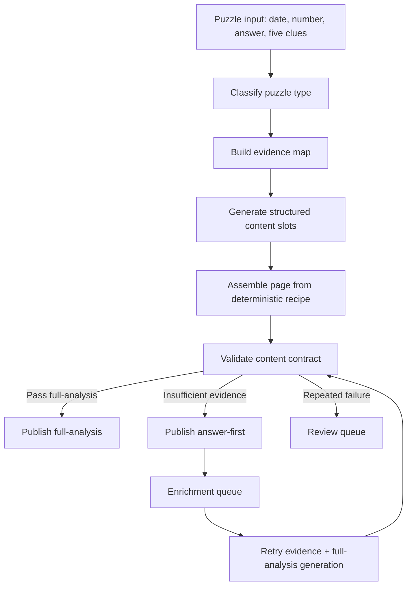

# Pinpoint Content Kitchen Plan — Architecture Reference

Date: 2026-05-22
Status: architecture reference
Source snapshot: `/Users/elng/Downloads/us.sitesucker.mac.sitesucker-pro/pinpointanswer.today`
First execution ticket: `docs/pinpoint-content-kitchen-pr6a-mvp-2026-05-23.md`
Rollout playbook: `docs/pinpoint-content-kitchen-rollout-playbook-2026-05-23.md`

## Document Role And Execution Boundary

This document is the architecture reference for the content kitchen. It explains the larger system: competitor lesson, content modes, evidence, validation, review, queue, audit, and rollout.

It is not the first engineering ticket.

Use the dedicated PR6A ticket for the first implementation:

> `docs/pinpoint-content-kitchen-pr6a-mvp-2026-05-23.md`

Use the rollout playbook for shadow/manual/canary/stop-the-line rules:

> `docs/pinpoint-content-kitchen-rollout-playbook-2026-05-23.md`

Execution rule:

- PR6A should be small enough to review in one sitting.
- PR6A should not change production rendering, sitemap behavior, Worker publishing, or CI/build behavior.
- PR6A should default `answer-first` to `noindex + sitemap exclude`.
- Shadow validation, legacy adapters, review UI, queue persistence, evidence retrieval, and public URL audits belong to later PRs.

## Executive Summary

This document splits the "content kitchen" work out from PR4/PR5 release gates.

PR4/PR5 made the publishing system safer: bad payloads, broken rendered HTML, repeated production commits, and unsafe queue states are now blocked or routed. That does not mean the content production system is complete.

The competitor snapshot shows the missing layer clearly: `pinpointanswer.today` wins by publishing a stable daily answer-page shape, not by writing unusually deep essays. Its detail pages are predictable, indexable, internally linked, and "complete enough" every day.

The goal for our next track is therefore:

> Build a deterministic content kitchen that can produce daily `answer-first` and `full-analysis` pages with stable structure, clue-level explanation, evidence, review artifacts, and automatic upgrade behavior.

This is not a proposal to copy competitor text. It is a proposal to copy and improve the production mechanism: fixed recipe, stable page sections, predictable enrichment, and machine-checkable quality.

## Review Addendum: Safety Boundaries Added

The review feedback confirms the direction of this plan, but tightens the implementation boundary.

The original plan defines what a finished answer page should look like. The strengthened plan must also define the system invariants that make those pages safe to publish at daily scale:

- `answer-first` must have an explicit SEO indexability policy, not a blanket assumption that every fast page is safe to index.
- `full-analysis` must be blocked by weak clue-fit evidence, not only by missing prose.
- page identity, canonical URL, content mode, and revision history must be stable across enrichment upgrades.
- validation must return structured outcomes that downstream queue, review, publish, and audit systems can consume.
- fixed recipe must be balanced by template-similarity and boilerplate-ratio checks.
- post-publish audit must distinguish hard publish failures from `published_but_audit_failed` states.
- PR6 should define the search-safe contract, validation protocol, minimal state model, and key fixtures; later PRs should implement the heavier runtime queue, review, audit, and launch operations.

These additions do not change the core direction. They keep the content kitchen from becoming a scalable producer of pages that are structurally complete but weakly evidenced, over-templated, or unsafe to index.

## What The Competitor Is Actually Doing

Local snapshot evidence:

- Root: `/Users/elng/Downloads/us.sitesucker.mac.sitesucker-pro/pinpointanswer.today`
- Detail route pattern: `/linkedin-pinpoint-answer/pinpoint-{number}/index.html`
- Archive route: `/linkedin-pinpoint-answer/index.html`
- Sample pages inspected:
  - `pinpoint-704`
  - `pinpoint-711`
  - `pinpoint-716`
  - `pinpoint-718`
  - `pinpoint-720`
  - `pinpoint-725`

Measured static output:

| Metric | Observation |
| --- | --- |
| Total files in snapshot | 278 |
| Puzzle detail pages | 268 |
| Puzzle range | #458 to #725 |
| Recent detail page average size | about 100 KB HTML |
| Recent detail page average text length | about 860 words |
| Recent detail page average headings | about 15 |
| Recent pages with FAQ section | 30 / 30 in the recent sample |
| Recent pages with recent-answer links | 30 / 30 in the recent sample |
| Detail pages with JSON-LD in snapshot | 0 detected |

The competitor has many SEO weaknesses, but it has one thing this project still needs to systematize: the daily page always looks like a finished answer page.

## Competitor Page Recipe

A typical detail page has this structure:

1. H1: `LinkedIn Pinpoint #{number} Answer & Analysis`
2. Spoiler-safe prompt:
   - asks what connects the five clues
   - encourages hints before reveal
3. Three trust cards:
   - daily updates
   - detailed explanations
   - continuous challenge
4. Hint / clue interaction area
5. Answer and full analysis block
6. Short first-person solve narrative:
   - initial wrong direction
   - clue that breaks the wrong theory
   - reset moment
   - final answer
7. Category block
8. "Words & How They Fit" table:
   - clue
   - phrase/example
   - meaning/usage
9. FAQ:
   - usually three questions
   - topic-specific, not only game-generic
10. Recent answer links:
   - gives crawl path and user continuation

Examples from inspected pages:

| Page | Content pattern |
| --- | --- |
| `pinpoint-720` | Starts with a misleading card-suit reading of "Spade", then pivots to gardening tools after "Rake". |
| `pinpoint-718` | Starts with color/food ambiguity, then pivots to universities after "Rice". |
| `pinpoint-716` | Starts with cuisine/geography ambiguity, then pivots to potato dishes after "Gnocchi". |
| `pinpoint-711` | Starts with alien/pop-culture race guesses, then pivots to constructed languages after "Elvish". |
| `pinpoint-704` | Starts with scattered physical objects, then pivots to the shared "slots" pattern. |
| `pinpoint-725` | Starts broad with music/genre ambiguity, then narrows to types of guitar after "Bass". |

The useful lesson is not the prose. The useful lesson is the skeleton:

- every page usually creates a turning point or narrowing moment
- every page maps all five clues
- every page has topic-specific FAQ
- every page links to recent answers
- every page gives users more than just the final answer

## Competitor Weaknesses We Should Not Copy

The competitor is useful as a production model, not as a quality ceiling.

Do not copy these weaknesses:

| Weakness | Why we should improve it |
| --- | --- |
| No detected JSON-LD on detail pages | We already have stronger structured-data infrastructure and should keep it. |
| First-person story can feel formulaic | We should use a controlled narrative, not fake diary prose. |
| Evidence is implicit | We need explicit evidence records and source levels. |
| Some pages rely on plausible explanation rather than cited grounding | This is exactly where hallucination risk enters. |
| Answer can be interaction-gated | Our SEO needs answer visibility in the rendered HTML while still supporting spoiler-safe UX. |
| Recent links are shallow | We can add stronger previous/next/archive graph rules. |

## What We Should Copy And Optimize

Copy the production mechanics:

- fixed answer page recipe
- fixed clue table
- bounded FAQ count and style
- fixed solve narrative slots with an escape hatch when no false start exists
- recent-answer internal links
- daily freshness discipline
- page length target around 500 to 900 words for most full pages, with longer pages allowed only when the puzzle needs it

Improve the content contract:

- require explicit clue-level evidence
- separate `answer-first` from `full-analysis`
- block fake specificity
- separate pre-publish and post-publish audits
- use schema and rendered HTML gates that the competitor lacks
- make each failure produce a review artifact

## Proposed Kitchen Architecture

The kitchen is a pipeline, not one prompt.



## Canonical Identity And Revision Model

The kitchen must treat `answer-first` and `full-analysis` as revisions of the same canonical page, not as separate SEO assets.

Canonical content object fields:

| Field | Purpose |
| --- | --- |
| `puzzleNumber` | Human-visible puzzle number when available. |
| `logicalGameDate` | Daily game date in the site timezone. |
| `slug` | Stable route slug derived from canonical identity. |
| `canonicalUrl` | One public URL shared by `answer-first` and `full-analysis`. |
| `contentMode` | Current mode: `answer-first` or `full-analysis`. |
| `revisionId` | Unique content revision id. |
| `inputSnapshotHash` | Hash of L1 input used for the revision. |
| `publishedRevision` | Current public revision id. |
| `contentHash` | Hash of rendered substantive content, excluding audit metadata. |
| `datePublished` | First public publish time for the canonical URL. |
| `dateModified` | Last substantive content update time. |

Rules:

- `answer-first` and `full-analysis` must share the same canonical URL.
- enrichment upgrades must create a new revision, not a second page.
- content hash unchanged means no new publish revision and no freshness update.
- `dateModified`, schema `dateModified`, and sitemap `lastmod` update only on substantive content changes.
- an old enrichment attempt with a stale `inputSnapshotHash` cannot overwrite a newer published revision.
- reviewer rejection applies to the rejected candidate revision and blocks that same revision from automatic publish.

## L1 Puzzle Input Contract

L1 is the authoritative puzzle input. Every content candidate, revision, validation result, and evidence map must be traceable to one L1 input snapshot.

```ts
type L1PuzzleInput = {
  puzzleId: string;
  puzzleNumber?: number;
  logicalGameDate: string;
  siteTimezone: string;
  answer: string;
  answerAliases?: string[];
  clues: Array<{
    clueId: string;
    text: string;
    position: number;
  }>;
  capturedAt: string;
  source: "worker_capture" | "manual_import";
  inputSnapshotHash: string;
};
```

Rules:

- L1 must contain exactly five clues.
- clue `position` values must be unique and stable within the input snapshot.
- `answer` cannot be empty; empty answer maps to `INVALID_L1_INPUT`.
- `logicalGameDate` is interpreted in the configured site timezone.
- if `puzzleNumber` is missing, slug generation must use `logicalGameDate` plus a stable puzzle id, not a guessed number.
- Worker recapture that changes answer, clue text, clue order, or date creates a new `inputSnapshotHash`.
- stale candidates with an old `inputSnapshotHash` cannot publish over a newer revision.

## Minimal State Model

PR6 should define a minimal state model so downstream PRs can extend it without changing the core contract.

The first implementation should keep states small. Most detail should live in fields such as `contentMode`, `indexPolicy`, `auditStatus`, `degradationStatus`, `requiredAction`, and `finalOutcome`.

V0 states:

```ts
type ContentKitchenState =
  | "draft"
  | "validated"
  | "published"
  | "review_required"
  | "blocked"
  | "superseded";
```

V0 detail fields:

```ts
type AuditStatus = "not_run" | "passed" | "failed";
type DegradationStatus = "none" | "noindex" | "hidden_from_recent" | "schema_removed";
```

| State | Meaning | Detail fields carry |
| --- | --- | --- |
| `draft` | Candidate exists but has not passed validation. | attempted mode, revision id, input hash |
| `validated` | Candidate passed the relevant v0 contract. | `contentMode`, policy enums, validation outcome |
| `published` | Canonical URL is live. | `contentMode`, `auditStatus`, `degradationStatus`, published revision |
| `review_required` | Automatic flow cannot safely continue. | issue codes, recommended action, artifact id |
| `blocked` | Candidate must not publish without new input or human decision. | blocking issue code and field path |
| `superseded` | Candidate or job was replaced by newer input/revision. | superseding revision or input hash |

Future states can be derived from V0 fields. They should not be first-implementation states.

| Future operational idea | V0 representation |
| --- | --- |
| `published_answer_first` | `state="published"`, `contentMode="answer-first"` |
| `published_full_analysis` | `state="published"`, `contentMode="full-analysis"` |
| `enrichment_pending` | job table field in PR9, not a PR6A state |
| `published_but_audit_failed` | `state="published"`, `auditStatus="failed"` |
| `published_but_degraded` | `state="published"`, `degradationStatus!="none"` |
| `dead_letter` | `finalOutcome="dead_letter"` |
| `rolled_back` | `finalOutcome="rolled_back"` |

Final outcome model:

| `finalOutcome` | Meaning |
| --- | --- |
| `completed_full_analysis` | Page reached valid `full-analysis` and no automatic work is pending. |
| `completed_answer_first_noindex` | Page remains `answer-first`, is not indexable, and no automatic upgrade is pending. |
| `completed_answer_first_review_accepted` | Reviewer accepted an `answer-first` final state. |
| `human_rejected` | Reviewer rejected the candidate or revision. |
| `human_approved_override` | Reviewer approved an exception with explicit scope. |
| `dead_letter` | Job exceeded retry or SLA limits. |
| `superseded` | Candidate or job was replaced by a newer revision. |
| `rolled_back` | Published revision was rolled back after an audit or content failure. |

V0 transition table:

| From | Event / guard | To | Side effect |
| --- | --- | --- | --- |
| `draft` | candidate passes its v0 contract | `validated` | assign policy enum values |
| `validated` | publish succeeds | `published` | set `datePublished` if first publish |
| `published` | post-publish audit fails | `published` | set `auditStatus="failed"` and create audit artifact |
| `published` | page must reduce SEO exposure | `published` | set `degradationStatus`, apply policy enums |
| `published` | rollback succeeds | `published` | set `finalOutcome="rolled_back"` and point to rollback revision |
| any non-final state | validation returns `requires_review` | `review_required` | create review artifact |
| any non-final state | validation returns `block_publish` | `blocked` | create blocking artifact |
| any non-final state | stale `inputSnapshotHash` detected | `superseded` | set `finalOutcome=superseded` |

State rules:

- `published` plus `contentMode="answer-first"` may later upgrade to `contentMode="full-analysis"` through a new revision.
- `published` plus `degradationStatus!="none"` is for pages kept online with reduced exposure; it is not the same as `publish_failed`.
- `auditStatus="failed"` requires an audit artifact and explicit recovery action.
- `blocked` requires new input, regenerated candidate, or human override before publish.
- heavier queue states such as locks, retries, and dead letters belong in PR9, not PR6A.

## Content Modes

### `answer-first`

Purpose: fast daily availability when evidence is incomplete, without pretending the page is finished.

Required fields:

- puzzle number
- logical game date
- answer
- five clues
- short clue list
- spoiler-safe summary
- status: `answer-first`
- enrichment deadline
- canonical URL
- revision id
- public status label

Allowed content:

- answer
- clue list
- brief "why this likely fits" paragraph
- short availability/status FAQ only when it is useful to users

Not allowed:

- invented clue-by-clue evidence
- fake solve path
- unsupported false starts
- topic FAQ pretending to be grounded
- FAQPage schema unless the page has non-generic, visible FAQ content
- title or meta description that says or implies the analysis is complete when it is not

Minimum publishable threshold:

An `answer-first` page may be published only if it is useful to users and does not pretend to be complete:

- answer is visible in rendered HTML
- puzzle number and logical date are visible
- all five L1 clues are visible
- canonical URL is stable and shared with the future `full-analysis` page
- content does not include fake clue-by-clue analysis
- page includes a specific short summary tied to today's answer or category
- page has an enrichment deadline and internal incomplete status
- page does not expose generic FAQ schema

Publishable `answer-first` copy rules:

- summary should normally be at least 40 words in v0, but word count is a heuristic, not a quality substitute
- summary must mention the answer or normalized category
- summary must mention at least two clue terms
- summary must not be reused unchanged from another `answer-first` page
- page must include a visible incomplete status
- page must not include fake clue-by-clue explanation

V0 SEO default:

```ts
const ALLOW_ANSWER_FIRST_INDEX = false;
```

When `ALLOW_ANSWER_FIRST_INDEX=false`, all `answer-first` pages must be:

- `noindex`
- excluded from sitemap
- excluded from FAQPage schema
- routed to enrichment or review

This means "publishable" is not the same as "indexable." In v0, `answer-first` can serve users, but search indexing waits for `full-analysis`.

Later PRs may allow limited `answer-first` indexing only after shadow validation and canary prove that the pages are not thin, repeated, or misleading.

Future indexable `answer-first` requirements, behind an explicit flag:

- rendered HTML audit proves answer and all five L1 clues are visible
- canonical URL is stable
- title and meta do not imply full analysis is complete
- no fake solve path or fake clue-by-clue evidence exists
- no generic FAQPage schema exists
- summary is specific, not reused boilerplate
- at least one real clue-level explanation is present
- at least one category definition is present
- post-publish audit has no P0 issue
- recent indexed `answer-first` ratio remains under the configured cap

### Policy Enum Definitions

The indexability matrix must compile into explicit policies. Avoid human-only terms such as "allowed" or "depends" in validator output.

```ts
type IndexPolicy = "index" | "noindex" | "review_required" | "block_publish";

type SitemapPolicy =
  | "include"
  | "exclude"
  | "remove_on_next_build"
  | "include_after_audit";

type SchemaPolicy =
  | "none"
  | "article_only"
  | "faq_allowed"
  | "block_schema";

type InternalLinkPolicy =
  | "normal"
  | "deemphasized"
  | "hidden_from_recent";

type RequiredAction =
  | "enrich"
  | "review"
  | "upgrade"
  | "rollback"
  | "degrade"
  | "create_fix_task"
  | "dead_letter"
  | "block_publish"
  | "keep_current";

type DegradationAction =
  | "remove_faq_schema"
  | "apply_noindex"
  | "remove_from_sitemap"
  | "hide_from_recent"
  | "create_fix_task";
```

Action rules:

- use `requiredAction="create_fix_task"` when the page can keep its current exposure and only needs follow-up work
- use `requiredAction="degrade"` when the live page must reduce SEO or content exposure
- when `requiredAction="degrade"`, include `degradationActions`, such as `apply_noindex`, `remove_from_sitemap`, `hide_from_recent`, `remove_faq_schema`, or `create_fix_task`

| Page state | `indexPolicy` | `sitemapPolicy` | `schemaPolicy` | `internalLinkPolicy` | `requiredAction` |
| --- | --- | --- | --- | --- | --- |
| `answer-first` default v0 | `noindex` | `exclude` | `none` | `hidden_from_recent` | `enrich` |
| `answer-first` below publishable threshold | `noindex` | `exclude` | `none` | `hidden_from_recent` | `enrich` or `review` |
| `answer-first` after flag/canary approval only | `index` | `include` | `article_only` | `deemphasized` | `enrich` |
| `answer-first` over SLA with valid full-analysis candidate | `noindex` | `exclude` | `none` | `deemphasized` | `upgrade` |
| `answer-first` over SLA without safe upgrade path | `review_required` | `remove_on_next_build` | `none` | `hidden_from_recent` | `review` or `dead_letter` |
| `full-analysis` valid | `index` | `include` | `faq_allowed` when visible FAQ exists | `normal` | `keep_current` |
| `full-analysis` P0 audit failed | `block_publish` | `remove_on_next_build` | `block_schema` | `hidden_from_recent` | `rollback` or `block_publish` |
| `full-analysis` P1/P2 audit failed | `review_required` | `include_after_audit` | `article_only` unless FAQ is affected | `deemphasized` | `degrade` with `degradationActions` or `create_fix_task` |

### `answer-first` Indexability Matrix

The human-readable matrix is derived from the policy enums above.

| Page state | Index? | Sitemap? | FAQPage schema? | Internal links | Required action |
| --- | --- | --- | --- | --- | --- |
| `answer-first` default v0 | No | No | No | Hidden or de-emphasized | Enrich |
| `answer-first` below publishable threshold | No | No | No | Hidden from recent | Enrich or review |
| `answer-first` after flag/canary approval only | Yes, capped | Yes, capped | Article only | De-emphasized with incomplete status | Enrich before SLA |
| `answer-first` over SLA with valid upgrade | No until upgraded | No until upgraded | No | De-emphasized | Upgrade |
| `answer-first` over SLA without safe upgrade | Review required | Remove on next build | No | Hidden from recent | Review or dead-letter |
| `full-analysis` valid | Yes | Yes | Allowed when visible and non-generic | Normal | Keep current |
| `full-analysis` P0 audit failed | Block or rollback | Remove on next build | Block | Hidden from recent | Rollback or block |
| `full-analysis` P1/P2 audit failed | Review required | Include after audit decision | Depends on affected section | De-emphasized | Degrade or create fix task |


The v0 goal is to keep all `answer-first` pages out of the search index until the system proves, through shadow validation and canary, that a small number can be indexed safely. The default route to indexing is still `full-analysis`.

### Site-Level Index Health Guard

Page-level policy is not enough. The site also needs guardrails so indexable `answer-first` pages do not become a thin-content cluster.

```ts
type SiteIndexHealthGuard = {
  maxIndexedAnswerFirstRatio: number;
  targetFullAnalysisMinutes: number;
  firstAlertAfterMinutes: number;
  reviewAfterMinutes: number;
  thinPageAutoNoindexAfterMinutes: number;
  highPriorityAlertAfterHours: number;
  autoNoindexIfOverSLA: boolean;
  excludeFromRecentIfNoindex: boolean;
  notificationChannel: "feishu" | "none" | "custom";
};
```

Recommended defaults:

- `maxIndexedAnswerFirstRatio`: 0 in v0 while `ALLOW_ANSWER_FIRST_INDEX=false`
- future canary-approved cap: min(10% of the most recent 30 pages, 3 pages)
- `targetFullAnalysisMinutes`: 30
- `firstAlertAfterMinutes`: 30
- `reviewAfterMinutes`: 60
- `thinPageAutoNoindexAfterMinutes`: 120
- `highPriorityAlertAfterHours`: 6
- `autoNoindexIfOverSLA`: true
- `excludeFromRecentIfNoindex`: true
- `notificationChannel`: `feishu`

Rules:

- `answer-first` should target a valid `full-analysis` upgrade within 30 minutes.
- `answer-first` older than 30 minutes without a valid upgrade sends a normal Feishu alert.
- `answer-first` older than 60 minutes without a valid upgrade enters review.
- v0 `answer-first` pages start as `noindex` and excluded from sitemap; they do not wait two hours for SEO downgrade.
- if a future flag allows limited indexing, thin indexed `answer-first` pages older than 2 hours without a valid upgrade become `noindex` and are removed from sitemap on the next build.
- `answer-first` pages still unresolved after 6 hours send a high-priority Feishu alert.
- if future indexable `answer-first` pages exceed the canary-approved cap, new `answer-first` pages must be `noindex` until the ratio recovers.
- every upgrade to `full-analysis` updates `dateModified`, schema `dateModified`, and sitemap `lastmod` when the content hash changes.

### `full-analysis`

Purpose: finished competitor-grade answer page with stronger evidence.

Required fields:

- answer
- five clue rows
- reasoning pattern: `turning_point` or `cumulative_confirmation`
- supported false starts, only when evidence-backed
- clue-by-clue mapping
- evidence source per clue
- topic-specific FAQ when useful
- internal links
- `dateModified`

Target shape:

- 500 to 900 words by default; longer only when the puzzle needs it
- required semantic sections instead of a fixed heading count
- 5 clue rows
- 2 to 4 FAQ items, default 3 when useful
- 3 to 8 internal links
- answer visible in rendered HTML

## Evidence Source Levels

The competitor does not expose evidence. We should.

| Level | Source | Allowed use |
| --- | --- | --- |
| L1 | Official puzzle capture / current Worker data | Required for answer, clue list, date, puzzle number. |
| L2 | Deterministic lookup or curated knowledge source | Strong support for clue explanations. |
| L3 | Search/grounding result with retrievable source metadata | Support for topic facts when deterministic lookup is insufficient. |
| L4 | Multi-model consensus | Weak support only; cannot alone justify `full-analysis`. |
| L5 | Human review | Can approve edge cases and repair evidence gaps. |

Evidence must prove more than source existence. A `full-analysis` page needs evidence that supports the clue fit.

Evidence types:

| Type | Purpose | Example |
| --- | --- | --- |
| `factEvidence` | Proves what a clue means or refers to. | `Bass` can refer to a bass guitar or bass instrument. |
| `fitEvidence` | Proves why that clue supports the answer/category. | Bass belongs in the category of guitar types, or the puzzle's category role is a guitar family member. |

Evidence record minimum fields:

- `evidenceId`
- `clueId`
- `evidenceType`: `factEvidence` or `fitEvidence`
- `sourceLevel`
- `sourceType`
- `sourceUrl` or deterministic source id
- `retrievedAt` or lookup version
- `claim`
- `supportingQuote` or structured lookup value
- `freshnessStatus`
- `confidence`
- `humanVerified`
- `conflictsWith` if another source disagrees

Source governance:

- L2 sources must come from an explicit first-version allowlist.
- L3 sources must be retrievable and must not be only a search snippet.
- competitor pages, answer aggregators, AI summaries, and generated pages cannot be used as L2/L3 evidence.
- L4 consensus can suggest candidates but cannot alone support `full-analysis`.
- ambiguous clue fits require stronger support: deterministic lookup, two independent sources, or human review.
- source conflicts must enter review unless a deterministic source has explicit precedence.

First-version source registry:

| Source | Level | Status | Use case | First implementation |
| --- | --- | --- | --- | --- |
| Official puzzle capture / Worker data | L1 | allowed | answer, clue list, date, puzzle number | existing Worker data |
| `category_membership.json` | L2 | allowed | clue-category mapping and deterministic category membership | hand-curated v0 file |
| `alias_dictionary.json` | L2 | allowed | answer aliases, clue aliases, phrase aliases | hand-curated v0 file |
| Versioned deterministic lookup tables | L2 | allowed | phrase, category, entity, or alias mapping | local JSON / checked-in data only |
| Wikidata structured lookup | L3 | conditional | entity/category support with stable ids and retrieval metadata | allowed after PR7 integration |
| Wikipedia page | L3 | conditional | general topic support with retrievable URL and quoted support | allowed after PR7 integration |
| Dictionary or lexical source | L3 | conditional | word meaning, phrase meaning, homograph or usage support | choose one provider before PR7 implementation |
| Official organization, brand, publisher, league, artist, or product page | L3 | conditional | entity facts or official category membership | allowed after PR7 integration |
| Human reviewer decision | L5 | allowed | exception approval, conflict resolution, edge-case support | review artifact decision |
| Competitor answer pages | banned | prohibited | never evidence | never allowed |
| Puzzle answer aggregators | banned | prohibited | never evidence | never allowed |
| AI search summaries | banned | prohibited | never direct evidence | never allowed |
| Search snippets only | banned | prohibited | never evidence | never allowed |
| Generated SEO pages | banned | prohibited | never evidence | never allowed |
| User forums | L3/L5 | review only | cannot auto-support `full-analysis` without human review | human review only |

Evidence v0 scope:

- PR6 only validates evidence object shape and clue-row references.
- PR7 v0 should support L1 plus local L2 JSON sources: `category_membership.json` and `alias_dictionary.json`.
- L3 search/grounding should be disabled for automatic `full-analysis` until source retrieval, quoting, caching, and cost controls are implemented.
- unknown sources cannot automatically support `full-analysis`; they can only create review candidates until added to the registry.

L2 dictionary governance:

- each dictionary file must include a version id
- every entry must include category or alias key, normalized value, source note, createdAt, and updatedAt
- dictionary changes require review before they can support automatic `full-analysis`
- dictionary version must be recorded in `evidence.lookupVersion`
- deleted or changed entries cannot silently invalidate old revisions; old revisions keep their recorded lookup version
- dictionary diffs should be reviewed as content-risk changes, not only data changes
- emergency dictionary corrections should create review artifacts for affected published pages

PR7 prerequisite:

- `category_membership.json` and `alias_dictionary.json` must each have a named owner before they can support automatic `full-analysis`
- unowned or unreviewed dictionary changes may run in shadow/manual review only
- every dictionary change must record reviewer, version id, affected categories or aliases, and whether published pages need recheck
- human override may suggest dictionary updates, but it does not automatically become L2 evidence until reviewed
- if a dictionary entry is corrected, affected published pages should be discoverable by lookup version and evidence refs

Rule:

`full-analysis` requires every clue row to reference at least one evidence record. At least one record per row must support the clue fit, not only the clue's dictionary meaning. L4-only rows should be marked `needsReview` unless a human approves them.

## Validation Result Protocol

PR6 must define a validation protocol that downstream systems can consume. The validator should not return only pass/fail.

Outcomes:

| Outcome | Meaning |
| --- | --- |
| `pass_full_analysis` | Candidate can publish or upgrade as `full-analysis`. |
| `pass_answer_first` | Candidate can publish as `answer-first`. |
| `downgrade_to_answer_first` | Candidate attempted `full-analysis` but only meets `answer-first` rules. |
| `requires_review` | Candidate may be publishable, but an explicit human decision is required. |
| `block_publish` | Candidate must not publish. |

Issue fields:

- `issueCode`
- `severity`: `P0`, `P1`, `P2`
- `fieldPath`
- `message`
- `suggestedAction`
- `blocking`
- `candidateRevisionId`
- `relatedEvidenceIds`

## Global Issue Code Taxonomy

Not all issue codes are implemented in PR6. Implementation ownership is defined in the Issue Code Phase Plan below.

| Code | Default severity | Typical outcome |
| --- | --- | --- |
| `MISSING_L1_INPUT` | P0 | `block_publish` |
| `INVALID_L1_INPUT` | P0 | `block_publish` |
| `INVALID_CANDIDATE_METADATA` | P0 | `block_publish` |
| `CANDIDATE_L1_MISMATCH` | P0 | `block_publish` |
| `MISSING_CLUE_ROW` | P0 | `downgrade_to_answer_first` or `block_publish` |
| `DUPLICATE_CLUE_ROW` | P0 | `block_publish` |
| `MISSING_EVIDENCE_REF` | P0 | `downgrade_to_answer_first` or `requires_review` |
| `FULL_ANALYSIS_STRUCTURE_NOT_VALIDATED` | P1 | `requires_review` |
| `UNSUPPORTED_CLUE_FIT` | P0 | `requires_review` or `downgrade_to_answer_first` |
| `WEAK_FIT_EVIDENCE` | P1 | `requires_review` or `downgrade_to_answer_first` |
| `L4_ONLY_EVIDENCE` | P1 | `requires_review` |
| `GENERIC_TURNING_POINT` | P1 | `downgrade_to_answer_first` |
| `INVENTED_FALSE_START` | P0 | `block_publish` |
| `TEMPLATE_FAQ` | P1 | repair or `downgrade_to_answer_first` |
| `FAQ_NOT_TOPIC_SPECIFIC` | P1 | repair or `downgrade_to_answer_first` |
| `ANSWER_HIDDEN_FROM_RENDERED_HTML` | P0 | `block_publish` |
| `COMPETITOR_TEXT_SIMILARITY_RISK` | P0 | `requires_review` or `block_publish` |
| `BOILERPLATE_RATIO_HIGH` | P1 | repair or review |
| `ANSWER_FIRST_BELOW_INDEX_THRESHOLD` | P1 | publish with `noindex` or enrich |
| `ANSWER_FIRST_OVER_SLA` | P1 | review, noindex, or upgrade |
| `FULL_ANALYSIS_WITH_LOW_CONFIDENCE` | P1 | `requires_review` |
| `MISSING_REASONING_PATTERN` | P0 | `block_publish` |
| `UNSUPPORTED_REASONING_PATTERN` | P0 | `requires_review` or `block_publish` |
| `GENERIC_REASONING_PATTERN` | P1 | repair or `downgrade_to_answer_first` |
| `CANONICAL_URL_MISMATCH` | P0 | `block_publish` |
| `CANONICAL_IDENTITY_UNSTABLE` | P0 | `block_publish` |
| `NOINDEX_REQUIRED_BUT_MISSING` | P0 | `block_publish` |
| `SITEMAP_POLICY_MISMATCH` | P1 | repair or `requires_review` |
| `ROBOTS_POLICY_MISMATCH` | P0 | `block_publish` |
| `DATE_MODIFIED_MISMATCH` | P1 | repair or `requires_review` |
| `SCHEMA_MODE_MISMATCH` | P1 | repair or `requires_review` |
| `FAQ_SCHEMA_WITHOUT_VISIBLE_FAQ` | P0 | `block_publish` |
| `INVALID_FAQ_STRUCTURE` | P1 | repair or `downgrade_to_answer_first` |
| `DUPLICATE_TITLE_META` | P1 | repair or `requires_review` |
| `ARCHIVE_LINK_MISSING` | P1 | repair or `requires_review` |
| `RECENT_LINK_POINTS_TO_NOINDEX` | P1 | repair or `requires_review` |
| `PUBLIC_HTML_FETCH_FAILED` | P0 | `block_publish` |
| `PUBLIC_HTML_RENDER_FAILED` | P0 | `block_publish` |
| `INTERNAL_LINK_BROKEN` | P1 | repair or `requires_review` |
| `SITEMAP_LASTMOD_MISSING` | P1 | repair or `requires_review` |
| `SCHEMA_DATE_MODIFIED_MISSING` | P1 | repair or `requires_review` |

Every issue code should have at least one negative fixture. PR6 should define the issue taxonomy and enforce the most important structural and safety issues; later PRs can attach richer runtime signals.

## Validator API Contract

PR6 validators should expose a stable interface so PR6A, PR6B, PR6C, PR7, and PR11 can add checks without changing the caller contract.

```ts
type ValidateCandidateInput = {
  candidate: ContentCandidate;
  l1Input: L1PuzzleInput;
  renderedHtml?: string;
  siteIndexHealth?: SiteIndexHealthSnapshot;
  existingRoutes?: ExistingRouteIndex;
};

type ValidationPolicies = {
  indexPolicy: IndexPolicy;
  sitemapPolicy: SitemapPolicy;
  schemaPolicy: SchemaPolicy;
  internalLinkPolicy: InternalLinkPolicy;
  requiredAction: RequiredAction;
  degradationActions?: DegradationAction[];
};

type ValidateCandidateOutput = {
  outcome: ValidationOutcome;
  policies: ValidationPolicies;
  issues: ValidationIssue[];
  artifactDraft?: ReviewArtifact;
};
```

PR6 validation boundary:

| Check class | PR6 scope? | Notes |
| --- | --- | --- |
| L1 data shape | Yes | exactly five clues, answer present, stable clue positions |
| content mode and canonical fields | Yes | PR6A owns identity and policy output |
| policy enum derivation | Yes | index, sitemap, schema, internal link, required action |
| clue row structural validation | Yes | PR6B owns five-row coverage and L1 clue mapping |
| reasoning pattern structural validation | Yes | PR6B owns required pattern and evidence-ref shape |
| rendered HTML structural check | Yes, local/pre-publish | answer/clues/FAQ presence in rendered candidate HTML |
| route existence check | Basic only | use `existingRoutes`; full crawl belongs to PR11 |
| site-level index health guard | Yes as input-driven policy | uses `siteIndexHealth`; no GSC dependency in PR6 |
| evidence source retrieval | No | PR7 owns source retrieval and grounding |
| post-publish public fetch/render audit | No | PR11 owns public URL audit |
| GSC indexing observation | No | launch/PR11 owns GSC fields |

Rendered HTML rule:

- if `renderedHtml` is missing, data-only validation may still run
- rendered visibility checks must return a skipped/requires-rendered-html issue instead of passing silently
- indexable pages cannot pass final publish validation without `renderedHtml`
- `answer-first` or `full-analysis` candidates that require `indexPolicy="index"` must prove answer and L1 clues are visible in rendered HTML
- FAQPage schema cannot be allowed unless visible FAQ is confirmed in rendered HTML

## Artifact Envelope And Review Schema

Artifacts must be machine-readable so validation, review, enrichment, publish, and audit systems can share the same failure record.

```ts
type ArtifactType =
  | "pre_publish"
  | "enrichment"
  | "review"
  | "post_publish_audit";

type ReviewArtifactStatus = "open" | "decided" | "superseded";

type ReviewerAction =
  | "approve"
  | "reject"
  | "force_answer_first"
  | "request_regeneration";

type ReviewArtifact = {
  artifactId: string;
  artifactType: ArtifactType;
  puzzleId: string;
  puzzleNumber?: number;
  logicalGameDate: string;
  candidateRevisionId: string;
  publishedRevisionId?: string;
  inputSnapshotHash: string;
  attemptedMode: "answer-first" | "full-analysis";
  validationOutcome: string;
  issues: ValidationIssue[];
  issueCodesRequiringDecision: string[];
  evidenceSummary: EvidenceCoverage;
  similaritySignals?: SimilaritySignals;
  renderedPreviewUrl?: string;
  recommendedAction: RequiredAction;
  allowedReviewerActions: ReviewerAction[];
  status: ReviewArtifactStatus;
  createdAt: string;
  dueAt?: string;
  relatedJobId?: string;
  relatedAuditArtifactId?: string;
};

type ReviewDecision = {
  decision: ReviewerAction;
  reviewerNote?: string;
  decidedBy: string;
  decidedAt: string;
  overrideScope?: string[];
  approvedRevisionId?: string;
  forceContentMode?: "answer-first" | "full-analysis";
  regenerationInstructions?: string;
};
```

Rules:

- every failed generation, downgrade, review, or audit failure must reference an artifact id
- reviewer decisions must reference the candidate revision and the issue codes being resolved, approved, or overridden
- human override cannot silently bypass validation; it must record `overrideScope`
- superseded artifacts remain auditable and must point to the newer revision when available
- artifacts must not contain secrets, cookies, API keys, or unnecessary private prompt material

## Concrete JSON Examples

These examples are illustrative contracts, not final runtime storage schemas.

### `answer-first` Candidate

```json
{
  "puzzleId": "pinpoint-725-2026-05-22",
  "puzzleNumber": 725,
  "logicalGameDate": "2026-05-22",
  "slug": "linkedin-pinpoint-answer/pinpoint-725",
  "canonicalUrl": "https://example.com/linkedin-pinpoint-answer/pinpoint-725/",
  "contentMode": "answer-first",
  "revisionId": "rev_001",
  "inputSnapshotHash": "sha256_l1input",
  "contentHash": "sha256_content_v1",
  "indexPolicy": "index",
  "sitemapPolicy": "include",
  "schemaPolicy": "article_only",
  "internalLinkPolicy": "deemphasized",
  "requiredAction": "enrich",
  "answer": "Types of guitar",
  "clues": ["Bass", "Classical", "Electric", "Acoustic", "Steel"],
  "publicStatusLabel": "analysis is being completed",
  "enrichmentDeadlineAt": "2026-05-23T08:00:00Z"
}
```

### `full-analysis` Candidate

Partial example; `clueRows` is truncated for readability. Real `full-analysis` candidates must contain exactly five clue rows.

```json
{
  "puzzleId": "pinpoint-725-2026-05-22",
  "puzzleNumber": 725,
  "logicalGameDate": "2026-05-22",
  "contentMode": "full-analysis",
  "revisionId": "rev_002",
  "inputSnapshotHash": "sha256_l1input",
  "contentHash": "sha256_content_v2",
  "answer": "Types of guitar",
  "reasoning": {
    "pattern": "cumulative_confirmation",
    "clueIds": ["clue_1", "clue_2", "clue_3"],
    "explanation": "The instrument-related clues narrow the category toward guitar types rather than general music genres.",
    "evidenceRefs": ["ev_1", "ev_2", "ev_3"]
  },
  "clueRows": [
    {
      "clueId": "clue_1",
      "clue": "Bass",
      "fit": "Bass guitar",
      "categoryRole": "member",
      "whyItSupportsAnswer": "Bass is a guitar family member in this category.",
      "evidenceRefs": ["ev_1"],
      "confidence": "high"
    }
  ],
  "faqItems": [
    {
      "question": "Why does Bass fit this Pinpoint answer?",
      "answer": "Bass fits because the clue can refer to bass guitar, which belongs to the guitar-type category."
    }
  ]
}
```

### Evidence Record

```json
{
  "evidenceId": "ev_1",
  "clueId": "clue_1",
  "evidenceType": "fitEvidence",
  "sourceLevel": "L2",
  "sourceType": "internal_curated_category_dictionary",
  "sourceUrl": null,
  "lookupVersion": "category_membership_2026_05_22",
  "claim": "Bass guitar is a member of the guitar types category.",
  "supportingQuote": "bass guitar -> guitar type",
  "freshnessStatus": "current",
  "confidence": "high",
  "humanVerified": false,
  "conflictsWith": []
}
```

### Validation Result

```json
{
  "candidateRevisionId": "rev_002",
  "outcome": "requires_review",
  "issues": [
    {
      "issueCode": "WEAK_FIT_EVIDENCE",
      "severity": "P1",
      "fieldPath": "clueRows[3].evidenceRefs",
      "message": "The clue row has fact evidence but no clue-fit support.",
      "suggestedAction": "Add fitEvidence or route to human review.",
      "blocking": false,
      "candidateRevisionId": "rev_002",
      "relatedEvidenceIds": ["ev_7"]
    }
  ],
  "policies": {
    "indexPolicy": "review_required",
    "sitemapPolicy": "include_after_audit",
    "schemaPolicy": "article_only",
    "internalLinkPolicy": "deemphasized",
    "requiredAction": "review"
  }
}
```

### Review Artifact v0

```json
{
  "artifactId": "art_review_001",
  "artifactType": "review",
  "puzzleId": "pinpoint-725-2026-05-22",
  "puzzleNumber": 725,
  "logicalGameDate": "2026-05-22",
  "candidateRevisionId": "rev_002",
  "publishedRevisionId": "rev_001",
  "inputSnapshotHash": "sha256_l1input",
  "attemptedMode": "full-analysis",
  "validationOutcome": "requires_review",
  "issueCodesRequiringDecision": ["WEAK_FIT_EVIDENCE"],
  "evidenceSummary": {
    "totalClues": 5,
    "cluesWithFactEvidence": 5,
    "cluesWithFitEvidence": 4,
    "needsReview": 1
  },
  "recommendedAction": "review",
  "allowedReviewerActions": ["approve", "force_answer_first", "request_regeneration", "reject"],
  "status": "open",
  "createdAt": "2026-05-22T10:00:00Z"
}
```

### Post-Publish Audit Result

```json
{
  "artifactId": "art_audit_001",
  "artifactType": "post_publish_audit",
  "puzzleId": "pinpoint-725-2026-05-22",
  "revisionId": "rev_002",
  "fetchedUrl": "https://example.com/linkedin-pinpoint-answer/pinpoint-725/",
  "httpStatus": 200,
  "auditOutcome": "published_and_audit_passed",
  "checks": {
    "answerVisible": true,
    "allCluesVisible": true,
    "canonicalMatches": true,
    "noindexPolicyMatches": true,
    "faqSchemaMatchesVisibleFaq": true,
    "sitemapLastmodMatchesDateModified": true,
    "internalLinksValid": true
  },
  "checkedAt": "2026-05-22T10:15:00Z"
}
```

## Template Similarity And Competitor Boundary

Fixed recipe should create reliable structure, not mass-produced sameness.

Template quality gates:

- FAQ question skeleton should not repeat across recent pages beyond a defined threshold.
- intro paragraph and solve-path openings should not reuse the same sentence pattern repeatedly.
- boilerplate ratio should stay below a defined threshold for `full-analysis` pages.
- title and meta description must be unique enough to reflect puzzle number, date, answer, or category.
- generated paragraphs should be checked against recent first-party pages for excessive similarity.
- competitor text similarity should trigger review or block when paragraph, FAQ, title, or section text is too close.

Similarity checks:

| Check | Scope | Method | Threshold | Action |
| --- | --- | --- | --- | --- |
| title similarity | generated page vs recent first-party and competitor titles | normalized string similarity | > 0.85 | review |
| meta description similarity | generated page vs recent first-party pages | normalized string similarity | > 0.85 | repair or review |
| paragraph similarity | generated body vs competitor snapshot | n-gram overlap after boilerplate removal | > 0.35 | block or review |
| FAQ similarity | generated FAQ vs recent first-party and competitor FAQ | sentence similarity / normalized skeleton | > 0.88 | review |
| boilerplate ratio | generated body excluding required labels and navigation | fixed-template token ratio | > 45% | review |
| repeated solve opening | recent 30 pages | normalized opening pattern | repeated more than configured limit | repair |

Similarity fixture plan:

- 10 safe pages that should pass similarity checks
- 5 high-boilerplate pages that should trigger `BOILERPLATE_RATIO_HIGH`
- 5 competitor-close paraphrase pages that should trigger `COMPETITOR_TEXT_SIMILARITY_RISK`
- 5 repeated FAQ skeleton pages that should trigger `TEMPLATE_FAQ`
- 5 title/meta duplicate cases that should trigger `DUPLICATE_TITLE_META`

Competitor raw text may be used only in an isolated similarity test corpus. It must not enter generation prompts, few-shot examples, evidence records, or repair prompts.

Fixed structure does not count as similarity by itself. The similarity gate should ignore required labels, table headers, navigation labels, and schema boilerplate, and focus on user-visible explanatory copy.

Allowed competitor usage:

- structural observation
- quality baseline
- abstract recipe design
- fixture inspiration using synthetic or first-party data

Disallowed competitor usage:

- source evidence
- few-shot generation examples using competitor text
- paraphrasing competitor FAQ, solve narrative, title, meta, or section copy
- feeding competitor raw page text into generation prompts
- using competitor pages as L2/L3 evidence

The system may encode abstract structure such as answer block, clue mapping, topic FAQ, and recent links. It must not derive production copy from competitor text.

## Queue Reliability Model

PR9 owns the full enrichment queue implementation, but PR6 should reserve fields that prevent unsafe automation later.

Queue/job fields:

- `jobId`
- `puzzleId`
- `targetRevision`
- `inputSnapshotHash`
- `idempotencyKey`
- `state`
- `lockedBy`
- `lockedAt`
- `lockExpiresAt`
- `attemptCount`
- `maxAttempts`
- `backoffStrategy`
- `nextAttemptAt`
- `deadlineAt`
- `deadLetterReason`
- `lastErrorCode`
- `jobPriority`

Rules:

- the same `puzzleId + targetRevision` can have only one active enrichment job
- stale jobs with an old `inputSnapshotHash` cannot publish over newer revisions
- validation failure, evidence retrieval failure, publish failure, and post-publish audit failure use separate retry policies
- reaching `deadlineAt` or `maxAttempts` moves the job to review or dead-letter instead of retrying forever
- daily publishing jobs outrank historical backfill jobs

## Target Content Recipe

### 1. Hero

Inputs:

- puzzle number
- date
- five clues
- spoiler-safe teaser

Output:

- H1
- one short prompt paragraph
- clue chips
- answer section available in rendered HTML

### 2. Answer Block

Inputs:

- normalized answer
- answer aliases
- confidence

Output:

- answer label
- one-sentence category definition
- publish mode badge

### 3. Solve Path

Inputs:

- first read
- `reasoningPattern`
- supported false starts, if present
- final reasoning

Reasoning pattern schema:

```ts
type ReasoningPattern = "turning_point" | "cumulative_confirmation";

type FalseStart = {
  clueId: string;
  plausibleWrongReading: string;
  rejectedByClueIds: string[];
  evidenceRefs: string[];
};

type TurningPointReasoning = {
  pattern: "turning_point";
  clueId: string;
  brokenTheory: string;
  supportedTheory: string;
  evidenceRefs: string[];
  supportedFalseStarts?: FalseStart[];
};

type CumulativeConfirmationReasoning = {
  pattern: "cumulative_confirmation";
  clueIds: string[];
  explanation: string;
  evidenceRefs: string[];
  supportedFalseStarts?: FalseStart[];
};
```

Output:

- 3 to 7 short paragraphs
- neutral walkthrough, not fake personal diary claims
- no unsupported "I guessed" unless generated from explicit solve metadata
- false starts may be empty when the puzzle does not support a real ambiguity

Preferred tone:

- direct
- concrete
- puzzle-specific
- lighter than a formal encyclopedia entry

Validation:

- every solve path must use exactly one `reasoningPattern`
- false start must be supported by a specific clue ambiguity
- `turning_point` must cite one clue id and explain which false theory it breaks
- `cumulative_confirmation` must cite at least two clue ids and explain how they jointly narrow the category
- do not force a dramatic turning point when the puzzle is solved by gradual narrowing
- first person is disallowed unless true solve metadata exists

### 4. Clue Mapping Table

Inputs:

- clue
- phrase/example
- why it fits
- evidence source

Output columns:

- Clue
- Fit
- Category role
- Why it supports the answer
- Evidence level
- Evidence refs
- Confidence

Validation:

- exactly five rows
- no duplicate clue
- no empty fit
- no invented clue
- every row maps to an L1 clue id
- every row references `factEvidence` or low-risk deterministic support
- every row has `fitEvidence` or a human-reviewed logical fit
- at least one row explains ambiguity or disambiguation when the puzzle has plausible false paths

### 5. Reasoning Pattern

Allowed patterns:

#### `turning_point`

Use when one clue clearly changes or disambiguates the interpretation.

Inputs:

- clue id that changes interpretation
- false theory it breaks
- stronger theory it supports
- evidence refs

Validation:

- must name one specific L1 clue id
- must explain a real contrast
- must cite evidence refs or reviewed clue-fit support
- cannot be generic text like "the pattern became clear"

#### `cumulative_confirmation`

Use when the answer is confirmed by multiple clues narrowing the category together, rather than by a single pivot.

Inputs:

- at least two supporting clue ids
- explanation of how the clues jointly narrow the answer/category
- evidence refs

Validation:

- must cite at least two L1 clue ids
- must not claim a single dramatic pivot
- must explain the narrowing path, not just restate the answer
- cannot use generic text like "the clues all pointed to the answer"

### 6. FAQ

Inputs:

- answer topic
- clue-specific ambiguity
- common user search intent

Output:

- 2 to 4 FAQ items for `full-analysis`, default 3 when useful
- at least one FAQ about a clue ambiguity when the puzzle has one
- at least one FAQ about the topic/category
- at most one generic Pinpoint gameplay FAQ

Validation:

- FAQ must not be a pure title rewrite
- FAQ answers must not introduce unsupported new facts
- at least two FAQ items should include today's clue, answer, or category language when four are present
- FAQ content should not be reusable unchanged across unrelated pages
- `answer-first` should not emit FAQPage schema by default

### 7. Internal Links

Inputs:

- previous puzzle
- next puzzle if available
- recent answers
- archive

Output:

- previous/next links
- recent answers block
- archive link

Validation:

- links point to existing public pages
- no broken slug
- archive count remains consistent


## Generation Failure Matrix

The generator must not force `full-analysis` by inventing missing pieces. Each failed slot has a deterministic downgrade, repair, or review path.

| Failure point | First response | Allowed repair | Final fallback |
| --- | --- | --- | --- |
| answer or clue list differs from L1 | block | none; reload L1 input | `block_publish` |
| clue fit has low confidence | downgrade or review | add fitEvidence or change to reviewed logical fit | `answer-first` or `review_required` |
| evidence source conflict | review | attach conflict summary | `review_required` |
| reasoning pattern missing | repair | switch to `cumulative_confirmation` if at least two clue ids support it | `downgrade_to_answer_first` |
| unsupported false start | remove false start | continue without false start | do not block if reasoning remains valid |
| generic reasoning pattern | repair | add clue ids and evidence refs | `downgrade_to_answer_first` |
| FAQ not topic-specific | remove or repair FAQ | suppress FAQPage schema | publish without FAQ schema or downgrade |
| internal links missing | repair | add archive/recent links only if targets exist | review or publish without optional links depending on severity |
| competitor similarity risk | block or review | rewrite from structured facts, not competitor text | `block_publish` if still similar |
| boilerplate ratio high | repair | reduce generic copy and add clue-specific explanation | review |

Repair constraints:

- repair cannot change L1 answer, clue list, puzzle number, or logical date
- repair cannot add unsupported evidence
- repair may remove unsupported false starts or FAQ
- repair may switch from `turning_point` to `cumulative_confirmation`
- repair attempts must be capped by PR9 queue policy

## Current Repo Integration Map

This plan should land as a small new contract layer first. It should not rewrite the whole publishing system in PR6A.

Current code already has several useful pieces:

| Area | Current files | What exists today | How PR6 should use it |
| --- | --- | --- | --- |
| Data schema | `lib/puzzles/schema.shared.mjs`, `lib/puzzles/schema.ts` | Legacy public detail fields such as `detailState`, `publishMode`, `pageExperienceMode`, `bodyMode`, `clueRows`, `faqItems`, and `updatedAt`. | Keep these working. Add PR6 candidate/validation contracts beside them instead of changing every existing record immediately. |
| Data validation | `scripts/validate-data.ts` | Build-time data checks, public state filtering, SEO description checks, legacy content contract checks, and backlog limits. | PR6 should add a new validator and then call it from this script in a controlled mode. Do not remove existing checks until PR6 fixtures pass. |
| Existing content contract | `lib/puzzles/content-contract.ts` | Older word-count, clue-count, FAQ, lesson, and semantic copy checks. | Treat as legacy guardrail. PR6 validator should be clearer and mode-aware, but can reuse utility functions when helpful. |
| Existing evidence contract | `lib/puzzles/evidence-contract.shared.mjs`, `lib/puzzles/pinpoint-evidence-v1.shared.mjs` | V1 evidence shape checks and clue row/evidence ref checks. | PR6B can borrow the idea of evidence refs, but PR6A should not require full PR7 evidence quality. |
| Publish eligibility | `lib/puzzles/publish-eligibility.shared.mjs` | Existing publish-mode resolver and full-analysis eligibility gate. | PR6A should not delete this. It should define a cleaner `ValidateCandidateOutput`, then later adapt publish eligibility to consume it. |
| Release queue | `lib/puzzles/release-queue-policy.shared.mjs`, `worker/src/index.ts` | Production push/candidate branch/hold-review decision logic. | PR6A should only define `requiredAction` and policy enums. PR9 should own heavy queue retries and locks. |
| Rendered HTML audit | `scripts/check-pinpoint-rendered-content.ts` | Build-output checks for visible answers, clues, structured data, sitemap, and links. | PR6B can use the same idea for local rendered candidate checks. PR11 owns public URL audit. |
| Detail page rendering | `app/(detail)/linkedin-pinpoint-answers/[slug]/page.tsx`, `components/detail/PuzzleDetail` | Public detail page reads puzzle data, metadata, structured data, recent links, and adjacent links. | PR6A should not redesign the page. It only needs the validator to know whether answer/clues are visible before indexable publish. |
| Sitemap | `app/sitemap.ts`, `lib/puzzles/data/public` | Public entries drive sitemap. | PR6A policy output should say include/exclude/remove-on-next-build. Wiring the actual sitemap behavior can be incremental. |

Migration rule:

- PR6A should add new files and tests first.
- Existing production release behavior should stay unchanged until the new validator can run in shadow mode.
- Legacy fields such as `bodyMode="short"` and `pageExperienceMode="light-explainer"` should map into `contentMode="answer-first"` for validation, but stored records do not need a full migration in PR6A.
- Legacy `detailState="fallback_full"` should be treated as public legacy content, not as a new PR6 state.
- PR6 states describe the new content kitchen flow; existing `detailState` values describe the current public data pipeline. The bridge between them should be explicit.

Recommended PR6A files:

| File | Purpose |
| --- | --- |
| `lib/puzzles/content-kitchen/types.ts` | TypeScript types for L1 input, content candidate, policy enums, issues, and validation output. |
| `lib/puzzles/content-kitchen/identity.ts` | Canonical URL, slug, input snapshot hash, and content hash helpers. |
| `lib/puzzles/content-kitchen/policies.ts` | Converts validation facts into `IndexPolicy`, `SitemapPolicy`, `SchemaPolicy`, `InternalLinkPolicy`, and `RequiredAction`. |
| `lib/puzzles/content-kitchen/validate-candidate.ts` | Main PR6 validator entrypoint. |
| `lib/puzzles/content-kitchen/fixtures/` | Positive and negative fixture JSON files. |
| `scripts/check-content-kitchen-contract.ts` | Standalone contract check for PR6A fixtures only. |

Later files:

| File | First allowed PR | Purpose |
| --- | --- | --- |
| `lib/puzzles/content-kitchen/rendered-html.ts` | PR6A.1 | Local rendered HTML visibility helper. |
| `lib/puzzles/content-kitchen/legacy-adapter.ts` | PR6A.2 | Converts current registry/detail records into PR6 `L1PuzzleInput` and candidate objects for shadow checks. |

PR6A should prefer new isolated files because they keep the new contract readable. After the contract is stable, existing scripts can import the new validator.

## PR Breakdown

### PR6 — Search-Safe Content Contract, Validation Outcomes, And Revision Invariants

Goal: define what a publishable answer page is, how validation decisions are represented, and which revision/state invariants downstream systems must respect.

PR6 dependency order:

- PR6A must land before PR6B.
- PR6B must consume PR6A candidate schema and policy enums.
- PR6C must consume PR6B validator outputs and should not introduce new validation behavior except fixtures, issue taxonomy, and artifact v0.
- PR7 may depend on PR6B evidence-ref shapes but should not block PR6A/PR6B.
- PR11 may extend PR6 issue codes for public fetch/render audit without changing PR6 validator output shape.

#### PR6A — Canonical Mode And Search Policy

Goal: define page identity and SEO policy outputs.

Deliverables:

- canonical content object
- `answer-first` and `full-analysis` mode enum
- minimal revision model
- `IndexPolicy`, `SitemapPolicy`, `SchemaPolicy`, `InternalLinkPolicy`, and `RequiredAction`
- basic validation outcome enum
- rendered answer visibility requirement

Acceptance:

- `answer-first` and `full-analysis` share one canonical URL
- candidate `puzzleId`, slug, and canonical URL match L1-derived identity
- content revision includes `revisionId`, `inputSnapshotHash`, and `contentHash`
- validator can return search policy enum values for a candidate
- `answer-first` maps to `noindex` and sitemap exclusion by default in v0
- answer must be visible in rendered HTML for any indexable page

##### PR6A Detailed Development Spec

Use the dedicated execution ticket:

> `docs/pinpoint-content-kitchen-pr6a-mvp-2026-05-23.md`

PR6A should be deliberately small.

PR6A only does:

- `types.ts`
- `identity.ts`
- `policies.ts`
- `validate-candidate.ts`
- minimal fixture runner
- minimal first fixtures, at least 6; see the dedicated PR6A ticket as source of truth
- `npm run test:content-kitchen`

PR6A does not do:

- `legacy-adapter.ts`
- shadow validation over real records
- full rendered HTML helper
- `validate:data` integration
- CI/build integration
- production rendering changes
- sitemap behavior changes
- Worker publish changes
- evidence retrieval
- review UI
- queue persistence

Important: PR6A still defines the `renderedHtml` rule. If a candidate would be indexable but `renderedHtml` is missing, validation must not silently pass. The full rendered helper can land in PR6A.1.

#### PR6B — Full-Analysis Structural Validator

Goal: validate the minimum structure of a safe `full-analysis` candidate.

PR6B validates structure and evidence-reference shape. Final clue-fit evidence quality enforcement belongs to PR7/PR8 after evidence sources and generation behavior exist.

Deliverables:

- five clue row validator
- clue row to L1 clue id mapping
- reasoning pattern contract
- visible FAQ and FAQ schema alignment check
- internal links basic validator
- rendered HTML structural check

Acceptance:

- `full-analysis` fails if any L1 clue is missing from the clue table
- `full-analysis` fails if reasoning pattern is missing, unsupported, or generic
- unsupported false starts can be removed without blocking when the rest of the page is valid
- FAQPage schema is blocked when matching visible FAQ is absent
- internal links must point to existing intended public routes or fail with an issue code

##### PR6B Detailed Development Spec

PR6B builds on PR6A. It should only check structure and references. It should not decide whether Wikipedia, Wikidata, or a dictionary source is truly good enough. That belongs to PR7.

PR6B input additions:

```ts
type FullAnalysisCandidateShape = {
  reasoning?: TurningPointReasoning | CumulativeConfirmationReasoning;
  clueRows?: ClueRowCandidate[];
  faqItems?: FaqCandidate[];
  internalLinks?: InternalLinkCandidate[];
};
```

PR6B checks:

1. `full-analysis` must have exactly five clue rows.
2. Every row must point to one L1 clue id.
3. No L1 clue id may appear twice.
4. No L1 clue may be missing.
5. Every row must have non-empty `fit`.
6. Every row must have non-empty `whyItSupportsAnswer`.
7. Every row must have at least one `evidenceRef` string.
8. PR6B only checks that evidence refs exist as refs. It does not verify source quality.
9. Reasoning must be one of `turning_point` or `cumulative_confirmation`.
10. `turning_point` must name exactly one L1 clue id.
11. `turning_point` must include `brokenTheory` and `supportedTheory`.
12. `cumulative_confirmation` must include at least two L1 clue ids.
13. Reasoning text cannot be generic filler.
14. FAQ schema requires visible FAQ in rendered HTML.
15. FAQ items must be 2 to 4 when present for `full-analysis`.
16. Internal links must be route-shaped and must match `existingRoutes` when provided.

PR6B should not:

- call search
- call a model
- judge source authority
- repair prose
- rewrite a candidate
- publish anything
- fetch public URLs

PR6B issue-code mapping:

| Problem | Issue code |
| --- | --- |
| clue row missing | `MISSING_CLUE_ROW` |
| duplicate clue row | `DUPLICATE_CLUE_ROW` |
| clue row points to unknown clue id | `MISSING_CLUE_ROW` |
| clue row is missing evidence refs | `MISSING_EVIDENCE_REF` |
| reasoning missing | `MISSING_REASONING_PATTERN` |
| reasoning pattern unsupported | `UNSUPPORTED_REASONING_PATTERN` |
| reasoning text generic | `GENERIC_REASONING_PATTERN` |
| FAQ schema present but visible FAQ missing | `FAQ_SCHEMA_WITHOUT_VISIBLE_FAQ` |
| FAQ item count invalid | `INVALID_FAQ_STRUCTURE` |
| internal link is not route-shaped | `INTERNAL_LINK_BROKEN` |
| internal link target missing from provided route index | `INTERNAL_LINK_BROKEN` |

PR6B fixture plan:

Positive fixtures:

- valid `turning_point`
- valid `cumulative_confirmation`
- valid FAQ visible in rendered HTML
- valid internal links with existing route index

Negative fixtures:

- four clue rows
- six clue rows
- duplicate clue id
- clue row text does not match L1 clue
- missing evidence ref shape
- missing reasoning
- generic reasoning
- FAQ schema without visible FAQ
- internal link missing from route index

PR6B done means:

- a `full-analysis` candidate cannot pass with only one clue row
- a generic solve paragraph cannot pass as reasoning
- FAQ schema cannot pass when FAQ is hidden or absent
- internal link checks can run without a crawler
- evidence refs are shaped for PR7

#### PR6C — Issue Codes, Fixtures, And Artifact v0

Goal: make validation results testable and reviewable.

Deliverables:

- P0/P1/P2 issue code taxonomy
- phase assignment for issue codes
- positive fixtures for `answer-first` and `full-analysis`
- 5 to 10 negative fixtures for P0 failures
- review artifact v0 schema
- validation result JSON examples

Acceptance:

- every PR6 P0 issue code has a negative fixture
- validator output includes `issueCode`, `severity`, `fieldPath`, `suggestedAction`, and `blocking`
- failed validation can create a review artifact v0
- fixtures cover hidden answer, missing clue row, duplicate clue row, missing reasoning pattern, canonical mismatch, noindex mismatch, and FAQ schema mismatch

##### PR6C Detailed Development Spec

PR6C turns PR6A/PR6B results into reviewable records. It is not a full human review product yet.

PR6C should add:

1. A checked-in issue code registry.
2. A fixture expectation format.
3. A review artifact builder.
4. Snapshot-like JSON examples that stay stable.
5. A fixture test that proves every PR6 P0 issue code has at least one negative fixture.

PR6C implementation files:

- `lib/puzzles/content-kitchen/issue-registry.ts`
- `lib/puzzles/content-kitchen/review-artifact.ts`
- `lib/puzzles/content-kitchen/examples/*.json`
- `scripts/check-content-kitchen-contract.ts`

The contract fixture runner owns the first coverage check:

- every emitted issue code must exist in the registry
- every PR6 P0 issue code must appear in at least one negative fixture
- every failed validation outcome must be able to build a review artifact v0
- review artifacts must not include raw rendered HTML content

Issue registry shape:

```ts
type IssueCodeDefinition = {
  code: string;
  phaseOwner: "PR6A" | "PR6B" | "PR6C" | "PR7" | "PR8" | "PR10" | "PR11";
  defaultSeverity: "P0" | "P1" | "P2";
  defaultOutcome: ValidationOutcome;
  defaultRequiredAction: RequiredAction;
  description: string;
};
```

Fixture expectation shape:

```ts
type FixtureExpectation = {
  name: string;
  expectedOutcome: ValidationOutcome;
  expectedPolicies?: Partial<ValidationPolicies>;
  expectedIssueCodes: string[];
  mustCreateArtifact?: boolean;
};
```

Review artifact builder rules:

- include only machine-useful fields
- include no secrets
- include no raw model prompt unless explicitly approved later
- include candidate revision id
- include published revision id when available
- include issue codes requiring decision
- include recommended action
- include allowed reviewer actions
- include evidence summary when available
- include rendered preview URL only when it is already safe to show

PR6C should create artifacts for:

- `requires_review`
- `downgrade_to_answer_first`
- `block_publish`
- any degraded published state
- any post-publish audit failure once PR11 exists

PR6C done means:

- a failed validator run can produce a useful JSON artifact
- reviewers do not need to inspect raw logs first
- issue code names are stable enough for later UI and queue work
- fixture tests protect the contract from drifting

### PR6 Engineering Handoff Checklist

Use this checklist when opening the PR6A work branch.

Branch and scope:

- create a branch such as `codex/pr6a-content-kitchen-contract`
- touch only contract, fixture, and validation files unless a small script entry is needed
- do not change production rendering behavior in PR6A
- do not change sitemap inclusion behavior in PR6A
- do not change Worker production push behavior in PR6A
- do not edit historical puzzle JSON files unless a fixture intentionally copies a small synthetic sample

First commit target:

- `content-kitchen/types.ts`
- `content-kitchen/identity.ts`
- `content-kitchen/policies.ts`
- `content-kitchen/validate-candidate.ts`
- minimal fixture runner
- `test:content-kitchen` package script
- two positive fixtures
- three negative fixtures

PR6A.1 target:

- rendered HTML helper
- rendered visibility fixtures
- noindex mismatch fixture
- documentation update if code differs from this plan

PR6A.2 target:

- legacy adapter
- shadow run over a small selected real-record sample
- output summary that does not fail build yet

Preferred PR6A review order:

1. Type names and enum values.
2. Canonical identity behavior.
3. Policy derivation behavior.
4. Rendered HTML missing behavior.
5. Fixture coverage.
6. Confirmation that production behavior is unchanged.

PR6A should not wait for:

- PR7 evidence source registry
- PR8 generator changes
- PR9 queue persistence
- PR10 review UI
- PR11 public fetch audit

PR6A must wait for:

- agreement that policy enum names are stable
- agreement that `ALLOW_ANSWER_FIRST_INDEX=false` is the v0 default
- agreement that missing `renderedHtml` cannot silently pass an indexable page
- agreement that old production behavior stays unchanged until shadow data is reviewed in PR6A.2

### PR6 Shadow Validation Plan

Shadow validation means the new validator runs and reports what it would do, but it does not block the current publish path yet.

Shadow mode should answer:

- How many current public records would pass PR6A identity checks?
- How many current public records would be treated as `answer-first`?
- How many current public records would be treated as `full-analysis`?
- How many would require rendered HTML before indexable publish?
- Which issue codes appear most often?
- Are any issue codes caused by adapter mistakes rather than real content problems?

Suggested first sample:

| Sample | Why it matters |
| --- | --- |
| latest 10 public puzzle records | catches current production shape |
| known weak records `#701`, `#747`, `#748`, `#749`, `#750` when present | regression anchors from prior release-quality work |
| one legacy `fallback_full` record | proves the adapter does not break old fallback content |
| one `bodyMode="short"` or `light-explainer` record if present | proves answer-first mapping |
| one current latest puzzle | proves today's route identity |

Shadow output should be a small JSON or console summary:

```json
{
  "checked": 20,
  "outcomes": {
    "pass_answer_first": 2,
    "pass_full_analysis": 12,
    "requires_review": 5,
    "block_publish": 1
  },
  "topIssueCodes": [
    ["ANSWER_HIDDEN_FROM_RENDERED_HTML", 5],
    ["MISSING_REASONING_PATTERN", 3]
  ]
}
```

Shadow mode rules:

- it may print warnings
- it may write an artifact only to a local ignored output folder if needed
- it must not edit puzzle data
- it must not push commits
- it must not call Worker publish
- it must not call GSC
- it must not fetch public production URLs
- it must be repeatable on a developer machine

### PR6 Test Command Plan

Recommended commands after PR6A code exists:

```bash
npm run test:content-kitchen
npm run typecheck
npm run lint
```

Recommended commands after PR6B code exists:

```bash
npm run test:content-kitchen
npm run test:pinpoint-rendered
npm run typecheck
npm run lint
```

Recommended commands before wiring into build:

```bash
npm run validate:data
npm run test:pinpoint-guardrails
npm run test:content-kitchen
npm run build
```

Do not add `test:content-kitchen` to `build` until:

- fixture results are stable
- shadow results are reviewed
- expected legacy false positives are either fixed or documented
- the validator can distinguish `requires_review` from `block_publish`
- missing rendered HTML behavior is accepted by the release owner

### PR6 Data Storage Non-Goals

PR6 should define shapes. It should not force the final database design.

PR6 may define these logical tables or collections in docs/types:

- `content_revisions`
- `validation_results`
- `review_artifacts`
- `post_publish_audits`
- `content_kitchen_jobs`
- `model_search_usage`

PR6 should not choose the final storage backend unless implementation has already committed to one.

For PR6A, fixture JSON and in-memory objects are enough.

For PR6C, artifact JSON examples are enough.

For PR9/PR10/PR11, real persistence becomes necessary.

### MVP Scope For PR6 Track

Must do:

1. canonical content object
2. `answer-first` / `full-analysis` modes
3. index / noindex / sitemap / schema policy enums
4. 5 clue rows structural validation
5. answer visible in rendered HTML validation
6. FAQ schema and visible FAQ alignment
7. `revisionId`, `inputSnapshotHash`, and `contentHash`
8. validation result schema
9. PR6 P0 issue codes
10. 5 to 10 negative fixtures
11. review artifact v0

Defer:

1. complete evidence search system
2. multi-source L3 grounding
3. advanced competitor similarity runtime
4. complete enrichment queue runtime
5. GSC API integration
6. full review UI
7. large-scale historical backfill

### Issue Code Phase Plan

| Phase | Issue codes |
| --- | --- |
| PR6A/PR6B/PR6C P0 | `MISSING_L1_INPUT`, `INVALID_L1_INPUT`, `INVALID_CANDIDATE_METADATA`, `CANDIDATE_L1_MISMATCH`, `MISSING_CLUE_ROW`, `DUPLICATE_CLUE_ROW`, `MISSING_EVIDENCE_REF`, `ANSWER_HIDDEN_FROM_RENDERED_HTML`, `MISSING_REASONING_PATTERN`, `UNSUPPORTED_REASONING_PATTERN`, `CANONICAL_URL_MISMATCH`, `FAQ_SCHEMA_WITHOUT_VISIBLE_FAQ`, `NOINDEX_REQUIRED_BUT_MISSING` |
| PR6A/PR6B/PR6C P1 | `FULL_ANALYSIS_STRUCTURE_NOT_VALIDATED`, `GENERIC_REASONING_PATTERN`, `INVALID_FAQ_STRUCTURE`, `INTERNAL_LINK_BROKEN` |
| PR7/PR8 | `UNSUPPORTED_CLUE_FIT`, `WEAK_FIT_EVIDENCE`, `L4_ONLY_EVIDENCE`, `INVENTED_FALSE_START`, `FULL_ANALYSIS_WITH_LOW_CONFIDENCE` |
| PR10 | review artifact completeness and reviewer decision consistency issues |
| PR11 | `PUBLIC_HTML_FETCH_FAILED`, `PUBLIC_HTML_RENDER_FAILED`, `SITEMAP_LASTMOD_MISSING`, `SCHEMA_DATE_MODIFIED_MISSING`, `INTERNAL_LINK_BROKEN`, `SITEMAP_POLICY_MISMATCH`, `ROBOTS_POLICY_MISMATCH`, `DATE_MODIFIED_MISMATCH`, `SCHEMA_MODE_MISMATCH` |

The full taxonomy can be defined early, but implementation and fixtures should follow this phase plan.

### PR7 — Evidence Source Layer

Goal: solve where evidence comes from.

Deliverables:

- evidence source schema
- source level enum
- L2 source allowlist
- L3 source quality rules
- prohibited source list for competitors, answer aggregators, AI summaries, and generated pages
- clue-to-evidence map
- `factEvidence` and `fitEvidence` records
- evidence freshness fields
- conflict handling fields
- human verification field

Acceptance:

- evidence cannot be generated as unsupported prose
- every clue row references evidence
- every `full-analysis` clue row has clue-fit support, not only a non-empty source
- L4-only rows require review or downgrade
- competitor pages cannot be used as L2/L3 evidence
- ambiguous clue fits require deterministic lookup, stronger independent support, or human review

Status as of 2026-05-23:

Implemented in PR7 v0:

- PR #61 added the content-kitchen evidence source validator, PR7 issue codes, L2 allowlist, L4-only handling, prohibited source handling, low-confidence handling, and unresolved-conflict handling.
- PR #62 added reviewed local JSON dictionaries: `category_membership.json` and `alias_dictionary.json`, plus dictionary readers and validation.
- PR #63 allowed `validateCandidate` to derive L2 category-membership evidence from reviewed local dictionaries when explicit `evidenceRecords` are not supplied.
- PR #64 added dictionary diff records so checked-in dictionary changes record version movement, reviewer, risk, and affected-page placeholders.
- PR #65 added a v0 affected-page lookup shape using published evidence usage records, lookup version, dictionary category, and dictionary member.

Still not implemented in PR7 v0:

- no production publish path reads these dictionaries yet
- no Worker queue or release flow uses dictionary-derived evidence yet
- no review UI exists for dictionary diffs or affected pages yet
- no persistent production store exists for published evidence usage records yet
- no L3 retrieval/search provider is enabled
- no automatic `full-analysis` publishing is enabled from this layer alone

Current boundary:

- PR7 v0 proves the local contract and validation behavior.
- It is safe for fixtures, tests, shadow/manual review work, and later integration.
- It is not yet permission to turn on production auto-publish.

### PR8 — Full-Analysis Generator

Goal: replace one-shot article generation with structured slot generation.

Deliverables:

- puzzle type classifier
- clue fit generator
- reasoning pattern generator
- false start generator with an empty-state path
- FAQ generator
- deterministic assembler
- local repair loop

Acceptance:

- generated content uses the fixed recipe without forced filler
- repair cannot change answer or clue list
- failed repair downgrades to `answer-first`
- false starts are omitted when unsupported
- competitor-style synthetic fixtures produce readable pages without template collapse

PR8 first implementation slice:

- add only the `full-analysis-slot-plan-v0` contract and local validator
- do not change the live generator, Worker, sitemap, rendering, or publish flow
- require exactly five clue-fit slots, one per L1 clue, each with evidence refs
- require a supported reasoning slot before deterministic assembly can happen
- require `falseStart.status = "omitted"` when no supported false start exists
- allow `falseStart.status = "included"` only when rejectedTheory and whyRejected are both present
- require two to four FAQ slots before a full-analysis slot plan can be assembled
- leave puzzle type classifier, slot generators, deterministic assembler, and repair loop for later PR8 slices

PR8 second implementation slice:

- add a conservative puzzle type classifier before generation
- classify as `category_membership` only when reviewed local dictionaries can map all five L1 clues to one category
- mark direct answer/category matches and reviewed answer aliases as high confidence
- keep partial, missing, or ambiguous dictionary coverage as `unknown`
- do not infer `phrase_pattern`, `wordplay`, or `entity_set` without dedicated later rules
- do not change generator, Worker, sitemap, rendering, or publish flow

PR8 third implementation slice:

- add a local clue-fit generator for `category_membership`
- generate one clue-fit slot per L1 clue only from reviewed dictionary evidence
- return evidence records next to the generated slots so validation can trace every claim
- fail when dictionaries are missing, puzzle type is unsupported, answer category is missing, or coverage is not 5/5
- preserve any safely generated clue-fit rows in failed output for review/debugging
- do not connect this generator to live publishing or LLM generation yet

PR8 fourth implementation slice:

- add a local reasoning pattern generator for `category_membership`
- generate `cumulative_confirmation` only after complete 5/5 clue-fit coverage exists
- carry evidence refs from the clue-fit rows into the reasoning slot
- fail when puzzle type is unsupported, answer category is missing, clue-fit coverage is incomplete, or evidence refs are missing
- do not generate turning-point reasoning until a later slice has specific false-start support
- do not connect this generator to live publishing or LLM generation yet

PR8 fifth implementation slice:

- add the false-start generator empty-state path
- return `falseStart.status = "omitted"` when no supported false-start evidence exists
- include a reason code so review/debugging can see why no false start was generated
- do not invent a rejected theory just to fill the article
- do not generate `falseStart.status = "included"` until a later slice defines supported false-start evidence
- do not connect this generator to live publishing or LLM generation yet

PR8 sixth implementation slice:

- add a local FAQ generator for `category_membership`
- generate two to four FAQ items only after complete 5/5 clue-fit coverage exists
- carry evidence refs from clue-fit rows into the FAQ items
- fail when puzzle type is unsupported, answer category is missing, clue-fit coverage is incomplete, or evidence refs are missing
- keep FAQ output structural only; rendered FAQ/schema checks still belong to validator and later public-page audits
- do not connect this generator to live publishing or LLM generation yet

PR8 seventh implementation slice:

- add a deterministic assembler for `full-analysis-slot-plan-v0`
- combine puzzle classification, clue-fit rows, reasoning, false-start, and FAQ slots without changing their content
- immediately run the full-analysis slot contract validator on the assembled plan
- fail when answer category is missing or assembled slots do not pass the slot contract
- return slot-level validation issues with assembly failures for debugging/repair
- do not connect this assembler to live publishing or LLM generation yet

PR8 eighth implementation slice:

- add a local repair loop planner for full-analysis generation failures
- collect generator, assembly, and slot-contract issues into deduped repair actions
- keep answer and L1 clue data immutable; repair actions only target classification, dictionaries, clue-fit slots, reasoning, FAQ, false-start, or assembly
- mark missing reviewed dictionary facts as not auto-repairable
- keep local structural issues auto-repairable by rerunning the relevant local generator and assembler
- do not connect this repair planner to live publishing or LLM generation yet

PR8 ninth implementation slice:

- add a local full-analysis pipeline entrypoint that runs classification, clue-fit generation, reasoning, false-start handling, FAQ generation, assembly, and repair planning in order
- return a complete slot plan only when every local step passes
- stop early with a repair plan when reviewed dictionaries are missing, puzzle type is unsupported, a generator fails, or assembly fails
- keep the pipeline local-only and deterministic; do not connect it to live publishing, background queues, external search, or LLM generation yet
- cover the happy path, missing dictionary path, and unsupported puzzle type path in the content-kitchen contract test

### PR9 — Answer-First Enrichment SLA

Goal: make `answer-first` temporary.

Deliverables:

- enrichment queue state
- `idempotencyKey`
- `inputSnapshotHash`
- `targetRevision`
- lock and lock expiry fields
- `nextAttemptAt`
- `attemptCount`
- `maxAttempts`
- `backoffStrategy`
- `deadlineAt`
- `targetFullAnalysisAt`
- `firstAlertAt`
- `reviewRequiredAt`
- `thinPageNoindexAt`
- `highPriorityAlertAt`
- failure reason codes
- dead-letter state
- Worker scan/resume behavior

Acceptance:

- `answer-first` targets `full-analysis` upgrade within 30 minutes
- `answer-first` older than 30 minutes without a safe upgrade sends a normal Feishu alert
- `answer-first` older than 60 minutes without a safe upgrade enters review
- v0 `answer-first` starts as `noindex` and excluded from sitemap; if future indexing is enabled, thin indexed `answer-first` older than 2 hours without a safe upgrade falls back to `noindex`
- unresolved `answer-first` older than 6 hours sends a high-priority Feishu alert
- Worker restart does not lose the queue
- only one active job can target the same `puzzleId + targetRevision`
- stale jobs cannot overwrite newer revisions
- successful enrichment updates `dateModified` only when content substantively changes

PR9 first implementation slice:

- add a local answer-first SLA clock; do not create the durable queue yet
- keep v0 answer-first pages `noindex + sitemap exclude` while they are still waiting for enrichment
- return `normal_alert_due` after 30 minutes without a safe full-analysis upgrade
- return `review_required` after 60 minutes without a safe full-analysis upgrade
- return `thin_page_noindex_required` for future indexed answer-first pages older than 2 hours without a safe upgrade
- return `high_priority_alert_due` after 6 hours unresolved
- return `upgrade_ready` as soon as a safe full-analysis candidate exists
- do not send Feishu messages in this slice; only return the alert level that a later notification layer can use

PR9 second implementation slice:

- add a local answer-first enrichment job contract; do not create durable storage or Worker scanning yet
- include `idempotencyKey`, `inputSnapshotHash`, `sourceRevisionId`, `targetRevision`, queue state, attempt counters, backoff strategy, lock fields, SLA timestamps, and failure reason codes
- make the idempotency key stable for one `puzzleId + targetRevision`
- treat queued, running, and review-required jobs as active for duplicate prevention
- block stale job results when the published source revision, input snapshot hash, or target revision no longer matches
- keep this slice local-only; later PR9 slices can attach it to storage, locks, resume behavior, and notifications

PR9 third implementation slice:

- add local job claim, lock expiry, retry, completion, and dead-letter helpers; do not attach them to Worker scanning yet
- allow queued jobs to be claimed only when `nextAttemptAt` has arrived
- allow running jobs to be claimed by another worker only after `lockedUntil` expires
- increment `attemptCount` on each claim and clear locks after failure or completion
- schedule retry delays from the configured backoff strategy
- move jobs to `dead_letter` after `maxAttempts`
- keep stale-result protection from the job contract unchanged

PR9 fourth implementation slice:

- add a local queue scanner; do not attach it to durable storage or Worker cron yet
- return due queued jobs and running jobs whose locks have expired
- skip queued jobs whose `nextAttemptAt` is still in the future
- skip running jobs whose lock is still active
- skip completed, review-required, and dead-letter jobs
- skip jobs that have reached `maxAttempts`
- support a batch limit and mark otherwise-runnable overflow jobs as `over_limit`

PR9 fifth implementation slice:

- add a local job state advancer; do not attach it to durable storage, Worker cron, or Feishu notifications yet
- keep fresh jobs unchanged before the 30-minute target
- mark jobs past 30 minutes with `ANSWER_FIRST_OVER_SLA` while preserving the current queue state
- move unresolved jobs past 60 minutes to `review_required` and clear locks
- move unresolved jobs past 6 hours to `dead_letter` and set `deadLetterAt`
- preserve completed and already-dead-letter jobs unchanged
- return the issue codes newly added by the advancement step so later artifacts/notifications can explain the change

PR9 sixth implementation slice:

- add a local worker tick that advances job states, scans the queue, and claims runnable jobs in one deterministic pass
- return updated jobs, claimed jobs, skipped jobs, and state advancement summaries
- claim jobs only after state advancement so review/dead-letter transitions happen before work is picked up
- keep this slice local-only; do not attach it to durable storage, Worker cron, or Feishu notifications yet

PR9 seventh implementation slice:

- add a local job store interface so worker ticks can load jobs and write updated jobs through one boundary
- include an in-memory store for contract tests and local dry runs only
- make the store return cloned job objects so tests do not accidentally mutate persisted state
- keep the final durable backend undecided; do not attach this slice to production storage, Worker cron, or Feishu notifications yet

PR9 eighth implementation slice:

- add a local JSON dry-run runner that reads enrichment jobs from a file, runs one worker tick, and prints a machine-readable result
- include a checked example input under content-kitchen examples
- expose the runner through an npm script for local inspection
- keep the dry run read-only; do not mutate the input file or attach it to production storage, Worker cron, or Feishu notifications yet

PR9 ninth implementation slice:

- add a local JSON file store for dry-run worker ticks
- allow the dry-run runner to write updated job state to a separate output JSON file
- keep the input file read-only and preserve non-runnable jobs in the output
- keep this local-only; do not attach it to production storage, Worker cron, or Feishu notifications yet

PR9 tenth implementation slice:

- allow the dry-run runner to use a file-store output JSON as the next input
- support command-line overrides for the next run timestamp, worker id, batch limit, and lock window
- keep resumed dry runs local-only and read-only against the previous output unless a separate output path is provided
- do not attach this slice to production storage, Worker cron, or Feishu notifications yet

PR9 eleventh implementation slice:

- add a local worker run summary for dry-run results
- include a short headline, human-readable lines, important counts, skip reason counts, output state counts, and issue code lists
- keep the summary machine-readable so later notification and review queue layers can reuse it
- keep this local-only; do not attach it to Feishu, review queue storage, production storage, or Worker cron yet

PR9 twelfth implementation slice:

- add local action drafts derived from the worker dry-run summary
- include a Feishu-shaped notification draft with priority, issue codes, job ids, puzzle ids, and a dedupe key
- include a review queue draft for `review_required` and `dead_letter` jobs with revision ids, snapshot hash, deadlines, issue codes, and recommended action
- mark notification drafts as `not_sent` and review queue drafts as `not_persisted`
- keep this local-only; do not send Feishu messages, write review queue storage, attach production storage, or run Worker cron yet

PR9 thirteenth implementation slice:

- add a checked local dry-run example for answer-first enrichment jobs older than the high-priority deadline
- prove the worker advances those jobs to `dead_letter` before claiming work
- prove the run summary counts `dead_letter` and high-priority jobs
- prove the local action drafts include a high-priority Feishu-shaped notification draft and a high-priority review queue draft
- keep this local-only; do not send Feishu messages, write review queue storage, attach production storage, or run Worker cron yet

PR9 fourteenth implementation slice:

- add a local `--action-output` option to the enrichment dry-run runner
- write only the action drafts to the action output JSON file, including `sourcePath` and `writtenAt`
- keep the existing `--output` job-state file separate from the action output file
- reject unsafe paths where `--action-output` equals `--input` or `--output`
- keep this local-only; do not send Feishu messages, write review queue storage, attach production storage, or run Worker cron yet

PR9 fifteenth implementation slice:

- add a local usage note for the enrichment dry-run runner
- document inspect-only mode, `--output`, `--action-output`, writing both files, and resuming from a previous output
- make the contract test check that the usage note names the dry-run command, output flags, and local-only safety markers
- keep this local-only; do not send Feishu messages, write review queue storage, attach production storage, or run Worker cron yet

### PR10 — Review Artifact And Human Review

Goal: make failed content actionable.

Deliverables:

- artifact envelope
- review artifact schema
- review decision schema
- review UI minimum surface
- pre-publish artifact
- enrichment artifact
- review queue artifact
- review decision fields
- Feishu notification payload
- normal and high-priority Feishu alert routing

Acceptance:

- every failed generation records exact blocking codes
- every failed generation, downgrade, review, or audit failure references an artifact id
- reviewer can approve, reject, force answer-first, or request regeneration
- reviewer decisions reference candidate revision, issue codes, and override scope when applicable
- review output is auditable
- Feishu notifications include puzzle number, logical date, current mode, issue severity, recommended action, public URL, and review URL when available
- normal Feishu alerts are used for 30-minute upgrade misses; high-priority Feishu alerts are used for 6-hour unresolved pages and P0 publish/audit issues

### PR11 — Post-Publish Content Audit

Goal: verify what users and crawlers see after publish.

Deliverables:

- rendered HTML content audit
- hard/soft audit severity mapping
- canonical, robots, and meta robots audit
- sitemap `lastmod` audit
- schema `dateModified` audit
- internal-link graph audit
- GSC/indexing observation fields
- post-publish audit artifact

Acceptance:

- upgraded `full-analysis` changes sitemap and schema modification time when content substantively changes
- crawler-visible HTML contains answer, clues, clue table, FAQ when present, and internal links
- post-publish audit is separate from pre-publish validation
- audit distinguishes `publish_failed`, `published_but_audit_failed`, and `published_and_audit_passed`
- P0 audit failures such as 404/500, hidden answer, missing clues, or broken canonical block or rollback the publish
- P1/P2 audit failures create fix tasks or review states without always blocking the page


## Review UI Requirements

Human review is not a prose-reading task. The reviewer must see the candidate, the issues, the evidence, and the rendered page state together.

### Review UI v0

PR10 v0 should provide only the minimum surface needed to decide blocked content safely:

- puzzle number, logical date, answer, and canonical URL
- five L1 clues
- current published mode and candidate attempted mode
- current published revision and candidate revision
- validation outcome and issue list grouped by severity
- clue table with evidence refs per clue
- evidence coverage summary
- policy enum outputs: index, sitemap, schema, internal links, required action
- recommended action
- reviewer action buttons:
  - approve
  - reject
  - force answer-first
  - request regeneration
  - add human note
  - override specific issue code with scope

### Review UI v1

Defer richer review ergonomics until after artifact v0 and review decisions are stable:

- rendered preview or static HTML preview
- source conflict diff
- similarity visualization
- post-publish audit history
- GSC discovered/crawled/indexed observations
- reviewer assignment and escalation workflow

Rules:

- reviewer approval must record the revision and issue codes being approved
- reviewer override must specify scope and cannot silently apply to future revisions
- request regeneration must preserve L1 answer, clues, puzzle number, and logical date
- force answer-first must recompute index and sitemap policy

Review operations:

- limited auto-publish must not start without a named review owner and backup
- P0 review items require immediate pause or rollback decision
- P1 review items should be handled within 24 hours
- review backlog over capacity pauses expansion and routes new weak candidates to `answer-first noindex` or manual publish
- reviewer approval may publish only the approved revision, not future regenerated revisions
- reviewer rejection blocks the same candidate revision from automatic publish
- override is one-time by default; long-lived rule changes must become dictionary or validator changes

## Launch And Rollout Plan

The PR breakdown defines engineering delivery. Launch should be staged separately so automation does not scale before validation, review, and audit signals are trustworthy.

Stages:

1. Shadow validation
   - run contracts and validators against candidates
   - do not block existing publishing
   - collect issue codes, evidence coverage, similarity signals, and estimated cost
2. Manual publish
   - generate candidates
   - require human approval for `full-analysis`
   - allow `answer-first` only as `noindex + sitemap exclude` in v0
3. Limited auto-publish
   - enable automatic `full-analysis` only for low-risk puzzle types and strong evidence coverage
   - route ambiguous or weak-fit puzzles to review
4. Canary
   - run for a fixed number of daily puzzles
   - monitor SLA, audit pass rate, review backlog, cost, and indexing observations
5. Full rollout
   - expand only after canary thresholds are met
6. Backfill
   - use a separate queue, budget, priority, and rollout gate
   - daily publishing must outrank historical backfill

Launch metrics:

- time to `answer-first`
- time to `full-analysis`
- answer-first over-SLA count
- validation issue distribution
- clue-fit evidence coverage
- post-publish audit pass rate
- template similarity failures
- review backlog age
- per-page and daily model/search cost
- GSC discovered/crawled/indexed observations when available

Metrics source table:

| Metric | Source |
| --- | --- |
| time to `answer-first` | content revision table |
| time to `full-analysis` | enrichment job table and content revision table |
| answer-first over-SLA count | content state table and SLA fields |
| validation issue distribution | validation result table |
| clue-fit evidence coverage | evidence records and clue row map |
| post-publish audit pass rate | audit artifact table |
| template similarity failures | validation result table / similarity signals |
| review backlog age | review artifact table |
| per-page and daily model/search cost | model/search usage log keyed by puzzle id and attempt id |
| GSC discovered/crawled/indexed observations | GSC API or manual import table |

Canary default thresholds:

Canary v0 sample:

- run at least 7 consecutive publishing days
- include at least 30 new or newly validated pages before expanding beyond canary
- cover at least 5 puzzle patterns when available
- auto-publish no more than 5 `full-analysis` pages per day during the first canary
- keep `answer-first` non-indexable during canary
- any P0 resets the canary clock and pauses auto-publish

| Metric | Measurement window | Go threshold | Hold / stop threshold | Default action |
| --- | --- | --- | --- | --- |
| wrong answer published | canary period | 0 | any occurrence | stop auto-publish and review |
| hidden answer or missing clues in public HTML | canary period | 0 | any occurrence | rollback or block publish |
| P0 post-publish audit failure rate | canary period | 0% | > 0% | hold rollout |
| `full-analysis` audit pass rate | canary period | >= 95% | < 95% | stay in canary or manual publish |
| `answer-first` over-SLA rate | rolling canary sample | <= 10% | > 10% | reduce auto-publish and route to review |
| review backlog p95 age | rolling 7 days | < 24h | >= 24h | hold rollout and add review capacity |
| competitor similarity P0 | canary period | 0 | any occurrence | block affected revisions |
| canonical / robots P0 issue | canary period | 0 | any occurrence | block rollout |
| cost per page | canary period | below configured budget | above configured budget | cap retries and review budget |

These are provisional defaults. Shadow validation can tune non-P0 thresholds, but P0 content, visibility, canonical, and competitor-similarity failures remain zero-tolerance.

Expansion after canary:

- do not jump directly from canary to full rollout
- expand from canary to limited daily quota first
- increase quota only after another clean review window
- keep `answer-first` indexing disabled until a separate SEO decision explicitly enables it
- if later enabled, cap indexed `answer-first` at min(10% of recent 30 pages, 3 pages)

Stop-the-line triggers:

- wrong answer published
- repeated P0 post-publish audit failures
- hidden answer or missing clues in public HTML
- review queue exceeds capacity
- cost exceeds the launch budget threshold
- large share of recent pages remains `answer-first` over SLA
- competitor similarity or boilerplate gates repeatedly fail

Stop-the-line ownership:

- auto-publish must not start without a named owner who can pause it
- the owner must also name a backup
- any reviewer may request a pause for P0 evidence
- only the owner or backup may resume auto-publish
- resume requires a written summary of what failed, what changed, and which validation/audit passed after the fix

## Minimal First PR

Do PR6A first, using the dedicated MVP ticket.

Reason:

Without a search-safe contract, evidence, prompts, review, SLA, and audit have no stable target. PR6A should not rebuild the generator or the full queue runtime. It should define and partially enforce only the smallest content surface and validation protocol:

- what is required for `answer-first`
- that `answer-first` is v0 `noindex + sitemap exclude`
- what is required for `full-analysis`
- why a draft failed
- which outcome downstream systems should take
- which fixtures prove the validator works
- which minimal revision fields later PRs must preserve

PR6A is the first foundation stone. PR6B, PR6C, PR7, and later rollout work should not be pulled into the first PR.

## Resolved Defaults

These defaults are no longer open unless implementation evidence contradicts them:

- `full-analysis` length: 500-900 words by default, longer only when the puzzle needs it
- FAQ count: default three, allow two to four
- voice: neutral solve walkthrough, not fake first-person diary
- reasoning: every `full-analysis` uses `turning_point` or `cumulative_confirmation`
- evidence: L1 required for puzzle data; L2/L3 required for clue facts and clue-fit support; L4 cannot stand alone
- Evidence v0: L1 Worker data plus local L2 JSON files, with L3 disabled for automatic `full-analysis`
- `answer-first` indexability: v0 default is `noindex + sitemap exclude`; no `answer-first` is indexable unless a future flag is enabled after shadow/canary
- `answer-first` SLA: target `full-analysis` upgrade within 30 minutes
- `answer-first` alerts: normal Feishu alert at 30 minutes without a safe upgrade; review at 60 minutes
- `answer-first` SEO fallback: v0 pages already start as `noindex`; future indexed `answer-first` pages must fall back to `noindex` if they miss SLA or quality checks
- `answer-first` escalation: high-priority Feishu alert after 6 hours unresolved
- site health guard: future indexed `answer-first` pages should not exceed min(10% of recent 30 pages, 3 pages)
- `answer-first` visible state: yes, but phrased as "analysis is being completed" and excluded from title/meta/schema descriptions
- `dateModified`: update on substantive upgrades or corrections, not unchanged retries
- notifications: Feishu is the first-version human notification channel for review and audit alerts
- rollout: use shadow validation and manual publish before limited auto-publish
- canary defaults: P0 content/audit/canonical/competitor failures are zero-tolerance; non-P0 thresholds can be tuned after shadow validation

## Remaining Decisions

These decisions are staged. Do not block PR6A on PR7 or auto-publish decisions.

Must decide before PR6A:

1. Who owns PR6A implementation?
2. Are the policy enum names final enough for the first ticket?
3. Is `ALLOW_ANSWER_FIRST_INDEX=false` accepted as v0 default?
4. Is missing `renderedHtml` forbidden from silently passing indexable validation?
5. Who signs off that PR6A will not change production rendering, sitemap, Worker publish, CI, or build behavior?

Must decide before PR7:

1. Who owns `category_membership.json` review?
2. Who owns `alias_dictionary.json` review?
3. What is the review process for L2 dictionary changes?
4. Can human review decisions feed back into L2 dictionaries, and who approves that?
5. Which dictionary or lexical provider should PR7 use if local L2 is insufficient?
6. What is the per-page and daily model/search budget ceiling?

Must decide before limited auto-publish:

1. Who is the first-week human review owner?
2. Who is the backup reviewer?
3. Who can pause auto-publish?
4. Who can resume auto-publish?
5. What is the review backlog capacity?
6. What happens when review backlog exceeds capacity?
7. What canary sample size is required before expansion?
8. Which production table or storage layer owns content revisions, validation results, artifacts, jobs, and usage logs?
9. Is the rollout playbook v0 low-risk puzzle type definition accepted, or should it be updated?
10. Is the rollout playbook v0 strong evidence coverage definition accepted, or should it be updated?

## Review Conclusion

The competitor proves the winning page shape:

- fast answer
- all five clues visible
- clear category
- clue table
- short solve story
- FAQ
- recent links

Our optimized version should add what the competitor lacks:

- explicit evidence
- structured validation
- schema and sitemap freshness
- review artifacts
- automatic `answer-first` to `full-analysis` upgrade

The next engineering move is not another release gate. The next move is PR6: define the content contract and fixtures so the kitchen has a recipe.
