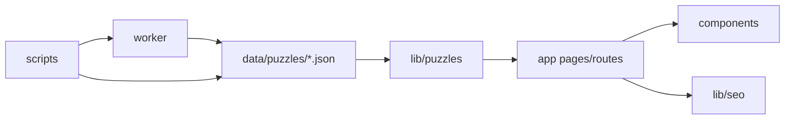

# Project Structure

This project is a Next.js content site for Pinpoint Answer Today. It serves daily LinkedIn Pinpoint answers, archive pages, SEO metadata, structured data, and automation around puzzle publishing.

## Stack

- **Framework:** Next.js 15 App Router
- **UI:** React 19
- **Language:** TypeScript
- **Validation:** Zod
- **Automation:** Node scripts plus Cloudflare Worker
- **Primary dev command:** `npm run dev`
- **Build command:** `npm run build`

## Top-Level Directory Map

| Path | Purpose |
| --- | --- |
| `app/` | Next.js App Router pages, route handlers, layouts, metadata routes, sitemap, robots, error and 404 pages. |
| `components/` | React UI components grouped by page or feature area. |
| `lib/` | Core business logic: puzzle data access, schemas, SEO builders, site config, security, utilities, and content generation. |
| `data/puzzles/` | Structured puzzle registry and per-puzzle detail JSON files. |
| `scripts/` | Validation, SEO checks, routing checks, release automation, Worker operations, visual capture, and low-frequency migration tools. |
| `worker/` | Cloudflare Worker for fetching, storing, generating, publishing, monitoring, and alerting around puzzle data. |
| `docs/` | SEO plans, PRDs, content QA notes, release checklists, runbooks, incident notes, and historical migration docs. |
| `public/` | Static assets such as favicon files, fonts, OG image, and verification files. |
| `tests/` | Additional test fixtures or test support files. |

## Runtime Flow



## Main App Routes

| Route | Entry | Responsibility |
| --- | --- | --- |
| `/` | `app/(site)/(home)/page.tsx` | Homepage with current puzzle, next preview, recent answers, and home structured data. |
| `/linkedin-pinpoint-answers/[slug]/` | `app/(detail)/linkedin-pinpoint-answers/[slug]/page.tsx` | Canonical puzzle detail page with answer reveal, analysis, metadata, and structured data. |
| `/linkedin-pinpoint-answers/[slug]/opengraph-image` | `app/(detail)/linkedin-pinpoint-answers/[slug]/opengraph-image/route.tsx` | Dynamic social image for a puzzle detail page. |
| `/puzzles` | `app/(site)/puzzles/page.tsx` | Canonical archive/search page with complete server-rendered puzzle links. |
| `/next-pinpoint-preview` | `app/(site)/next-pinpoint-preview/page.tsx` | Next puzzle preview, countdown, and playbook content. |
| `/about-us` | `app/(site)/about-us/page.tsx` | Trust/about page. |
| `/contact-us` | `app/(site)/contact-us/page.tsx` | Contact and feedback page. |
| `/privacy` | `app/(site)/privacy/page.tsx` | Privacy page. |
| `/terms` | `app/(site)/terms/page.tsx` | Terms page. |
| `/disclaimer` | `app/(site)/disclaimer/page.tsx` | Disclaimer page. |
| `/pinpoint/today` | `app/(site)/pinpoint/today/route.ts` | Dynamic alias for today's canonical detail page. |

## Legacy and Redirect Routes

These routes preserve SEO value and validate old URLs before redirecting:

- `app/(site)/linkedin-pinpoint-answers/page.tsx` - legacy archive alias redirect back to `/puzzles`
- `app/(site)/pinpoint/[value]/page.tsx`
- `app/(site)/pinpoint/archive/page.tsx`
- `app/(site)/puzzles/[puzzleNumber]/page.tsx`
- `app/(site)/puzzles/connector/[slug]/page.tsx`
- `app/(site)/puzzles/connectors/[slug]/page.tsx`
- `app/(site)/puzzles/themes/[slug]/page.tsx`

The canonical detail URL shape is `/linkedin-pinpoint-answers/[slug]/`. Route constants live in `lib/paths/routes.ts`.

## Layouts and Global Files

| File | Responsibility |
| --- | --- |
| `app/layout.tsx` | Root HTML layout, global metadata fallback, font wiring, analytics scripts. |
| `app/(site)/layout.tsx` | Standard site navigation and footer layout. |
| `app/(detail)/layout.tsx` | Detail-page navigation/footer plus detail CSS. |
| `app/not-found.tsx` | Global noindex 404 page. |
| `app/error.tsx` | Global error page. |
| `app/opengraph-image.tsx` | Root/default OG image route. |
| `app/sitemap.ts` | Sitemap generation from static routes and puzzle detail entries. |
| `app/robots.ts` | Robots policy. |
| `middleware.ts` | Canonicalization and redirect-related request handling. |
| `next.config.ts` | Security headers, API noindex headers, legacy redirects, Next config. |

## API Routes

| Route | Entry | Responsibility |
| --- | --- | --- |
| `GET /api/archive-groups` | `app/api/archive-groups/route.ts` | Returns archive groups as JSON. |
| `GET /api/pinpoint/today` | `app/api/pinpoint/today/route.ts` | Proxies Worker today puzzle data. |
| `GET /api/puzzles/summary` | `app/api/puzzles/summary/route.ts` | Returns latest published live puzzle summary. |
| `GET /api/health` | `app/api/health/route.ts` | Health endpoint backed by Worker health. |
| `GET /api/indexnow-key` | `app/api/indexnow-key/route.ts` | IndexNow verification key. |
| `POST /api/revalidate` | `app/api/revalidate/route.ts` | Revalidates paths/tags after publishing and pings IndexNow. |
| `POST /api/feedback` | `app/api/feedback/route.ts` | Handles contact form submissions, validation, rate limiting, and webhook delivery. |
| `POST /api/fallback/worker-pinpoint` | `app/api/fallback/worker-pinpoint/route.ts` | Fallback data endpoint for Worker flows. |
| `POST /api/admin/generate-draft` | `app/api/admin/generate-draft/route.ts` | Admin-only draft generation/localization endpoint. |
| `POST /api/admin/validate-draft` | `app/api/admin/validate-draft/route.ts` | Admin-only draft validation endpoint. |
| `GET /.well-known/traffic-advice` | `app/.well-known/traffic-advice/route.ts` | Traffic advice metadata route. |

## Component Map

| Path | Responsibility |
| --- | --- |
| `components/home/` | Homepage sections: hero, reveal section, FAQ, recent answers, CTA, and next unlock. |
| `components/detail/` | Puzzle detail UI: answer reveal, full analysis, check-in, share button, CTA, sticky banner. |
| `components/archive/` | Archive header, card, explorer, and answer reveal interactions. |
| `components/preview/` | Next preview page sections and guides. |
| `components/shared/` | Reusable UI such as answer reveal, countdown, recent answer card, and section heading. |
| `components/layout/` | Navigation, footer, and footer badge wall. |
| `components/seo/` | Structured data script injection. |
| `components/analytics/` | Analytics script wiring. |
| `components/contact/` | Contact/feedback form. |

## `lib` Map

| Path | Responsibility |
| --- | --- |
| `lib/puzzles/data.ts` | Barrel export for puzzle data access APIs. |
| `lib/puzzles/data/` | Data access layer split into archive, current, preview, detail, registry, legacy redirects, and public API modules. |
| `lib/puzzles/data-sources.ts` | Registry/detail JSON loading plus local/remote fallback behavior. |
| `lib/puzzles/schema.ts` | TypeScript-facing puzzle schemas. |
| `lib/puzzles/schema.shared.mjs` | Shared runtime schema used by app, scripts, and Worker-adjacent code. |
| `lib/puzzles/detail-view.ts` | Detail view helper logic. |
| `lib/puzzles/content-enhancer.ts` | Enhances or normalizes puzzle detail content for display. |
| `lib/puzzles/fallback-copy.ts` | Shared fallback copy builders. |
| `lib/puzzles/publish-eligibility.*` | Publish gate validation shared with Worker flows. |
| `lib/puzzle-generation/` | LLM generation prompts, provider client, parsing, response shape, and content composition. |
| `lib/seo/` | Metadata, structured data, social image, and SEO text builders. |
| `lib/site/` | Site constants, admin auth, admin rate limit, badges, static page metadata. |
| `lib/paths/routes.ts` | Central route constants. |
| `lib/security/url-allowlist.ts` | URL allowlist validation. |
| `lib/utils/` | Date and Pinpoint unlock utilities. |
| `lib/analytics.ts` | Client analytics helper. |
| `lib/rate-limit.ts` | Rate limiter utility. |
| `lib/logger.ts` | Logging helper. |

## Puzzle Data Model

Puzzle data lives in `data/puzzles/`.

| File Pattern | Purpose |
| --- | --- |
| `data/puzzles/registry.json` | Registry of all puzzles, including number, slug, publish date, status, clues, answer, category, summary, and timestamps. |
| `data/puzzles/pinpoint-answer-*.json` | Detail content for individual puzzle pages. |

Important detail fields include:

- `slug`
- `puzzleNumber`
- `publishDate`
- `detailState`
- `bodyMode`
- `pageExperienceMode`
- `questionType`
- `difficultyBand`
- `clues`
- `answer`
- `category`
- `wordHints`
- `spoilerHints`
- `articleBlocks`
- `solutionNarrative`
- `lessons`
- `faqs`
- `solvePath`
- `turningPoint`
- `clueRows`
- `faqItems`
- `display`

Validation runs through `npm run validate:data`. The production build also runs validation first through `npm run build`.

## SEO Architecture

- Page metadata is built through `lib/seo/metadata.ts`.
- Homepage structured data is built through `lib/seo/home-structured-data.ts`.
- Archive structured data is built through `lib/seo/archive-structured-data.ts`.
- Puzzle detail structured data is built through `lib/seo/puzzle-detail-structured-data.ts`.
- JSON-LD is injected through `components/seo/StructuredData.tsx`.
- Sitemap is generated from static routes plus detail entries in `app/sitemap.ts`.
- API routes receive `X-Robots-Tag: noindex, nofollow, noarchive` through `next.config.ts`.
- Global 404 is explicitly noindex.

## Scripts

| Script | Purpose |
| --- | --- |
| `scripts/validate-data.ts` | Core data validation for registry/detail JSON and content contracts. |
| `scripts/check-pinpoint-seo-builders.ts` | SEO builder and structured data checks. |
| `scripts/check-routing-regressions.ts` | Routing, redirects, middleware, and static params regression checks. |
| `scripts/check-pinpoint-guardrails.ts` | Large guardrail suite covering publish, revalidate, Worker proxy, URL allowlist, draft validation, and release safety. |
| `scripts/run-pinpoint-regression.mjs` | Content-generation regression runner. |
| `scripts/release-production.mjs` | Production release orchestration. |
| `scripts/worker-ops.mjs` | Worker operations such as preflight, health, and cookie refresh. |
| `scripts/generate-static-page-metadata.mjs` | Generates static page metadata based on git modification dates. |
| `scripts/gsc-pinpoint.mjs` | Google Search Console CLI helper. |
| `scripts/capture-detail-screenshots.mjs` | Playwright-based detail screenshot capture. |
| `scripts/vercel-ignore-build.mjs` | Vercel ignore-build decision script. |
| `scripts/import-legacy-puzzles.mjs` | Legacy puzzle import/migration helper. |
| `scripts/pinpoint-intermediate-state.mjs` | Intermediate-state/commit-detection helper used by guardrails. |
| `scripts/install-hooks.mjs` | Git hook installation during `prepare`. |

## Worker

| Path | Responsibility |
| --- | --- |
| `worker/src/index.ts` | Main Worker entry, route handling, cron handling, KV access, GraphQL proxy, publish orchestration, fallback, health, monitoring, and alerts. |
| `worker/src/enrich-llm.ts` | LLM prompt construction and puzzle draft generation/regeneration. |
| `worker/src/lib/publish/auto-i18n-policy.ts` | Auto-i18n enablement policy. |
| `worker/src/lib/publish/locale-auto-publish-freeze.ts` | Locale auto-publish freeze rules for specific puzzle ranges. |
| `worker/README.md` | Worker operations and deployment notes. |
| `worker/wrangler.toml` | Cloudflare Worker configuration. |

Current concern:

- `worker/src/index.ts` is very large and mixes HTTP routes, scheduled cron, publish logic, GraphQL proxying, notifications, fallback, and monitoring.
- A future refactor should split it into `routes/`, `publish/`, `graphql/`, `monitoring/`, and `fallback/`.

## Documentation Organization Recommendation

| Suggested Path | Content |
| --- | --- |
| `docs/release/` | Deployment checklists, smoke checks, production env notes. |
| `docs/seo/` | SEO audits, GSC plans, ranking recovery, cutover SEO notes. |
| `docs/content/` | Content generation best practices, QA checklists, backfill plans, release gates. |
| `docs/prd/` | Product requirements, implementation plans, feature PRDs. |
| `docs/ops-runbooks/` | Worker runbooks, GraphQL cookie recovery, incident reviews, recovery notes. |
| `docs/archive/` | Historical migration, cutover, and completed checklist docs. |
| `docs/artifacts/` | Visual evidence and screenshots for specific audits or PRs. |

## Keep / Refactor / Archive Guidance

### Keep

- `data/puzzles/registry.json`
- `data/puzzles/pinpoint-answer-*.json`
- `scripts/validate-data.ts`
- SEO/routing/guardrail/regression scripts
- `worker/README.md`
- `lib/puzzles` schemas and shared contracts
- `lib/seo` builders

### Refactor Later

- `worker/src/index.ts`: split by responsibility.
- `scripts/`: group by `validation/`, `release/`, `ops/`, and `archive/`.
- `lib/puzzles/`: consider deeper grouping by `data-access/`, `schema/`, `publish/`, and `content/` only after stabilizing tests.

### Archive Candidates

- Old one-time migration/cutover docs from March 2026.
- Low-frequency scripts such as `scripts/import-legacy-puzzles.mjs`, after confirming no active README or npm script references break.
- Completed visual artifacts under `docs/artifacts/`, if no longer needed in repo history.

## Common Commands

```bash
npm run dev
npm run typecheck
npm run validate:data
npm run test:pinpoint-seo
npm run test:pinpoint-routing
npm run test:pinpoint-guardrails
npm run test:pinpoint-regression:core
npm run build
npm run release:production
```

## Current Cleanup State

- `docs/README.md` now indexes the active docs.
- Completed March 2026 cutover and migration docs live under `docs/archive/2026-03/`.
- `scripts/README.md` documents routine scripts, release scripts, Worker scripts, visual/search tools, and low-frequency helpers.
- Local assistant state should stay ignored through `.claude/`.
- Worker fetch route matching now lives in `worker/src/routes/dispatch.ts`; route bodies still live in `worker/src/index.ts`.
- CI GitHub actions now use `actions/checkout@v6` and `actions/setup-node@v6` while the project install still uses Node 20.

## Suggested Next Steps

1. Split one low-risk Worker route body from `worker/src/index.ts` only after adding focused guardrails for that route.
2. Move active documents into topic folders only after checking links from README files, scripts, issues, and PRs.
3. Group scripts into folders only after `package.json`, runbooks, and release commands are updated together.
4. Keep `validate:data`, SEO checks, routing checks, guardrails, Worker typecheck, and production build green before any directory move.
